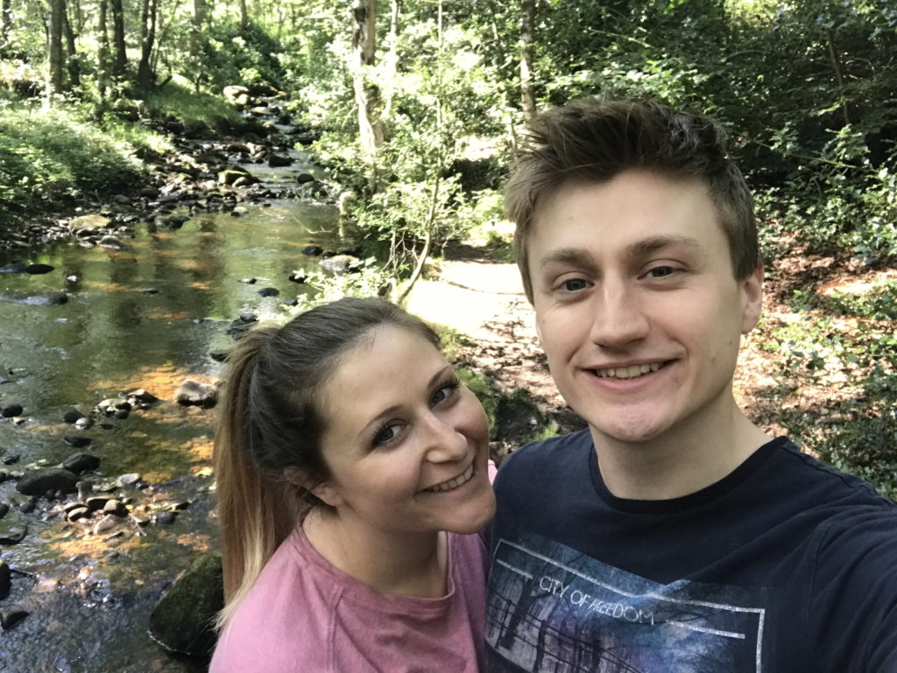

I’ve been working as a software developer since August 2020, but the road that led me to the profession has been anything but smooth. Below you will find a candid chronicle of my history. Hopefully it’ll help you gain a better understanding of who I am, and what motivates me.

Way back in the days of secondary school, I had absolutely no idea what career path I was hoping to embark down. Frankly, I wasn’t hoping to embark on any sort of career at all. I spent most of my time in school amusing myself and irritating my teachers with my silly behaviour and nonchalant disregard for authority.

If you’d asked me back then what I wanted to “be” after I’d aged an appropriate number of years, and had sat patiently through my spiel about cultivating an orange orchard in a sleepy Spanish village whilst working part-time at the local convenience store, you’d have probably heard me say something like “Well, graphic design doesn’t seem too bad”. Of course, we live in a decidedly systematised society where career is paramount, and as I was reaching an age where utility was beginning to be expected from me, I was indeed asked this sort of question quite a bit. Eventually, through a process of attrition, I learned to think and say that I wanted to be an architect. I mean, I quite liked drawing.

At sixth-form college, not much changed during the first year – I was still a bit of a layabout, for want of a better word. It was only when I received my AS Level results at the end of the year that things started to change. The results weren’t great, and included a D in Product Design, a D in Further Maths and an E in ICT (something which my computing-averse wife, who received an A\* in her ICT GCSE, likes to remind me about!). I’d always been competent academically, throughout all my years of mischief-making, and so these results were a bit of a shock to the system, and proof that my intelligence alone was no longer enough to cut the mustard – genuine effort was required too. I’m pretty clever, but as these results conclusively proved, no genius! It was also around this time that I realised – a gradual, terrible realisation – that all of my friends had actually been planning their futures fastidiously for quite some time. Suddenly, my friends were in open discussion about university – not _whether they would go_ at this point, but _where_ they might apply, and exactly what branch of such-and-such they were hoping to focus on. And suddenly, I felt like the butt of a universal joke, with just a year left before I was to be forcefully extricated from my cocoon of lazy teacher-baiting and introduced into a painfully real world.

And so, I trained my sights on becoming a Marine Biologist. In hindsight, it seems like the guiding motivation here might have been pipe dreams of whale-watching in Bermuda, but I’m sure there must have been something more substantial to the interest at the time. The bad news was that I hadn’t actually studied Biology at AS Level, and so to facilitate this dream I had to take the unprecedented step of dropping three AS subjects (all of the ones I had ballsed up – see paragraph above) and taking the full Biology A Level in a single year. That year I worked harder than ever before, both at college and at home, revelling in the novel sense of fulfilment that proper engagement with an academic curriculum gave me. Ultimately I’m pleased to report that the hard work paid off, as I topped the cohort academically in all three subjects I studied (Biology, Environmental Studies and Maths), achieving the top A\* grade in each with percentage points to spare. To this day, the academic turnaround I achieved in that year stands as my proudest achievement.

This reversal in my fortunes saw me re-evaluate my future prospects. I was suddenly in possession of one of Willy Wonka’s golden tickets, and the world felt like my oyster. I became completely unenthused by the prospect of heading to the south coast to study Marine Biology, a vocation that now evoked in my mind only forlorn premonitions of my future self, alone in a dreary, windowless laboratory, sifting through sediment. And so, somewhat starry-eyed and thoroughly underprepared, I attempted to “gain entry” into the University of Oxford, with straight-up Biology on the agenda. This turned out to be an unfortunate idea – I ended up tanking both of the interviews I had at the university, as my lack of serious interest in the subject was brutally exposed. I remember feeling quite petrified and terribly out of place throughout the entire process, with my fear of failure ironically rendering me quite incapable of presenting myself as anything other than a gibbering moron, and it was no great surprise when I later learned of my rejection. Nevertheless, it is a rejection that pains my ego to this very day!

With my dreams of Oxford’s spires extinguished before they’d barely taken root, I somewhat lost the taste for household names in academia, and ended up taking up a place at the University of York, a decision based mainly on the fact that I’d visited a friend there during my gap year, and we’d had a couple of great nights out! The university period of my life was positive overall, although it’s impossible to sum it all up with a single feeling. On the one hand, I met the love of my life, Kate; made some great friends, with whom I remain close to this day; and had a fantastic array of new and interesting life experiences (including spending four months living in Denmark and then returning home to work as a carer in a nursing home for elderly people with dementia) – but on the other hand, I realised very early on that there was no future for me in Biology, and my level of academic engagement was frankly abysmal. I ended up coasting to a 2.1 that I barely deserved, making up for a general absence of coursework with strong examination results, begotten by a strange regime of extremely intense, last-minute rote study (picture me striding up and down the riverside, clutching a batch of printed notes and reciting the content aloud in an effort to commit it to memory). When all is said and done, the overall feeling I get when I think about university is that I just wish I’d studied something I actually wanted to pursue long-term.

_Me and my wonderful wife Kate in 2020. We met at the University of York in 2013_

Upon graduating in 2017, I returned to the care industry, spending five months working full-time in a home for adults with learning disabilities. This was as challenging and enriching an experience as you might expect, and one that I look back on fondly. I then used the money earned from my labours to facilitate a jolly-good gallivanting around Asia with Kate for another five months, between November 2017 and March 2018, taking in far too many countries to list here. Lots more fond memories were made.

Career-wise, I was in a bit of a rut. In early 2018 I was 24 years old, and still without a firm idea of what I wanted to do for a living. It seemed to me that everybody else was well on the way down paths that had been set in stone years ago. My younger brother was a prime example – at that time, he was already two years into an IT career, having completed a degree in IT and business. And so, like a little chunk of soul searching for the nearest living thing to attach to, my career ambitions began to focus around the idea of teaching – after all, Kate had completed a PGCE in Primary Education prior to our Asian excursion and had an NQT job lined up for our return. If I became a teacher, I’d have plenty of time off, and I’d be able to spend all of that time off with Kate. It all seemed very convenient – forget the general lack of interest in teaching!

And so that’s how I found myself taking up a place on a PGCE in Secondary Mathematics at Sheffield Hallam University in late 2018. I’ve made a few bad decisions in my life, but taking this course was probably the worst. The two months I spent working as a trainee teacher were two of the most traumatic in my life, as my confidence and wellbeing were crushed on a daily basis by the nature of the job, and by the nature of some of the individuals around me. Secondary schools are hard, uncompromising places, and my somewhat sensitive, conscientious and overanalytical personality proved a poor fit indeed. Yep, it certainly had me looking back at my own secondary school antics with a new perspective! By October I had dropped out of the course. I briefly flirted with the idea of going into primary teaching, and spent a couple of fairly positive months working as a teaching assistant in several primary schools in Sheffield, including a couple of weeks working in an integrated special needs unit for children with autism. Then, in January 2019, after finally heeding advice from friends and family, who knew all about my hobbyist proclivity for data, statistics and spreadsheets, I took up an office-based role in data analytics.

This was huge for me – it was the first “proper” job I’d ever had; “proper” in the sense that a white-collar career might be spawned from the position. It was also the first time I’d ever worked in an office. I remember clearly the initial sense of alienation: everywhere I looked, people just sat in rows, silently staring at their computer screens, for hours at a time. To somebody who had only ever worked in convenience stores, care homes and schools, it felt like some sort of social experiment. However, this sense of alienation subsided surprisingly quickly, as my enjoyment of data analytics took a driving seat, and I saw that I really did have a natural gift for it. I remember it feeling like the university experience I never had – there was a sense of ambition; of diligent youth looking forward to a brighter future.

As much as I enjoyed data analytics, I felt myself increasingly drawn towards software development. Writing MySQL stored procedure code became an increasingly prominent aspect of my job role, and I cherished the outlet that it provided my innate problem solving ability – a single skill that could be learnt and mastered; a skill that other people actually valued. However, I also became increasingly aware that there was a world of programming beyond SQL, which is, after all, incredibly domain-specific by its very nature.

Beginning in early 2020, I started writing Python code in my spare time. Initially, I found myself using libraries like _Matplotlib_, _Numpy_ and _Pandas_ for data analysis, but before long I expanded my horizons into general programming, and started to code simple programs, such as a _Top Trumps_ simulation. Next I started coding pared-down, terminal-based versions of popular games like _Pandemic_ and _Pokémon_; using APIs (such as Spotify’s); and experimenting with new libraries and techniques, such as _Selenium_ for browser automation and _Beautiful Soup_ for web scraping. All the while I was learning more and more about computer science, with the help of fantastic YouTube tutorials such as _[Crash Course Computer Science](https://www.youtube.com/watch?v=tpIctyqH29Q&list=PL8dPuuaLjXtNlUrzyH5r6jN9ulIgZBpdo)_ (which I highly recommend to anybody starting out in the industry!). My increasing exposure to the world of software development gradually helped me to realise that my history of using Microsoft Excel actually aligned more closely with software development than data analytics – after all, my most impressive Excel-based achievement was the creation of a program that was able to simulate an entire league season’s worth of football fixtures, with each result taking into account such nuances as differences in team rating, offensive inclination, home advantage and recent form, and generate a series of intermediate league tables for inspection: a piece of work that had absolutely nothing to do with analytics.

In March 2020, I put my feelers out at work regarding a potential change of department, from data analytics to web development. My initial, relatively half-hearted attempts to gain part-time experience in the web development team were met with resistance and came to nought, but eventually, in May, my persistence paid off and a departmental switch was agreed. I began to focus my extracurricular learning efforts on web development (for obvious reasons!), using resources like [Free Code Camp](https://www.freecodecamp.org/), whilst also continuing with some exciting Python-based projects, such as porting over the base logic from my Excel-based football simulation to pursue the simulation build in greater depth than ever before.

My first few weeks as a Web Developer were tough, as I tried to provide value to the company while being introduced on a daily basis to a raft of new and alien concepts. For a data analyst whose only experience of programming at that point involved standalone SQL stored procedures that ran to at most a few hundred lines, the volume and complexity of the source code powering Twinkl’s website was quite overwhelming! The pressure was intensified by the fact that I had been allocated by the CEO Jon Seaton into his personal workforce of developers, nicknamed Team Fox, whose function it was to rapidly implement and deploy priority features. I’ve always felt honoured by the faith Jon showed in me at that time, but it was nevertheless an unforgiving environment in which to hone my craft, and one that in reality wasn’t exactly a representative experience of software development as an industry.

Bug fixes and minor feature requests made up the majority of my workload for the first few months of my time as a Web Developer, until one day, while working on a feature request involving emails, I noticed an opportunity to automate and optimise our processes around email sending. I put forward a solution to the company’s CTO, and before I knew it I was working pretty much full-time on fleshing out this solution. The software project that was spawned here was internally named the Email Explorer, or Emex, and was the thing to which I devoted the majority of my time and effort for the remainder of my tenure at the company. I plan to do an article on the Email Explorer at some point, so stay tuned!

In August 2021, Kate and I moved to Singapore after she applied for and accepted a job as a primary school teacher at one of the many English-speaking international schools over there. I handed in my notice at Twinkl, as I had no desire to work fully remotely for five days a week; instead, I planned to spend my time in Singapore studying for a computer science degree, working on personal projects and volunteering. To my surprise, Jon responded by saying that he would be happy to allow me to work only two days a week if this was the only way to retain my services, and I gratefully accepted this offer, figuring that on balance it made a lot of sense from a financial and career perspective to remain employed. And so I moved from fully remote work in the UK to fully remote, mostly asynchronous work in Singapore, with the time difference of seven hours meaning that I ended up siloed off in the world of the Email Explorer even more so than I had been previously. I thought about studying in Singapore, but baulked at the exorbitant costs; instead, I started a remote MSc in Computer Science with the University of Bath. I also began volunteering at a soup kitchen for migrant workers in a part of town called Little India. Working, studying, volunteering – this was how I initially filled my time abroad.

Alas, although Singapore is a wonderful place, my existence out there became somewhat lonely. Working only two, fully remote days a week for Twinkl saw me gradually grow disconnected from the company’s mission and my colleagues, and it soon became apparent that my long-term future lay elsewhere. I sought alternative employment based in Singapore itself, with the idea of office-based work and face-to-face interactions with colleagues alluring after so long spent working remotely. A large, international financial analytics company called S&P Global took a punt on me, and I began work there as an Associate Software Engineer in May 2022, contracted to a four-day week to allow time for study. The work was boring and I felt reduced to little more than an automaton by the repetitive, process-driven workflow and the rigid, hierarchical environment. My motivation was not helped by the fact that all of S&P Global’s clients were financial behemoths themselves, organisations who existed solely to turn a profit; this was so far from the charitable work I had once envisioned myself doing. As you can imagine, I quickly grew disillusioned. These feelings coincided with mine and Kate’s decision to return to Europe in the summer of 2023, and so I sought employment based in countries including Spain, as this seemed our most likely destination at the time. A music technology company based in Barcelona called BMAT hired me as a Backend Engineer, with the idea being that I would begin fully remote work immediately, and then transition to a hybrid arrangement once we had completed a move to Spain in the summer. I started there in January 2023.

Kate and I returned to England to spend the end of 2022 with family, but also took the opportunity while in Western Europe to scout out Barcelona and Madrid, with the aim of choosing between the two as potential home cities. What we both realised while we were there was that it didn’t make a great deal of sense to move to Spain at all – we would still be a long way from friends and family, and living in a foreign country would make us much less able to put down roots and start a family of our own. We thus decided that we would instead return to England that summer, the decision taken before I’d even started working at BMAT. It was necessary but frustrating, as it meant in my case that I would be locked in to fully remote work for the foreseeable future, which had categorically not been the intention.

Just three days after returning to England, Kate and I were involved in a horrendous car accident, as the Audi we were travelling in failed to stop at a crossroads and was T-boned by a van at a speed of around 60 mph. Kate, as the front-seat passenger, was hospitalised for several days with serious but non-life-threatening injuries including facial scarring, broken ribs and a broken hand, while I was in the rear passenger-side seat and got away with a big lump on my forehead and bruising across my upper body. I can’t help getting emotional when I revisit the event in my mind, because of how close we came to devastating tragedy. We were so, so lucky to survive.

I was already thinking about leaving BMAT, and this near-death experience only served to strengthen my desire for a new challenge. I have always wanted to spend my time doing good and helping other people in some way, not serving the interests of a corporation, and the Civil Service soon emerged as a leading candidate for the esteemed position of my future employer, with its public service mission complemented by myriad other benefits. In fact, I submitted a job application to DLUHC (the former name for MHCLG) on my first day back at work after the accident!

After receiving job offers from both of the departments of the Civil Service I applied to – DLUHC and the Home Office – I decided to move forward with the Home Office role, mainly as I found myself unable to resist the allure of a more grandiose-sounding job title: “Senior Python Developer” sounded distinctly better than “Software Developer”. My time with BMAT drew to a close without fanfare at the beginning of December 2023, and I prepared myself for a fresh start in a more demanding role. Then, in early January, I received an unexpected email from DLUHC, asking me if I was planning to proceed with them: it turned out that, despite months of literally no contact, because I’d never formally withdrawn my application it had remained live in their system. My appetite for _volte-face_\-ing is endless, and so it was with a frisson of devilish glee that I jumped ship to DLUHC just one week before I had been due to start with the Home Office. Why? Well, if I’d joined the Home Office, we’d have been obliged to remain in or near Sheffield, over an hour’s drive away from Kate’s family in Leeds. This wouldn’t have been conducive to the close-knit family lifestyle that Kate and I had envisioned for ourselves in the latter days of Singapore – it just took me a while to realise what my priorities were. I started with DLUHC at the end of that month.

As I write this in November 2025, I’ve been with MHCLG, formerly DLUHC, for a year and nine-and-a-bit months. It wouldn’t be professional to talk with great candour about a current role here, but suffice to say it’s been good so far. I fought successfully for the role to be re-titled from Software Developer to Senior Developer shortly after starting with it, and it has certainly lived up to its new title, as I’ve had the opportunity to line manage other developers and lead small groups of developers on long-term technical projects.

Thanks for reading.
