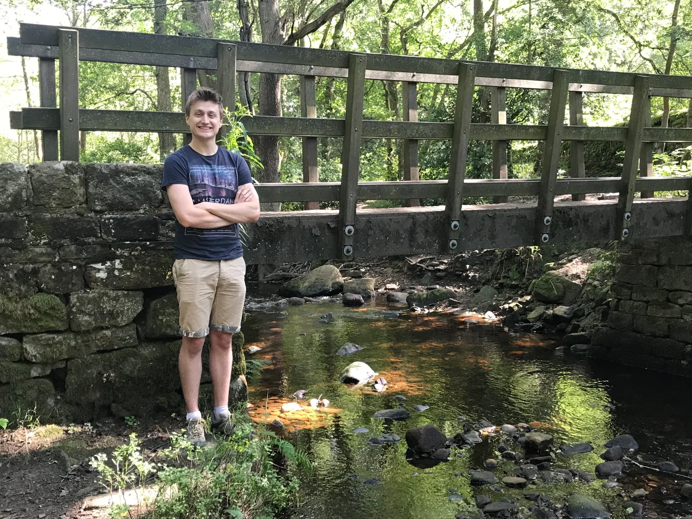

**Welcome, dear visitor!**

This is my website, where I publish articles about the software projects I’ve been working on. From atop these digital ramparts I am able to blithely spout my waffle into the infinite void that is cyberspace, proudly undeterred by the recipient silence. But, since you’re already here, why not read some of my waffle?

_**Who am I?**_

My name’s Will May, and I’m an English software developer based in Harrogate, where I live with my beautiful wife Kate, our beautiful little boy Jasper, and our two beautiful cats, the ostentatiously monikered Lysander and Sebastian. I’m an avid programmer, long-time vegetarian-turned-pescetarian, football stats nerd, Radiohead devotee, Spanish language learner, lapsed badminton player, God-awful pianist, PADI-certified scuba diver (with a fear of open water), former care worker and teaching assistant, co-founder of a short-lived app start-up, and ex-expat (Singapore!), among other things. I tend to fall short of excellence and I’ve had my fair share of failures and setbacks over the years, but I like to think I get the important things in life right.

**_Why do I have a website?_**

Well, what better way to dispel any suspicion that I might not be a competent developer than by maintaining my own website? But really, I like the fact that it provides a safe space to publicise my work and articulate my thoughts, and have them persisted forevermore on the internet. If people read what I’m writing, that’s a bonus!
