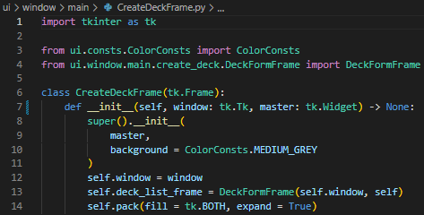
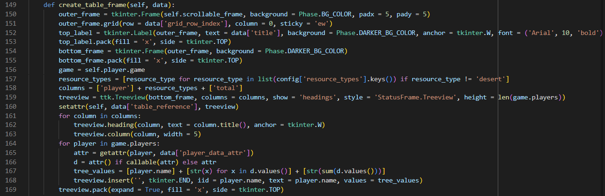
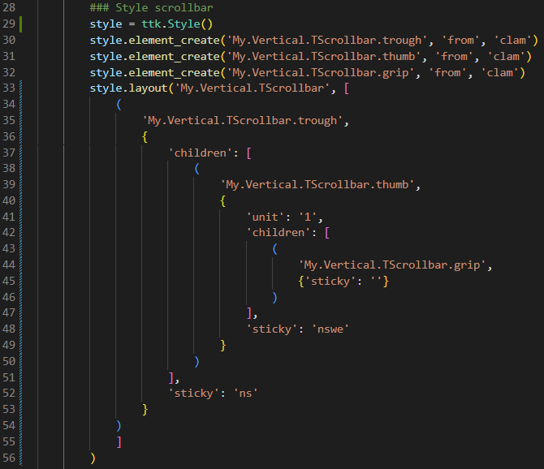
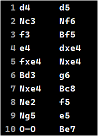
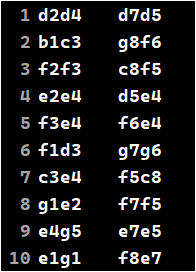
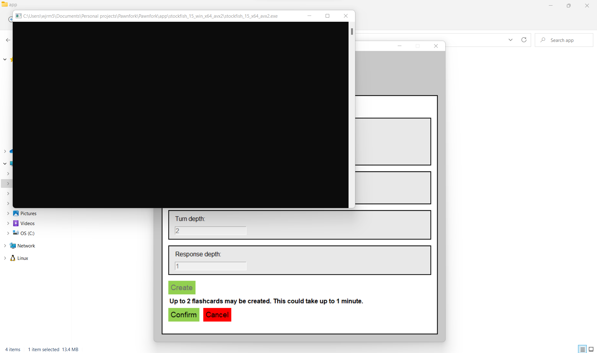

The other day I published my latest app – a little desktop-based number whose aim it is to make memorising chess openings as easy as falling off a log (this is apparently a real idiom). It’s called Pawnfork, and you can download it [here](/wp-content/uploads/2022/08/Pawnfork.zip).

Of course, it’s not every day that I fire out a new app, and so when I do, it is incumbent upon me as a conscientious blogger to milk it for all it’s worth. That is why I am back today with a new article: _6 Talking Points from Pawnfork_. I’ll make things exciting by giving each “talking point” a clever title, and ending each “talking point” with an exclamation mark (!).

**1\. Once more Tkinter the breach**…

Some of my past Tkinter code has become a bit convoluted, and so for this project I wanted to take a new architectural approach. After Googling around for inspiration, I decided to devise my own solution: every single Tkinter widget in my application would be its own class, extending a built-in Tkinter widget class, and would be responsible for “packing” itself, with the packing taking place within the constructor. Sub-widgets (widgets within other widgets; all widgets except the root widget are sub-widgets) are instantiated within their parent widgets’ constructors, creating a recursive system whereby simply instantiating the root widget generates the entire widget tree, from top to bottom. See image below for an example class:

I was initially sceptical that this approach would actually work in practice, but it did. The resultant source code looks clean and easy-to-maintain; a far cry from the work I did on my Catan game, for example. You can see some example Tkinter code from that project below:

Directly calling multiple Tkinter constructors in the same method, and sometimes not even binding the resultant widgets to objects – a recipe for disaster.

I’ll definitely be following my new approach on any future Tkinter projects!

**2\. … but is it “ta-ra, Tkinter”?**

Despite finding a new architectural style that seems to work with Tkinter, there remain good reasons to ask questions of the library itself. Tkinter is the only Python GUI library I’ve really used and it’s certainly serviceable (after all, it facilitated the creation of the wonderful Pawnfork!), but there were times during this project when its flaws became pretty noticeable, which got me wondering whether there exists a better alternative for desktop app building in Python.

What’s wrong with Tkinter then? For a start, it’s a bit _ugly_. That is to say that apps built using Tkinter tend to be less Xabi Alonso, more Jay Spearing. Pawnfork itself is rather “utilitarian” in appearance, and although it is feasible to build attractive, modern-looking apps with Tkinter, they certainly don’t make it easy. The default look and feel of many widgets is very 90s, and customisation means interfacing with the horribly unintuitive `ttk.Style` API. Here’s some example code from my Catan project, that uses this API to style a scrollbar:

Pretty grim, right? Perhaps I’m just too used to a high level of abstraction when it comes to styling – I tend to use libraries like Bootstrap when developing Web applications – I don’t know.

And then there is the difficulty in implementing something as rudimentary as a scrollable frame – oh my word, don’t get me started on bloody scrollable frames in Tkinter. Actually, too late – I’ve started now! To make a `Frame` widget scrollable, you have to stick a `Canvas` widget inside it, and then inside the `Canvas` widget insert another `Frame` widget, and _then_ create a separate `Scrollbar` widget, and configure it so that it’s hooked up to your `Canvas` widget. So instead of just one, scrollable `Frame` widget, you end up with four widgets in play – an outer `Frame`, a `Canvas`, a `Frame` that goes inside the `Canvas`, and a `Scrollbar`. But alas, for that is not the end of your pain, oh no. Because when you have only the four widgets, but you want your scrollable `Frame` to have a border, what you’ll find is that the `Canvas` overlaps any border you add to the outer `Frame`, and it looks silly. The only solution here is to stick the outermost `Frame` inside _another_ `Frame`, and put the border on that other `Frame` instead. So now, you have FIVE widgets, all for the sake of implementing scrollability!

My last gripe with Tkinter is its API for text manipulation. As an example, if you want to delete everything that’s inside a Tkinter `Entry` (input) widget, the correct command is this: `entry.delete(0, 'end')`. Yep, really. The first argument is the integer `0`, and the second argument is the string `‘end’`. I have no idea why; just _reasons_.

So, what are the alternatives?

Well, I could do a Web app and build the frontend with HTML, CSS and JavaScript. As I’m pretty familiar with these technologies from my time in Web development, this seems at first glance like a reasonable option. However, Web apps aren’t always an appropriate design solution, and I feel that that is the case with Pawnfork. Why? Firstly, there’s no good reason for Pawnfork to be a Web app – it’s self-contained, with no internet access required. Secondly, Web apps have some additional, architectural overhead – I’d have had to use a library like Flask to construct a set of endpoints and run an HTTP server in order to access the app via a browser, and live deployment of the product might have meant hosting the code on a remote server, which costs money. I could serve it via a free Heroku dyno (like I do with [Soccer Simulation](http://soccer-sim.herokuapp.com/)), but then the app would suffer from the same boot time lag.

What else could I use? In terms of Python libraries, the most popular outside of Tkinter include Kivy, PyQt and wxPython. I’ve never used any of these, and so can’t really offer much insight here, but perhaps for my new GUI project I could have a closer look at each and choose the most appealing. Away from Python, Java offers GUI frameworks like JavaFX and Swing, while there are JavaScript-based options like NodeGUI which look quite interesting.

If you have any recommendations when it comes to GUI frameworks, let me know!

**3\. Checking for checks**

Chess notation is the recording of chess moves, and algebraic notation is the most common form of chess notation. It looks something like this:

This might look like gobbledygook to somebody who’s never played chess before, but this is probably the simplest and most readable chess notation around. However, this is a notation optimised for humans rather than computers, and chess software tends to use less descriptive forms of notation internally. Coordinate notation is the notation used internally by the Python Stockfish API (which from here on out I will refer to as simply the “Stockfish API”), for example. In the below image I show the equivalent coordinate notation for the moves notated algebraically above:

The Stockfish API does not provide the means to convert a move from coordinate notation to algebraic notation, which was a bit of a problem for me, as I didn’t really want to display coordinate notation to the end user. Trying hard to avoid hard work, I turned to the [Python chess](https://pypi.org/project/chess/) package, which seemed on the face of it to provide the necessary notation conversion functionality. However, in practice I found the package’s notation conversion to be very patchy, as it seemed to label almost every single move as giving check, regardless of whether or not check was actually given. In hindsight, my problems with this package _may_ have simply resulted from misuse on my part, but either way, at the time I simply binned it off. And thus, the onus fell upon me to encode the chess notation conversion functionality myself.

At its most basic, an algebraically notated move includes the destination square, and if the moving piece is not a pawn, a prefixing letter indicating the type of piece moving (e.g., B for bishop, or N for knight).

But of course, there’s lots more to it than that. For a start, you need to annotate piece captures with an “x” immediately before the destination square. In the context of this project, this isn’t actually too hard to encode, as the Stockfish API has the awkwardly-named `will_move_be_a_capture` method to help out.

Then, you also need to annotate things like castling, and pawn promotion. Again, neither of these are too difficult to encode, even without the help of the Stockfish API – as long as your application is internally keeping track of the positions of all of the pieces on the board, you can just check for your king’s file index changing by more than one in a single turn in the case of castling, or check for a pawn arriving at either the first or eighth rank in the case of pawn promotion.

Great! So, what’s the problem then? Well, algebraic notation also requires you to identify whether a given move puts your opponent’s king in check. And complexity is added here by the fact that it’s not always the moving piece that gives check – _discovered_ checks are a pretty common feature of chess. Furthermore, discovered checks can lead to check being given by more than one piece at the same time. All of this would be fine if the Stockfish API had a friendly `will_move_be_a_check` method, but alas it does not – it is in fact a rather bare interface, exposing less of itself to the world than a Victorian-era woman.

The final nail in the coffin of my hopes of providing full and proper algebraic notation to the end user was the requirement to _[disambiguate](https://en.wikipedia.org/wiki/Algebraic_notation_\(chess\)#Disambiguating_moves)_ moves, which is to say, clarifying exactly which piece is moving to the destination square when more than one identical piece is able to.

With all this being said, and also taking into account the basic overhead of having to double check on each move whether another piece of the same type can theoretically also move to the destination square, it was clear that disambiguation would be an absolute bugger to implement. In the end, as this functionality was very much non-essential to the app in the grand scheme of things, I simply didn’t bother with it.

So, what did I do? I implemented a pared-back form of algebraic notation, with no checks for checks, and no disambiguation. That way the end user gets the benefit of improved move readability, and I save on development time!

**4\. Becoming a typewriter**

I’m always looking to improve my programming practice, and one of the ways I tried to do that on this project was by ensuring I annotated all of my class methods with type hints, for both the arguments and the return values.

I did this with Pawnfork, but it was all rather academic in the end – 131 of the 151 type-hinted methods in the project indicated a return type of `None`, and no level of static type checking was ever implemented. While a lot of these `None`\-returning methods are constructors (the project includes 79 classes), the apparent reality of a Tkinter application is that data is not often transported between components; rather, most of the code concerns itself with declaratively updating the state of the GUI.

Despite this level of redundancy, for my next Python project I’m going to look into using either of the Python VSCode extensions Pylance or Pyright, which provide static type checking functionality. It’s time to put the Python in a straitjacket!

**5\. Hacking the Matrix – sort of**

One of the issues I encountered when packaging up my code into an executable file using PyInstaller was that when the resultant Pawnfork application was running, a rogue terminal window would open whenever the Stockfish engine was used:

This obviously makes for an atrocious user experience, and so it was of course necessary to find a way to resolve this issue, by hook or by crook.

After a couple of hours’ worth of online research, I managed to effect a solution. And, interestingly, it involved actually going into the Stockfish library and tweaking the source code. I’ve never touched library code before, so this was new territory for me.

All it involved in the end was adding the parameter `creationflags=subprocess.CREATE_NO_WINDOW` to the list of parameters passed to the `subprocess.Popen` constructor used to create the internal representation of the main Stockfish class. Adding this one line of code solved the issue completely!

**6\. Future reflections**

Work on Pawnfork is by no means finished yet, although I’ll be putting it on the backburner for the time being in favour of other projects, just for the sake of variety. Here are some of my favourite ideas for future improvements:

-   Flashcards presented to user based on [spaced repetition](https://en.wikipedia.org/wiki/Spaced_repetition) algorithm
-   Chessboard animations, e.g., animating opponent’s last move when flashcard appears
-   Ability to delete openings
-   Move evaluation for incorrect moves i.e., was the incorrect move a blunder, a mistake, an inaccuracy, good or excellent

Thanks for reading, and see you next time!
