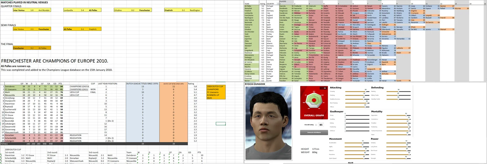
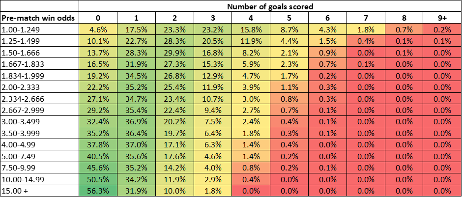
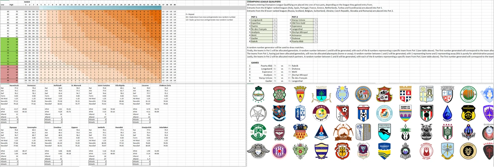
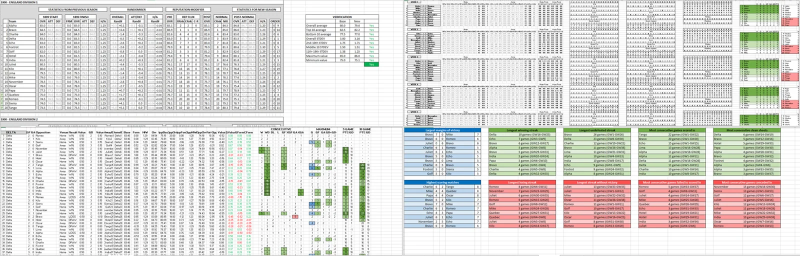
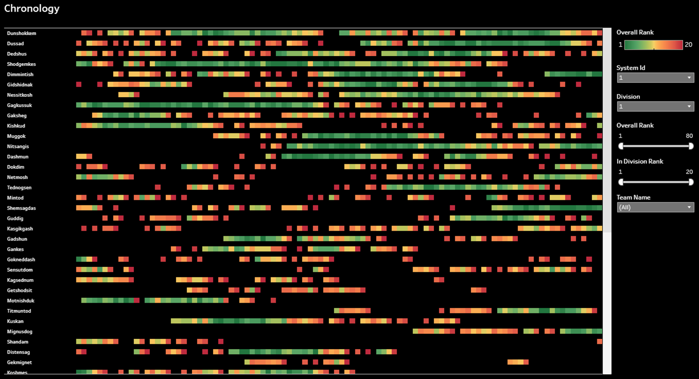

**<u>Preamble</u>**

In preparation for the release of my latest project, a football league simulation built in Python and served as a web app via Flask and Heroku, I thought it would make for a purgative experience to step through the history of my interest in football simulation. For it truly is a long and jumbled history, spanning multiple epochs in my own life; and it is the epoch-spanning nature of the work that makes it particularly interesting, for me at least, because my own technical development is so clearly traceable in the fissures of the project.

Before I delve in, I thought I would take a leaf out of JavaScript’s book and hoist a few bits and bobs to the top of the page…

-   Follow [this link](https://gitlab.com/wjrm500/fake-football-sql/-/tree/master) for the SQL-based version of my football simulation, first produced in 2019
-   Follow [this link](https://public.tableau.com/app/profile/william.may5212/viz/VisualisingSQLfootballsimulationdata/Chronology) if you like your data served up to you on a nice Tableau platter – and please tell me what type of visualisation this is, if you know!
-   And follow [this link](https://gitlab.com/wjrm500/fake-football-pandas/-/tree/master) if you love Pandas (the Python library, not the animal – sorry) and want to see it used and abused in the first Python version of my football simulation

**<u>And so it begins</u>**

I’ve been a massive football fan since the age of five. What got me into it wasn’t a love of being outdoors or anything so halcyon as that – just pure idolatry. Michael Owen I believe it was, the object of my fixation back then. That’s probably why I support Liverpool, although I also like to think that that came about as a result of my wanting to spite my father, an Arsenal fan not averse to decorating his children in Arsenal garb as part of a not-so-subtle program of indoctrination.

I aged, as we all do, and bore my love for football along the way. At the age of 12 years old, rare home video footage shows me knelt in front of the TV watching the 2006 World Cup, pen and paper in hand, evidently scoring the players for what I perceived to be positive or negative contributions to the unfolding. A sad sight to behold really, made all the sadder by the fact that the camera then pans to my brother outdoors, happily kicking a football around in the sunshine.

Increasingly however, I found that the real world of football and the data derived therefrom was not enough to quench my thirst for statistics, for structure; for order. I began to create and flesh out a parallel football universe in my mind and on the computer, using Excel to record lists of invented teams and invented players. Godlike, I created these players as virtual avatars on the football videogame PES, and later FIFA, and used them in-game to wreak footballing havoc against my long-suffering father, who always gamely agreed to a thrashing.

_A selection of screenshots from Excel workbooks produced circa 2009/10. Clockwise from top left: the results from manual ([random.org](http://random.org) was my friend) simulation of my parallel football universe’s version of the Champions League; a list of some invented clubs, with ratings and a selection of associated players; _avatar-ifying the player Dungook on some videogame or another – can’t remember which one___;_ _a manually-prescribed league table, one of many – this one for a set of Dutch teams_

It wasn’t until early 2016 that things started to get a bit more interesting, from a technical angle at least. At this point, it had been many years since I’d even thought about, let alone worked on, my parallel football universe – the university experience, with all its emotional highs and lows, had consigned that aspect of my life to the undergrowth: an inane and pointless vestige of my misspent youth. Good riddance!

But in early 2016, having returned home early from a year abroad in Denmark, I suddenly had quite a bit more time on my hands. With my university studies temporarily on hold, and living with my Mum and her partner in semi-rural Hampshire, five hours’ drive away from my then-girlfriend and now-wife Kate in York, my life became an unconventional mixture of shift work at a care home for elderly people with dementia by day, and feverishly cocooning myself away inside an ever-expanding parallel football universe by night (I was a “shit Batman”, as my brother elegantly puts it).

Being (slightly) more learned and ambitious than before, I was no longer interested in manual prescription of data; instead, I was intrigued by the prospect of automatic data generation. This was truly the extreme nascency of my software development career; however, having absolutely no idea how to do things properly, I found myself continuing to operate solely within the wholly unsuitable environment that is Microsoft Excel. A poor choice of tool no doubt, but it was all I knew at the time. Excel can be a surprisingly versatile application builder if one grits one’s teeth and learns to harness and combine its ample catalogue of functions, with its cell-as-variable paradigm workable at small scale – but it is highly un-performant, and its use leads inevitably to a chaotic and disorganised program structure, with data co-mingled with the functions that operate upon them; no linear representation of the program body, with links between program components only identifiable via cell references hidden inside cell formulae; and related data split arbitrarily across multiple cells (rather than bundled together in single, convenient data structures such as lists). Further, as the complexity and scale of one’s Excel application grows, one encounters very early on memory issues that cause not only noticeable degradations in performance, but catastrophic failure and application crashing – a state of affairs requiring an incredible degree of ingenuity to surmount, and even then only temporarily. Anyway, I’m sure this information is all irrelevant – I very much doubt you needed to be convinced not to use Excel for your next application! Alas, if only I had had such counsel way back when.

At its most basic, the earliest version of my simulation for a single league season required three static data references and a function:

Static data references:

1.  A list of teams. Each team has a name, correlated offence and defence attributes (each scored out of 100), and a unique index value used for match scheduling
2.  A double round-robin match schedule
3.  A “score lookup table”, utilised by the match algorithm to translate an offensive potential value and a random number into a number of goals scored

Functions:

1.  A match algorithm, which uses the two participating teams’ offensive and defensive attributes, a pair of random numbers and the aforementioned “score lookup table” to generate a match score

By far the hardest thing to get right at this stage was mapping offensive potentials to number of goals scored in such a way that the patterns observable in real world football were produced by the simulation, at both the level of a single match and at a macroscopic level, across seasons’ worth of matches. In order to achieve this, I pulled together a real-world dataset comprising 50,000 individual “number of goals scored in a match” data points, alongside the pre-match win odds corresponding to the team in question, to quantify the correlation between expected likelihood of victory and number of goals scored. Data was taken from 76 individual league seasons split across eight different nations, between 2008 and 2016.

In the figure below, you can see the correlation between expected likelihood of victory and number of goals scored:

Working with the findings from this dataset, and with more than a little trial and error, I eventually managed to produce a system that seemed to generate match scores in-keeping with real-world patterns. This breakthrough meant I had a working Excel-based football simulation that was able to simulate a season’s worth of results in a jiffy. Work complete, I spent a cathartic hour or so running and re-running the simulation, and gazing in wonder at the resultant, prettified league tables. And then of course, I lost interest in the project completely.

_A selection of screenshots from Excel workbooks produced circa 2016. Clockwise from top left: a version of the “score lookup” table, which could be used by taking the row corresponding to a team’s “offensive potential” and the column corresponding to a randomly generated number between 1 and 40, then finding the “goals scored” value in the intersecting cell; a textual description of how Champions League qualification worked; _not really relevant to the simulation, but just another example of how much time I spent on this stuff – a selection of badges I created, primarily by grabbing pre-existing badges from Google Images and manipulating them in paint.net_;_ _one gameweek’s worth of fixtures, and the values inputted to and generated by the match algorithm_

It was in early 2017 that I once more picked up the baton, during a time period where I really ought to have been studying for my final year Biology exams. This time around, I recreated the Excel program from scratch, ramping up the complexity by introducing factors such as…

-   Random-based generation of team attributes (replacing the near-manual prescription of team attributes used previously)
-   Simultaneous simulation of multiple leagues within a tiered league system
-   A chronology extending beyond a single simulation: the ability to string together a series of simulations over multiple seasons, witnessing the effects of promotion and relegation between divisions, and season-on-season changes in team attributes
-   Team form – modulating team attributes throughout the season based on performance versus expectation
-   Automatic capturing of pertinent information only available at an aggregated level, including seasonal “records” such as “Largest margin of victory” and “Longest winning streak”

Team form was a particularly notable addition to the program, acting as a cartilaginous connector between matches, which had previously been isolated components. On a practical level, it also meant that a notionally smaller team “doing a Leicester” (surpassing all pre-season expectations with a sustained run of excellent form) had now entered the realms of statistical possibility. With this additional complexity built into the program, I was theoretically able to run bigger, better simulations than before – but Excel memory issues reared their ugly head in catastrophic fashion, effectively preventing me from continuing with the work. And thus the project once again became dormant, this time for a prolonged period.

_A selection of screenshots from Excel workbooks produced circa 2017/18. Clockwise from top left: the “home page” of the simulation, where teams are initialised in pre-season; the body of the simulation, where the fixtures are being played out, with intermediate league tables displayed on the right; a selection of seasonal “records”, captured and sorted automatically by a cascade of formulae__; the “form repository”, where form values are calculated and stored for reference in the simulation body_

In March 2019 I returned to the project. I was less than two months into my first job in tech and my brain was filled to the brim with SQL and especially the MySQL stored procedure language, and the myriad possibilities uncovered by my newfound command over an honest-to-goodness programming language (even if it was a domain-specific one). I transformed my Excel simulation into an SQL stored procedure, made some improvements, and, without the constraints imposed by Excel, the simulation exploded in scale. At the touch of a button, I was able to run a simulation containing 1,280 teams (split across 64 leagues, which in turn are split across 16 league systems) over an infinite number of seasons.

The resultant data was rich and fascinating. If you fancy having a play around with it yourself, you can download the program code [here](https://gitlab.com/wjrm500/fake-football-sql/-/tree/master). Or you can check out a couple of data visualisations I whipped up in Tableau – [one](https://public.tableau.com/app/profile/william.may5212/viz/VisualisingSQLfootballsimulationdata/Tables) that shows league tables, and [a more interesting one](https://public.tableau.com/app/profile/william.may5212/viz/VisualisingSQLfootballsimulationdata/Chronology) that uses graded colour to show, for a given league system, all clubs’ overall ranking progression over the course of the 100 years of the simulation. By the way, if anybody knows the name for this type of visualisation, please let me know – I’m curious. I’ve attached a screenshot below:

Meanwhile, I also built the simulation in Python for the first time – you can see the code [here](https://gitlab.com/wjrm500/fake-football-pandas/-/tree/master). Being a Data Analyst, using Python meant Jupyter Notebooks and Pandas dataframes, a toolset again quite unsuitable for the work, but a quantum leap forward from Excel. The code looks somewhat like gobbledigook to me now, so I’d advise you steer clear of it yourself for your own sanity, unless you happen to have some recent experience of array programming.

A quick aside – as you may have noticed from the topmost screenshot montage above, over the years I had also maintained an interest in another aspect of football simulation – player simulation, rather than league simulation. By player simulation, I mean automatic generation of players, with attributes such as name, position, age, current rating, potential rating, transfer value and retirement age. My work on player simulation had begun, like my work on league simulation, with painstaking manual prescription of data, but eventually took on a semi-automatic aspect. Despite much time devoted to both strands of work – league and player simulation – I never found a way to integrate the two together into a single, all-encompassing simulation, at once granular and expansive. In all honesty, the prospect was rather daunting, especially given the fact Excel was the only tool I felt I had my disposal. Back then I may as well have been trying to combine general relativity with quantum theory.

In August (or perhaps September) 2020 I returned again to the project, this time around armed with a much stronger understanding of programming, thanks to months of YouTube learning and extracurricular project work in Python. For the umpteenth time, I recreated the simulation from scratch, again in Python, but this time using an object-oriented architecture, and, more importantly, a completely novel player-based approach.

The work I did here was extensive and saw the project grow enormously in complexity. Among the additional features worth a mention:

-   The object hierarchy in a sentence: a universe comprising systems comprising leagues comprising clubs comprising players comprising properties including…
-   Name, age, peak age, growth speed (both leading up to and away from peak age), retirement threshold (how far will the player’s rating fall before they retire), six-factor skill distribution (see below), form, fatigue and injuries
-   Each player has a six-factor skill distribution comprising offence, spark, technique, defence, authority and fitness – skills which collectively and individually affect not only the player’s team’s chances of success, but also the player’s chance of scoring a goal or providing an assist, as well as their accumulation of fatigue and concomitantly injuries
-   A player’s preferred position is calculated from their skill distribution, rather than vice versa
-   Fixtures from round-robin domestic league, domestic knockout and inter-system knockout competitions (both with two-legged ties) are interwoven into a single schedule, which in conjunction with player form, fatigue and injuries facilitates interplay between competitions
-   A team selection algorithm which works by iterating through combinations of available playing positions and available players N times, where N is the number of available playing positions, selecting the best combination on each pass and removing the corresponding playing position and player from their respective pools
-   Nature of available playing positions determined by a club’s manager’s preferred formation, which can be one of 17, randomly selected with weighting based on a real-world distribution
-   Work started on a transfer market simulation, with transfer values based on the difference observed in expected league finishes, given no random effectors, calculated over a five-year period, between a squad with and without the particular transfer target. Attempted unsuccessfully to apply data science techniques, as brute repetition proved too computationally expensive
-   _timeLord.createUniverse()_ existing as a working line of code – what every stakeholder longs to see!

In the future it’d be great to showcase various components of this system to you, my avid reader, by web hosting self-contained, interactive implementations of the various algorithms that together comprise the simulation; but I’ll refrain from wandering down that tangent for the time being, or I’ll never get this godforsaken article published!

This era of the football simulation project lasted until around November 2020, by which time I was completely burnt out from the hours I’d been putting in outside of work. I shelved it then with a degree of dissatisfaction – because despite my pride in what I’d achieved, there wasn’t really anything tangible to show for it. The work never reached a conclusive and stable endpoint, and without even a basic UI, one was restricted to a periscopic view of the project, having to write and run Python scripts just to view simple terminal printouts. I resolved to return to the work one day, to build a front end; a portal through which the glory of my back end could shine undiminished (!). And it was in April of the following year, with the global pandemic getting into its swing, that I did just that.

Now I’m not going to delve too deeply here into the minutiae of this latest, Flask-based iteration of the simulation, as I plan to devote a separate article to it in the near future – in fact, I’m not going to delve into it at all!

**<u>Conclusion</u>**

In its various guises, this project is a perfect microcosm of the technical universe I’ve inhabited over the past however many years. Like Gollum and the One Ring, it is an addiction to which I ascribe both loving and hateful feelings; on the one hand, the programming skills I’ve acquired as a result of my enduring fascination with it may well have propelled me into a career in tech; but on the other hand, it has proven an enormous time sink over the years, and has likely gotten in the way of more diverse and valuable learning experiences.

I’ll end this article by sincerely thanking you for your time – and please, if you have any questions whatsoever, I’d be more than happy to answer them. Just ping me a message [on LinkedIn](https://www.linkedin.com/in/william-may-6893371a3/), or email me at [wjrm500@gmail.com](mailto:wjrm500@gmail.com).
