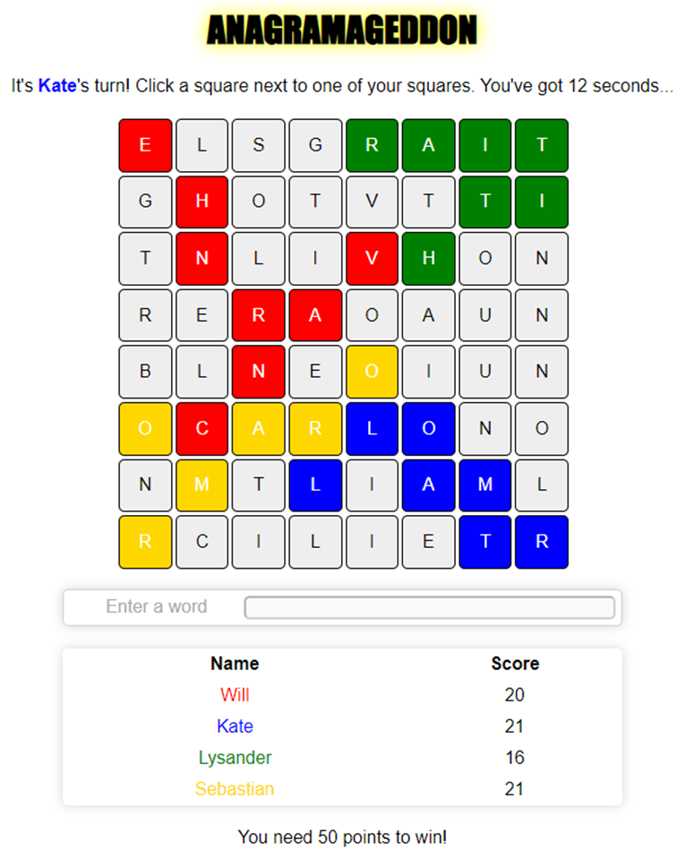
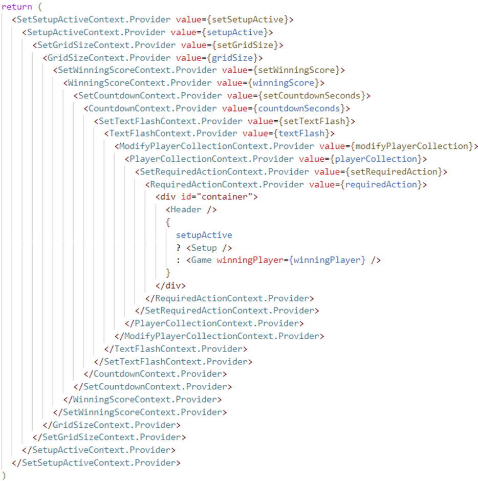

_Update: Anagramageddon is no more! It has grown into [Gramlet](https://gramlet.co.uk), so the play links below no longer work._

I’ve created a new word game called **Anagramageddon**, played on a single computer by between two and four players. In a nutshell it involves users taking it in turns to (A) select a letter and (B) enter a word that can be formed from all of their letters. It’s a competitive game, and the time limit adds an element of excitement (read: stress!), especially once you acquire a solid bank of letters to create anagrams from. You can also steal letters from your opponents, which enhances the strategic aspect of the game: do you go all out and attack your opponent’s territory, at the expense of more promising letters, or do you hunker down in your corner of the board and focus purely on word-finding?

The game looks like this:

You can play it here: [https://wjrm500.github.io/AnagramageddonBrowser/](https://wjrm500.github.io/AnagramageddonBrowser/)

Some rules to bear in mind:

-   You can only select a letter adjacent to a letter you already own
-   You can only enter words that can be formed by the letters you have already selected
-   You cannot enter the same word twice
-   Guessing an incorrect word (i.e., the word either doesn’t exist, cannot be formed with your letters, or has already been used) incurs a five-second penalty
-   If you reach the winning score before any of your opponents, but one of your opponents has a turn “in hand” and has enough letters to match or beat your score, the winner will only be decided once that opponent has also taken their turn. In the unlikely event that the opponent matches your score, turns will continue to be taken until one player ends the round on a higher score than the other

I designed this a few months ago as a vanilla JavaScript app, and recently refactored it into a React app, adding new functionality in the process (configurable game settings with custom player names, and support for more than two players).

The original app source code can be found here… [https://github.com/wjrm500/WordGame](https://github.com/wjrm500/WordGame)

… while the React source code can be found here: [https://github.com/wjrm500/Anagramageddon-frontend](https://github.com/wjrm500/Anagramageddon-frontend)

Although the original app consisted of a few JavaScript files, the majority of the logic was dumped in one, unwieldy, 200-line script, which appears something of an abomination in hindsight. It wasn’t my finest work, but was probably a fair reflection of my JavaScript prowess at the time. Over the following months, I learnt more about JavaScript frameworks through the medium of React, and so eventually decided to take up the challenge of rebuilding Anagramageddon from scratch, using React. This proved a good challenge, helping me to expand upon the knowledge I gained from doing the [Wordle tracker](/2022/11/04/using-react-to-build-a-wordle-tracker "Wordle tracker"). In particular, I learnt more about the difference between functional and class components; component lifecycle; global state management, context providers and the useReducer hook; and incorporating non-React JavaScript class components into a React application. I also learnt quite a bit about Redux, and although I haven’t incorporated it into Anagramageddon yet\*, it seems like a great fit for more complex state management needs, in particular removing the need for the ridiculous-looking series of nested context providers currently seen in Container.js:

!!!

React-ifying the app has made the code much more maintainable and flexible, and future development of new features and potentially a backend should be a hell of a lot easier now.

So… play the [game](https://wjrm500.github.io/Anagramageddon-frontend/ "game"), check out the [source code](https://github.com/wjrm500/Anagramageddon-frontend "source code"), and let me know what you think!

_As a note, the dictionary API currently being used in the app can be a bit dodgy at times, so if you find a common word getting rejected, let me know and I can manually add it to the existing, supplementary bank of missing words. At some point I mean to programmatically run through a dictionary and identify all words missing from the API, but I haven’t got round to that yet_.

_\* Update on 11th December 2022: the app has now been “Redux-ified”._
