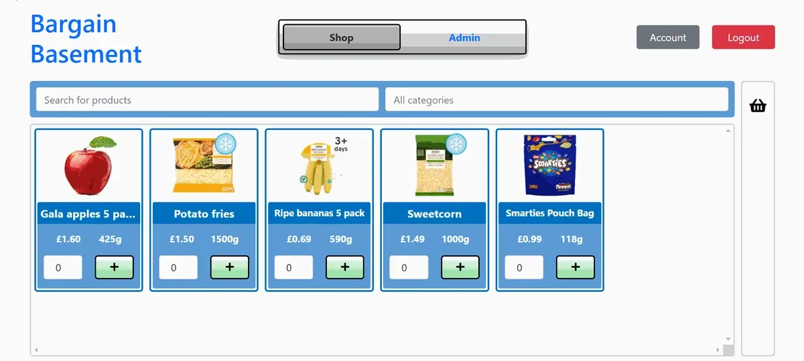
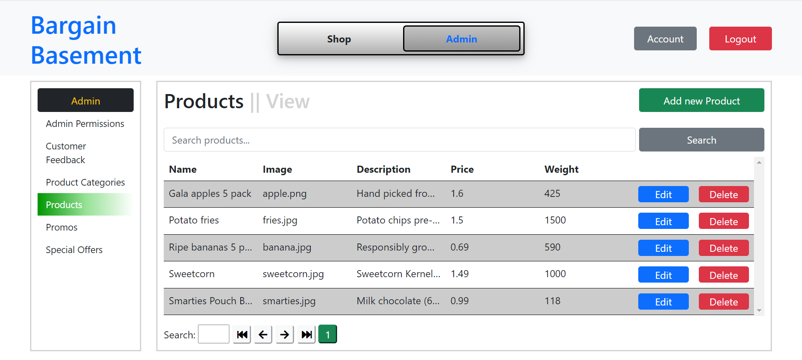

Good day, and welcome to my first ever blog post on **_Will May’s Journey to Educate Himself in Software Development_**. Today I want to discuss my most recent personal project – an e-commerce website built on top of a custom-built PHP MVC framework, complete with both a customer-facing shopping experience and a staff-facing content management system. The website is for a fake supermarket company called **Bargain Basement**.

_The_ _shopping page, viewed on a smaller screen. The search functionality is JS-based, as is pretty much everything here, giving the shopping experience something of a single-page application feel. Items can be added to or removed from the basket, with the interface updating to reflect the change. Basket data is persisted simultaneously to both browser local storage and a MySQL database, via AJAX. The basket container on the right hand side is currently maximised, but can be minimised with a click on the “-” button next to “My Basket”. The container automatically maximises when the first item is added to the basket, and automatically minimises when the last item is removed from the basket. The product grid on the left-hand side is responsive, and product widgets shift around to accommodate the horizontal movement of the basket container. Finally, both product and basket widgets can be clicked to reveal a modal containing product description and nutritional information._

For a period of around two months, I spent almost every evening working on this project: my first serious web application. I must confess that, unlike some of the projects I’ve worked on in the past, this one was not exactly a labour of love, and it was with a sigh of something like relief that I eventually laid down the virtual quill in mid-March. Why? Well, as the scale of the application grew, I got the distinct sense that my work was becoming shabbier. Shabbier not in the sense that individual lines or even blocks of code were being written poorly; rather, shabbier for the fact that I was semi-consciously neglecting the underlying skeletomuscular architecture of the application, the very ligaments and tendons that held everything together, in favour of transient gains. The scale of what I wanted to achieve with this application was never clearly defined, and there was an endless list of features to code and fixes to make; it was in this demanding context that shortcuts were taken. Shortcuts that did, in the end, lead to the relatively timely production of a fairly complete, well-featured little website; but shortcuts that simultaneously compromised its robustness and future viability.

Nevertheless, I feel a great sense of satisfaction at having created this thing, and I certainly learnt a lot in the process. First and foremost, what better way to learn how a modern MVC web application works than to code one yourself from scratch, with nary a framework in sight? I should at this point give thanks to Zura Sekhniashvili (AKA “The Codeholic”), of YouTube fame, whose free, six-hour video series _[Use PHP to Create an MVC Framework](https://www.youtube.com/watch?v=6ERdu4k62wI)_ formed the basis for this entire project. Zura’s “Laravel-lite” was a brilliantly scoped piece of work, one that managed to retain a fairly light weight despite being packed full of real-world functionality. Among the MVC concepts implemented were dependency injection, routing, separation of concerns during request handling, data validation and database abstraction, through object-relational mapping and migrations. From my perspective, as well as building on top of what Zura had done, I’m proud to say that I truly got my hands dirty with this core code as well, making substantial changes to most of the core classes, as well as coming up with some of my own architectural innovations, such as my “Layout Tree” (patent pending!) concept for arbitrarily deep nesting and hot-swapping of view files, which I might discuss in a future post.

_One of the two admin pages I ended up coding out for the staff-facing content management system (the other was “Product Categories”). New products can be added, edited or deleted. On display in this image is the result of one of the elements of this project of which I am most proud – the custom JS module I coded to handle pagination, based on sharing of data attribute values between hidden table “pages” and numbered buttons. I ended up using a lot of this pagination logic at work, although there, for scalability purposes, further integration with the backend via AJAX was required._

Things to take away for the future…

-   **Work on smaller projects** – This one was a little bit ambitious for a starter project, in hindsight. For the time being, any projects I pick up should be smaller and denser, with less emphasis on utilising existing knowledge to meticulously build out a complicated front end, and more emphasis on interfacing with new tools and techniques
-   **Have a defined endpoint** – Without one, it can be easy to lose focus and motivation. That was certainly the case here, as I found myself robotically building out feature after feature, with little light at the end of the tunnel
-   **Do something interesting** – Perhaps unsurprisingly, building a website for a supermarket that doesn’t exist turned from an amusing little diversion into a study in nihilism. In future, I should pick a project whose end product is something I’m actually excited to see

You can see my code for this project [here](https://gitlab.com/wjrm500/my-mvc). Thanks for reading, and see you next time.
