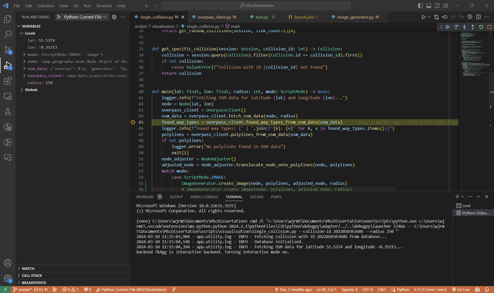
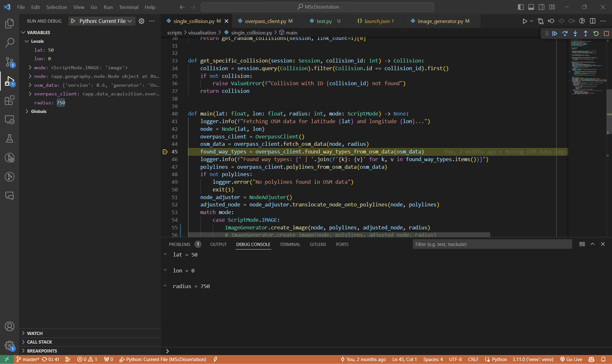

Using a debugger has been a core part of my workflow ever since I started life as a professional software developer three-and-a-half years ago. However, until very recently, I never really understood the internal mechanics of debugging, and this meant that when debugging the debugging process itself, I was often unable to reason about the cause and left to rely on trial and error. Learning about how it works was genuinely fascinating and has already helped me in the workplace, and so I’m writing this article to share that learning with the world, like the generous soul I am.

For those of you who have no idea what debugging is, I’ll give a brief explanation, from the ground up.

### What is debugging?

Software developers (a fancy term for programmers) spend a good deal of their time writing code. This code is simply text that sits in files on the developer’s computer. The text really is just that – text; it has no magical powers, and without help the computer itself has no understanding of what, for example, the following Python code means:

```python
def greet_user(name):
    """Greet the user with a personalised message."""
    greeting = f"Hello and welcome, {name}!"
    print(greeting)
```

The computer understands only machine code – zeroes and ones – and therefore for Python (or any other programming language) code to be executed by the computer, it needs to be translated into machine code, a process that is mediated by tools including compilers and interpreters. This machine code can be thought of as a long string of zeroes and ones, that the computer by default processes sequentially, left to right (jump instructions aside). Because machine code correlates strongly with the source code (the code written by developers, that sits in those text files) from which it was compiled, the execution flow of a program can be traced in the source code too. Following source code through and forming an internal conception of a program’s state and how that changes is _the_ fundamental skill of programming, and it is something programmers do in their own heads all day long.

That’s where debuggers come in. They are a tool that manifests on the screen the mental conception a developer has of a program’s state, in doing so massively reducing the cognitive burden on the developer. Debuggers allow you to run a program, pause the flow of execution on any arbitrary line of code and inspect the state of the program at that point, examining things like variable values in “real time”. Have a look at the screenshot below, taken during the execution of an application I’ve built as part of my Computer Science MSc project, to see what I mean:



As you can see, variable values are displayed on a panel on the left-hand side of the screen. Among other things, we can see that `lat` is equal to 51.5274, `node` is an instance of the class `app.geography.node.Node` and `osm_data` is a dictionary which can be expanded to see what lives within. We can even execute arbitrary lines of code in the debug console to manipulate these values:



But how does it work?

### How debuggers work

What you can see above is debugging from the point of view of the text editor / IDE, in this case VSCode – the debugging _client_. Like many other modern applications, debugging tools are based on a client-server model, with the client sending requests to the server, receiving responses and updating the user interface according to the information contained within those responses. One of the beauties of this architecture is that it doesn’t matter whether the debugging server runs on your local machine or remotely, although for the purposes of the example below we consider the local scenario for simplicity. It is through the lens of this request-response cycle between client and server that we will examine debugging in more depth, focusing specifically on Debugpy, the default Python debugger for VSCode.

Let’s say we have a Python script we want to debug in VSCode. Before we can begin debugging, we first need to install the Python extension for VSCode, which we can do by clicking on the “Extensions” button in the activity bar on the left-hand side of the screen and searching for “Python”. Installing the Python extension automatically installs the Python Debugger extension, which allows VSCode to act as a Debugpy client and spin up Debugpy server instances for the client to communicate with during debugging sessions.

#### Running the debugger

**User perspective**

Once we have the Python Debugger installed, we can click on the “Run and Debug” button in the activity bar, “Run and Debug” in the primary side bar, “Python Debugger” in the “Select debugger” modal that appears at the top of the screen, and finally “Python File” from the “Debug configuration” menu in the same modal. VSCode will then proceed to execute the program, with the output printed to the terminal as normal.

**Under the hood**

When we clicked “Python File”, a couple of different things happened in the background. Firstly, VSCode spawned a Debugpy server instance in a separate process. Secondly, VSCode sent a “Launch” request to the Debugpy server, including the path to the Python interpreter from which to spawn processes, and a list of breakpoints. Thirdly, in response to this “Launch” request, the Debugpy server instance spawned a Python interpreter process to execute the Python script. This interpreter process is where the actual execution of the Python code takes place, but with an important twist: it runs under the control of the Debugpy server, allowing the server to intercept execution at predetermined points, inspect the state of the program, and communicate this state back to the client (VSCode). This interception and control are facilitated by Debugpy’s use of the Python runtime’s debugging and introspection capabilities, such as the `sys.settrace` function, which allows Debugpy to set a trace function that will be called at various points during execution, including at the start of each line of code.

#### Adding a breakpoint

**User perspective**

We can add a breakpoint in VSCode by clicking to the left of the line number where we wish to pause execution. This action places a red dot next to the line number, visually indicating where the execution will pause.

**Under the hood**

When a breakpoint is added, the VSCode client sends a request to the Debugpy server containing the location (file and line number) of the breakpoint. The server stores this information as part of its internal state, in a location exposed to the trace function that was set using `sys.settrace` during the initial setup of the debugging session. As the trace function also has access to contextual information about the file and line number that the Python interpreter process is about to execute, it is able to check that information against the list of breakpoints; if the current line matches a breakpoint, execution is paused and control is temporarily transferred back to the Debugpy server.

#### Re-running the debugger with the breakpoint active

**User perspective**

The user re-runs the debugging session, this time with the breakpoint active. Execution proceeds as normal until the breakpoint is reached, at which point execution pauses, and the user can inspect variables, evaluate expressions, and step through the code line by line.

**Under the hood**

When the user re-runs the debugging session with an active breakpoint, the Debugpy server and Python interpreter process alike are re-initialised via VSCode, with the previously-set breakpoints sent across to the server as part of the “Launch” request. As the program executes, and the interpreter process reaches the line of code where a breakpoint is set, the Debugpy server’s trace function intercepts and halts the execution as planned. The server then notifies the client that execution has been paused, providing details about the current state of the program, including variable values, call stack, and other contextually relevant debugging information.

### Remote debugging

Remote debugging allows developers to debug applications running on a different machine or device than the one they are working on. To set up remote debugging, the remote machine must have the necessary debugging tools installed, and the application must be started in debugging mode, exposing the debugging server to external connections.

For example, when using Debugpy for Python remote debugging, you can start the application in debugging mode using the following command:

`python -m debugpy --listen 0.0.0.0:5678 --wait-for-client app.py`

This command starts the Python script `app.py` in debugging mode, with the Debugpy server listening on all network interfaces (0.0.0.0) and port 5678. The `--wait-for-client` flag ensures that the script waits for a debugging client to attach before executing.

To connect to the remote debugging server, you need to configure your local debugging client, such as VSCode, with the appropriate settings. This typically involves specifying the remote machine’s IP address and the port number (5678 in the case of Debugpy).

One crucial aspect of remote debugging is the use of path mappings in the debugging configuration. Path mappings translate file paths between the local and remote machines, ensuring that the debugging client can interpret the information it receives from the remote server and display it in the context of the local source code. This is necessary because the file paths on the remote machine may not match the paths on the local machine.

For example, in the `launch.json` “Remote Attach” configuration for VSCode, you might see something like:

`"pathMappings": [ { "localRoot": "${workspaceFolder}/my-application", "remoteRoot": "/app" } ]`

This path mapping tells the debugging client to map the local path `${workspaceFolder}/my-application` to the remote path `/app`.

### Conclusion

I hope you’ve enjoyed learning more about debugging with me today. While we’ve focused on Python and Debugpy in this article, the concepts and techniques discussed are relevant to debugging in a wide range of languages. This is because Debugpy utilises the Debug Adapter Protocol (DAP), a standardised protocol used by all VSCode debuggers for communication between the debugging client and server.

The next time you find yourself debugging, take a moment to appreciate the intricate dance between client and server that makes it all possible!
