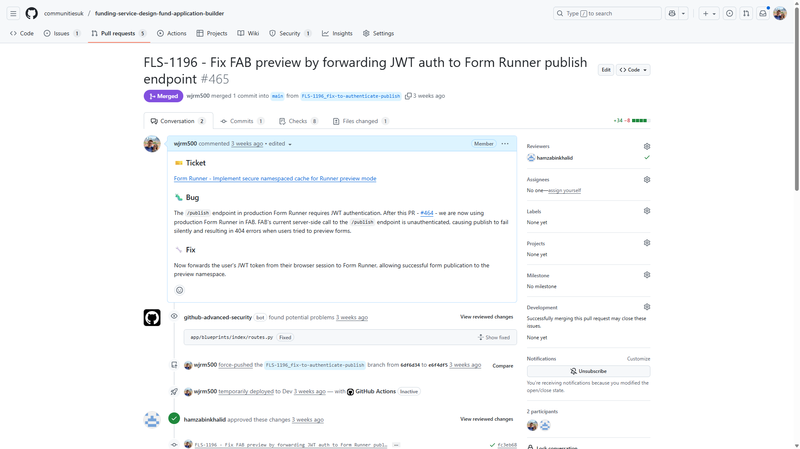
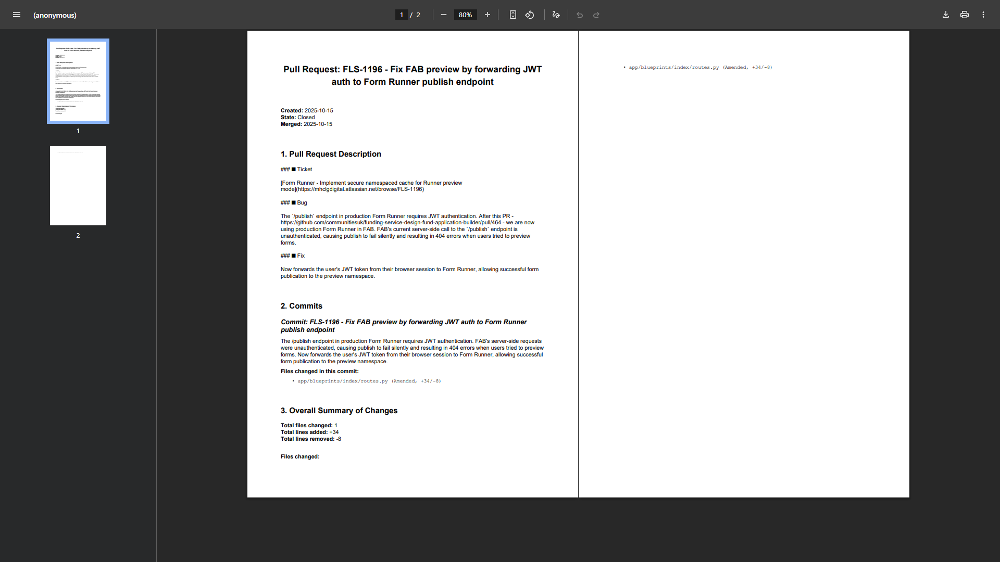
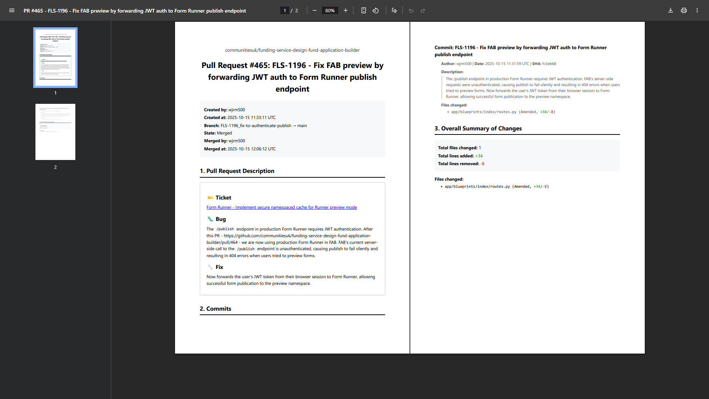

_TL;DR – find my GitHub pull request → PDF converter [here](https://github.com/wjrm500/PRtoPDF), with everything you need to get set up._

---

The other day me and countless other software developers and digital professionals across the UK Civil Service were compelled to submit a detailed self-assessment at work, as part of the [Government Digital and Data Profession Capability Framework](https://ddat-capability-framework.service.gov.uk/). This bi-annual process is not one that inspires a great deal of enthusiasm; but, as it determines how much additional [bunce](https://www.youtube.com/watch?v=O0avZZzSMhY) you receive on top of your base salary, it is certainly one that commands your full attention.

_No explanation needed_

The assessment asks you to score your capability in ten different skills, including “Development process optimisation”, “Systems design” and “User focus”. Naturally, everybody puts “Working above” for every single skill (it’d be rude not to), and it’s up to the assessors to sort the Zuckerbergs from the Zoidbergs. And what these assessors want _passionately_ is some sort of evidence that what you’re saying isn’t just hot air. A senior software developer will typically do work across a number of platforms – they might write up a technical proposal in Confluence, Google Docs or SharePoint, or neatly define a milieu of related subtasks on Jira or Trello – and a lot of these platforms provide export functionality that makes any work done reasonably straightforward to evidence. But there is one, fairly massive blind spot: GitHub pull requests.

Pull requests are where developers spend a lot of their time, and constructing a good pull request is a real act of craftsmanship, albeit one that I’ve only really come to appreciate over the past couple of years. After all, at [Twinkl](https://www.twinkl.co.uk/), where I cut my teeth as a software developer between 2020 and 2022, pull requests simply weren’t used, which seems a bit mad now. The art of the pull request is in making the reviewer’s job as easy as possible. Make the description attractive, use formatting, emojis, be concise and avoid jargon, provide business context, be clear about what’s changed and why, flag weird bits, add links, screenshots, testing instructions. Make each commit simple, easy-to-understand, preferably deployable in isolation, keep scope tight, avoid polluting with style or formatting changes, give a clear description. Rebase to avoid chaining noisy fix or amend commits that shouldn’t be merged. Fundamentally, it’s about more than just the code.

Naturally, I wanted to be able to evidence my pull requests as part of this self-assessment. But I was mildly surprised to discover that there isn’t really any tool available for converting a GitHub pull request into an exportable artifact (i.e., a PDF document) that can be neatly attached in evidence. Yes, you can go to a pull request in your browser, right click and hit “Print”, but the result doesn’t look great, misses out a load of important information, and can’t be anonymised.

So, I created a tool to create PDF documents from GitHub pull requests, and used it for my self-assessment. The version of the tool I was using at that point was just an initial prototype, but since then I’ve gone away and iterated on it, and now it’s at a point where I reckon it’s worth sharing with the world!

For a taste of what it can do, here’s a GitHub pull request:

Here’s what my early prototype (the one I used in my self-assessment) produces from that pull request:

And here’s what the current version of the tool produces:

It also offers anonymisation:

Note the redaction of the “Created by” and “Merged by” fields from the metadata section, and the commit authors from the commits section.

All of the code is public, and can be found here: [https://github.com/wjrm500/PRtoPDF](https://github.com/wjrm500/PRtoPDF). There is a detailed README that will tell you exactly what you need to do to set this up locally and start creating PDFs yourself. I was particularly keen to work in the open on this project, as (A) a lot of my other personal projects are private, and I _do_ want people to see my code, I promise, and (B) knowing that people might look at my code encourages me to do things properly.

As always, any comments or questions are welcome! In particular, if you know of any similar tools already out there that I’ve somehow completely missed, I’d be interested (read: mildly infuriated) to take a look.
