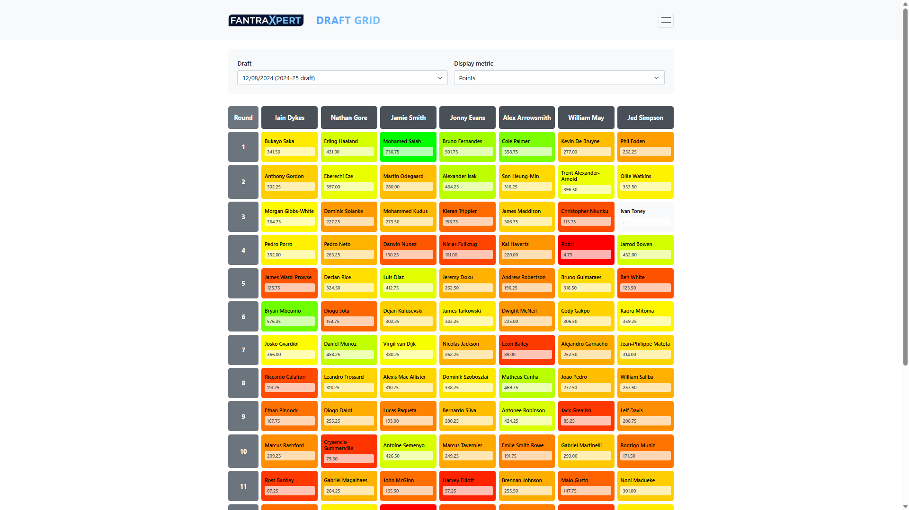
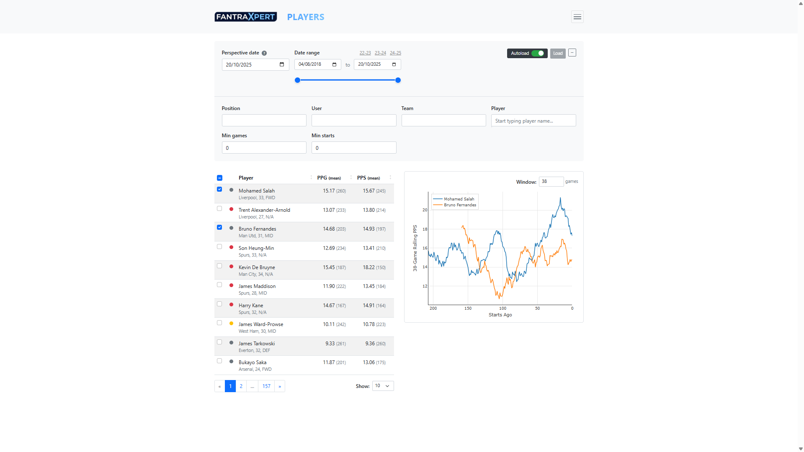
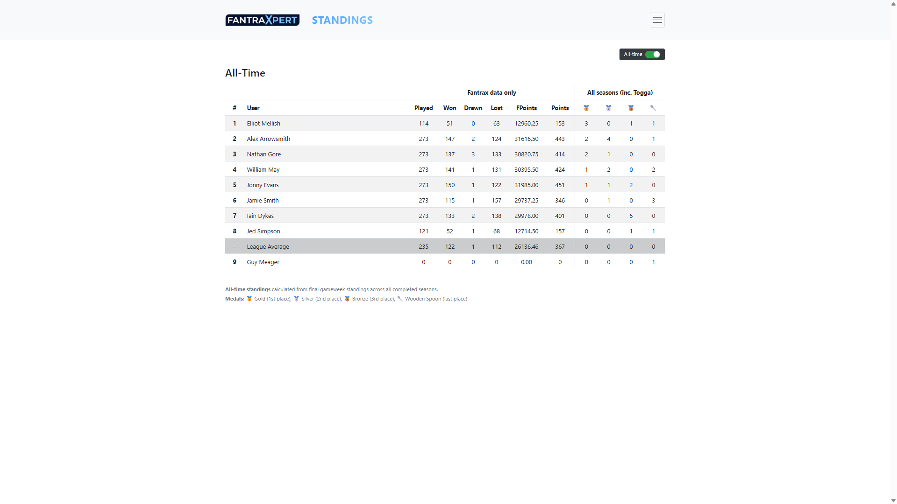
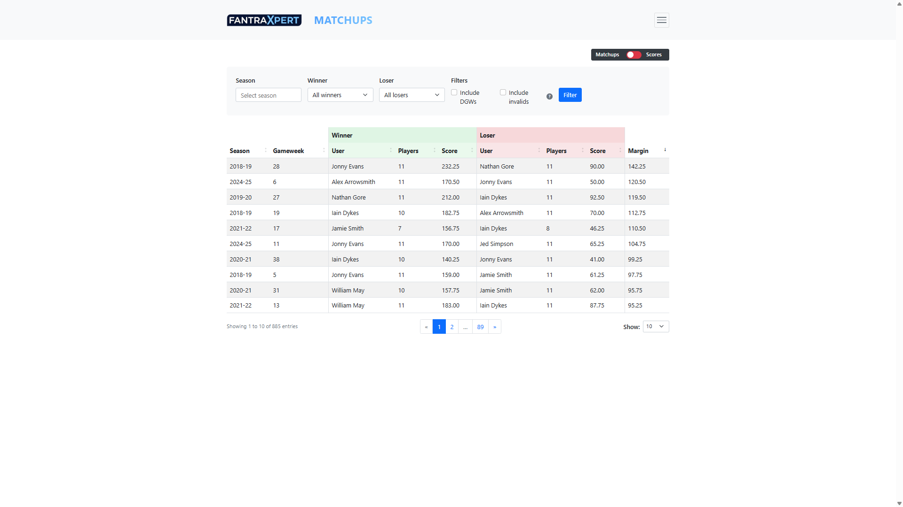
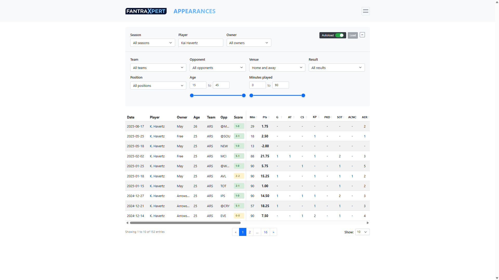
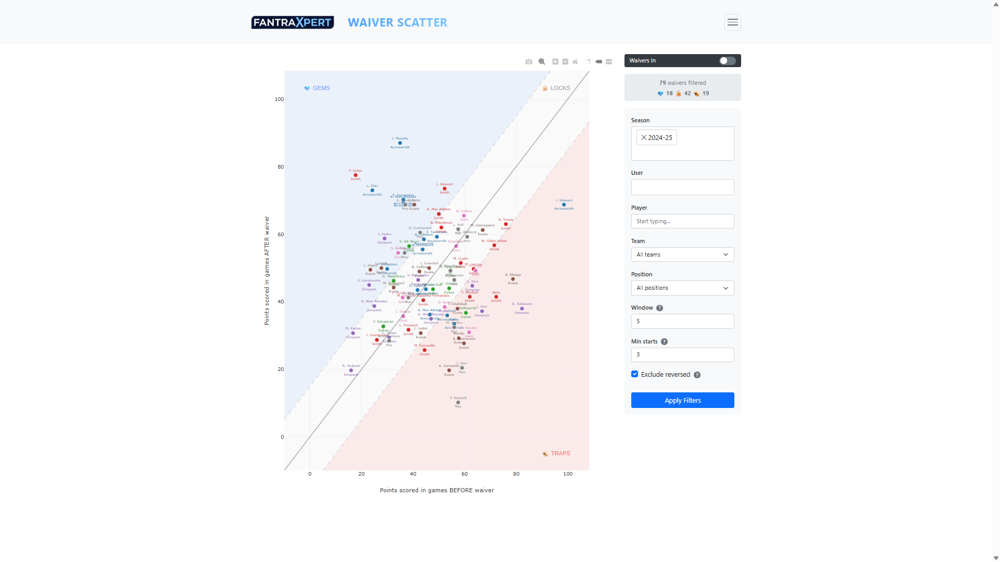
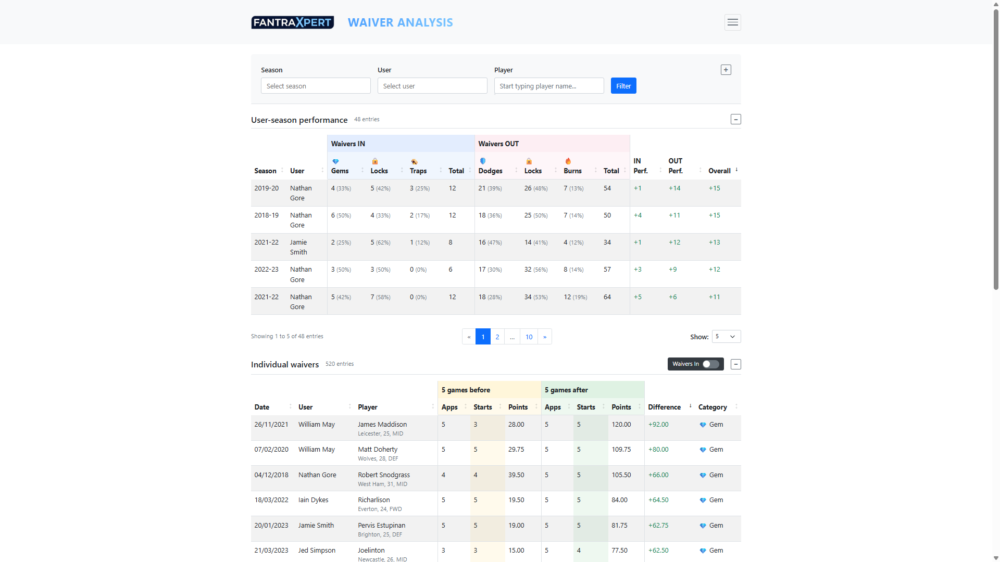
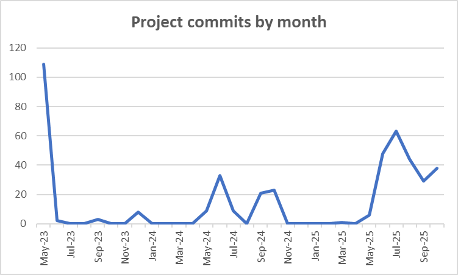
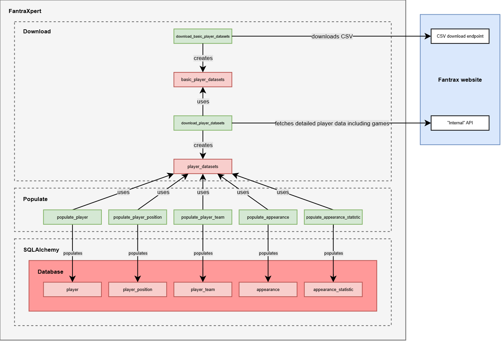
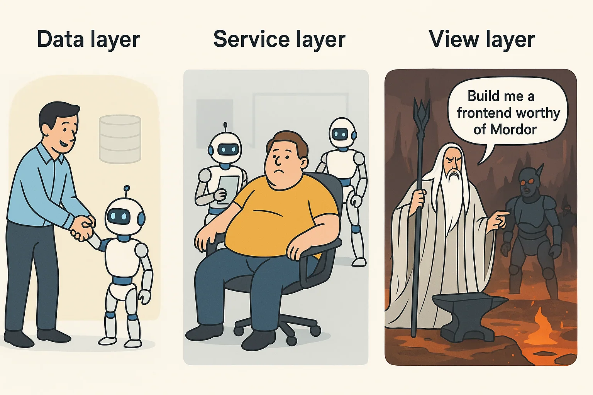

<iframe src="https://www.youtube.com/embed/2PdK6gOOlh8?start=1" title="Introducing a fantasy football dashboarding app - FantraXpert" loading="lazy" allow="accelerometer; clipboard-write; encrypted-media; gyroscope; picture-in-picture; web-share" referrerpolicy="strict-origin-when-cross-origin" allowfullscreen=""></iframe>

Me and my friends have been competing in a [draft fantasy football](https://www.premierleague.com/en/news/1245430) league since 2016. The platform we use, Fantrax, offers detailed [scoring rules](https://www.thedraftsociety.com/post/fantrax-scoring-system) that reward players for completing all sorts of on-field actions, which is one of the reasons it’s so addictive. Despite my best efforts, I’ve never been particularly good at it. I’ve won our six-to-eight man league (the size has varied over the years) once in nine years, and even then I finished on an extremely unconvincing 21 wins in 38 games, a record low for a champion. I’ve also “won” the Wooden Spoon twice, that truly wretched object awarded to the user finishing last. With _“This end in anus”_ scrawled on the bowl of the spoon, and a square of cardboard from an Alpen cereal bar multipack untidily Sellotaped to the shaft to fashion a sort-of plaque, the Wooden Spoon is not the sort of ornament that adds to a living room’s _feng shui_.

So I’ve built a shiny new app to help me be better. I’ve been developing it very much on and off for over two years, and last week I finally deployed it to the internet.

## What is it?

It’s called **FantraXpert** (name selected over FannyDash and OnlyFantrax) and it’s a data dashboard, comprising a number of different views onto data harvested from our Fantrax league. These views can be filtered by a variety of dimensions, and include bespoke visualisations and sortable, paginated tables. Below are screenshots taken from the app:

_Draft grid: A grid showing draft results. Cells are colour- coded according to a selectable metric, allowing you to visualise various measures of draft performance._

_Players: Compare players by various peformance metrics over any period of time, with interactive filtering and optional performance-over-time visualisation._

_Standings: The Fantrax league table, with season and gameweek filters. Switch to "All-time" to see The King upon his throne._

_Matchups: See the biggest margins of victory ever recorded, along with the highest and lowest individual user gameweek scores._

_Appearances: A detailed table showing individual player performances, including every single metric recorded in Fantrax (goals, assists, and of course contests succeeded)._

_Waiver scatter: Analyse waiver performance with a plot showing player performance before and after a waiver event (claim or drop)._

_Waiver analysis: Compare users' ability to make savvy waiver decisions, using a system that categorises picks into gems, locks and traps, and drops into dodges, locks and burns._

## The development story

#### Establishing the backend

As you can see from the graph above, the app began life in May 2023. After just over three weeks of furious development, I had a well-developed data model, a functional but somewhat fragile data harvesting process, and an even more fragile data pipeline for predicting the number of points a player would score in their next fixture, based on the outputs of a pair of machine learning models, one for predicting minutes played and the other for predicting points per 90 minutes. I didn’t use this pipeline regularly, mostly because it kept breaking, but I remember it once unexpectedly recommending Taiwo Awoniyi, who went on to score that week. That was very much its highpoint.

The data harvesting process that was established during that initial phase of development has not fundamentally changed since, and can be described thus:

-   Reference data is hard-coded – think seasons, users, drafts. You can pull this stuff programmatically from the website, but because the data is important and low-volume, it makes sense to simply hard-code it
-   A CSV is downloaded from the website [fixturedownload.com](https://fixturedownload.com/). Team names and fixture dates, participants and scores come from here
-   CSVs are downloaded from the Fantrax website – the CSV at the `/fxpa/downloadPlayerStats` endpoint gives high-level player data (name, age etc.), while the CSV at the `/fxpa/downloadTransactionHistory` endpoint gives waiver and trade data
-   Requests are made to Fantrax’s private API at `/fxpa/req?leagueId={league_id}` – this is an undocumented API designed to be used only by the Fantrax frontend. By inspecting network requests in the browser, it is possible to work out how to get relevant data

To download CSVs from the Fantrax website and make requests to Fantrax’s private API, authentication is always required: the Fantrax backend expects you to prove you’re a logged in member of the league for which you’re requesting data, and the league is always part of the query context for Fantrax data. We handle this authentication requirement by automating login with the browser automation tool Selenium, storing the session cookie, and passing it in any requests. Keeping up with the evolving authentication requirements of the Fantrax website has always been one of the most energy-sapping elements of the development process, but such are the perils of guerrilla API integration.

#### An architectural exorcism

The data harvest code became difficult to understand and debug. This made breakages more likely, and fixing those breakages more difficult. So in June 2024, I embarked on a mission to improve the code.

What did I do? I incorporated SQLAlchemy as an object-relational mapping (ORM) wrapper around the database, and painstakingly replaced the raw SQL that riddled the codebase with references to ORM entities; adopted a pattern whereby each code module is responsible for only one database table; and separated the download and populate components into different packages. Previously, database tables that were populated from the same data source were populated in the same code module; in the new world, data sources are constructed separately and passed into any modules that need them to populate their corresponding database table.

The shiny, new data harvesting architecture that I created is illustrated in the diagram below, created using [draw.io](https://draw.io/). Please note that the diagram focuses solely on player data; however, the same pattern is replicated throughout the data harvest process.

_Green rectangles represent code modules, while pink rectangles represent data objects_

#### Actually using the data

At this point in time, I’d collected all this lovely data, but I wasn’t really doing anything with it. With generative AI, it was possible to spin up ad-hoc Python scripts to visualise specific areas of interest pretty quickly, but any visualisations created were little more than ephemeral novelties. The project was crying out for a live data dashboard, and I duly started work on this in earnest in June of this year.

I leant heavily on AI, and specifically Claude, during the development of the dashboard. My role in the human-computer cooperative was mostly product manager and technical supervisor, but occasionally I was compelled to get more hands-on with the code to prevent things from degenerating too much. Overall though, it’s fair to say I know less about the code in this project than just about any project I’ve ever worked on. This is especially true for the frontend stuff, with Claude having created a jungle of JavaScript right under my nose, much of which I’ve barely deigned to inspect. When it comes to the frontend, my logic is that if it looks like it works, it probably works. In truth, it’s a blessing to be able to delegate that aspect of full-stack development; my affinity for UI design does not always extend as far as UI design _implementation_.

The image below visualises the nature of my cooperation with AI in developing each of the three software layers:

## Finally going live

I deployed the app to my web server – a DigitalOcean Droplet instance that costs £25 a month – using my now-standard deployment pattern. Here’s what I did:

1.  Created a Dockerfile in the application repo `FantraxAnalysis`, built the image locally and pushed it to Docker Hub. The image contains the Python application code and dependencies
2.  Created a Docker Compose configuration file `fantraxpert-docker-compose.yml` in my `ServerConfig` repo (used on my server, containing Docker Compose configurations for all my apps), that defines two services: a web service built from the custom Docker image created in step #1; and a MySQL database service
3.  Updated the symlinked `nginx.conf` file in `ServerConfig` to add a new `server` block for `fantraxpert.wjrm500.com`. This configuration routes incoming traffic on port 443 (HTTPS) to the FantraXpert container
4.  SSH-ed into my web server, pulled the latest `ServerConfig` changes, pulled the Docker image and started the service using Docker Compose

There were a couple of additional, _special_ considerations for this deployment…

Firstly, I needed to add authentication, because unfortunately FantraXpert was not designed for the masses – it was designed purely to be used by me and my friends. This isn’t because I’m being secretive, it’s simply because most of the pages in the dashboard are specifically about data that would be of zero interest to anybody outside of our Fantrax league, such as which user waivered which player on which date. It’s also because my method of harvesting the data was somewhat illicit, so it’s probably best not to draw attention to myself too much by making that data publicly accessible, or, say… writing a blog post about it. Ah.

Initially I thought about a user-based authentication system: the scheming villain in me liked the idea of tracking the actions of individuals across the app, to see if I could gain any competitive advantage that way. In the end I went with [HTTP Basic Authentication](https://en.wikipedia.org/wiki/Basic_access_authentication), less because of any moral qualms with the above, and more because user-based auth would have been quite a faff to implement, and I’d already spent far too long developing the app. Implementing Basic Auth was simply a matter of creating a file on the web server `/etc/nginx/.htpasswd` with a set of shared login credentials inside, referencing this file in the FantraXpert Nginx configuration block, and then sharing those credentials with my friends.

Secondly, I needed some way of keeping the database up-to-date. I used `cron` to schedule a database update task at 02:00 every night. This task deletes all of the existing data associated specifically with the current season and runs a fresh data harvest to re-populate it, hitting up the various external resources mentioned earlier, including of course the Fantrax website itself.

There were also a few unexpected issues after deployment. For example, the first-ever nightly data harvest worked fine for the 2018-19 and 2019-20 seasons but crashed with an out-of-memory error during processing of the 2020-21 season. It turned out that the application was pre-fetching required lookup data from all seasons, instead of filtering to the processed season, meaning the memory footprint grew with each season processed. I’d never experienced this issue locally simply because my local machine has 4x as much RAM as my web server.

Another issue was that an internal server error was triggered every morning when I first opened the dashboard, before resolving immediately on refresh. This was caused by the fact that MySQL databases automatically close unused connections after eight hours, and was fixed by enabling a setting called `pool_pre_ping` in SQLAlchemy, which ensures connections are tested before use.

Finally, I was forced to take down the broken “WhoScored” page from the live website. This page, which can be used for retrieving data from WhoScored.com and estimating the PPG of given player in any given league in any given season, works fine locally but not when deployed on a DigitalOcean Droplet instance. This is because the WhoScored.com website uses the anti-bot software Cloudflare, which is able to identify and block data centre IP addresses such as that belonging to my web server.

## Future work

As my wife constantly reminds me, I’ve already spent far too long on this thing. However, I do feel there are a few bits of unfinished business…

-   **Player points prediction** – in the very first month of developing this application I created an ML model to do this, but priorities shifted over time and we now don’t have anything similar. It’d be pretty cool if you could go to the “Players” page and see how many points each player is predicted to score in the next 1 to X games
-   **Optimal bench play** **toggle** – this would be a counterfactual filter on the “Matchups” and “Standings” pages for showing how results and even entire seasons might have panned out differently given optimal “bench play”, i.e., if on any given gameweek a user had started the 11 players in their squad who did the best that gameweek (in a valid formation)
-   **WhoScored clean sheets** – WhoScored PPG estimates currently don’t take into account points gained from clean sheets, simply because clean sheet data is not easily retrievable. We should explore ways of incorporating this, as it’s an especially important metric for defenders
-   **Failsafe data management** – the current data harvest process deletes all of the data associated with the current season before re-populating. But if re-population fails, we’ve just deleted data and not replaced it. We should implement a more robust process that can restore data if needed
-   **Limited general access** – it does seem a shame not to allow the general public to access any of the website, especially as there are certain pages – “Players” and “Appearances” specifically – that could be of interest. We would lock the bulk of the website away behind user-based authentication
-   **Code refactoring** – as mentioned, the frontend code is a bit of a jungle. It’d be good to review it properly and remove any redundant or duplicate code

For now though, I’ll be using what I’ve already created to try and help me climb the league table. I’ve named my team “This is for you Jasper ❤️” this year, mostly because the idea of me then finishing bottom causes me great amusement, but nevertheless I don’t want to let the wee lad down.

Thanks for reading, and please feel free to add comments or questions below!
