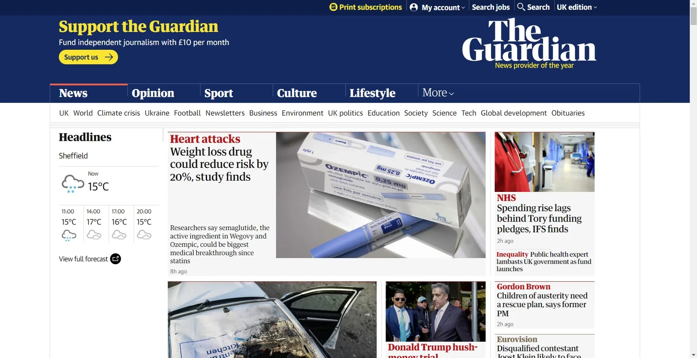
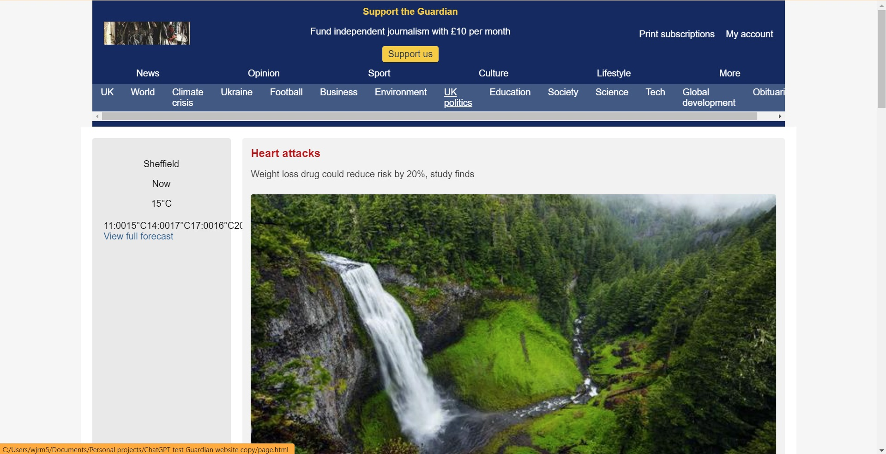
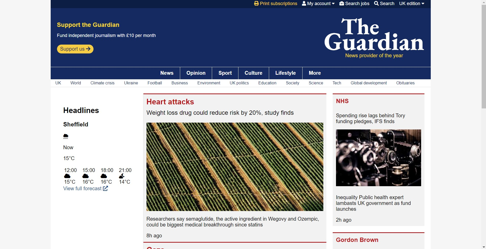

### Hype

GPT-4o is OpenAI’s latest frontier model, announced by CTO Mira Murati in a livestream yesterday at 18:00 UK time, and at first glance the new capabilities that it promises are extremely exciting. The “o” in GPT-4o stands for “omni”, a reference to the native multimodality of the new model, which was trained end-to-end on not only text but also images and audio. You might be thinking, “this isn’t new, ChatGPT could already handle image and audio data” – the difference is that previously, when you used ChatGPT’s voice mode, the following steps would happen under-the-hood:

-   Your voice audio would be transcribed into text by a model called Whisper
-   That text would be fed into the GPT model, that great, big transformer neural network that represents the seat of the application’s intelligence
-   The GPT model would output text
-   That text would be converted back into speech by a text-to-speech model

Note that three different machine learning models are involved in the process, creating a communications overhead that results in not only latency but also, much more importantly, information loss. Meanwhile if you wanted to generate an image, ChatGPT could indeed do this for you, but only through integration with the separate, text-to-image model DALL-E. GPT-4o, on the other hand, is a unified model, meaning that it processes text, images, and audio seamlessly within a single neural architecture.

In the case of audio, this means that sonic characteristics such as tone, pitch, timbre and volume, all of which can carry huge amounts of meaning, can be taken into account by the model. Why might this be useful? Imagine for example that you are in the midst of a medical emergency and your tone of voice is urgent, your cadence rapid; the model could infer that you need information delivered as clearly and as concisely as possible, and alter its response accordingly.

In the case of images, the opportunities are possibly even more intriguing. Imagine you want to create a cartoon strip consisting of a series of images, for example. With a cartoon strip, you of course require consistency between the images in terms of the way the characters, objects and backgrounds look, or it just wouldn’t make much sense. Owing to the unified, multimodal nature of GPT-4o, this can now be achieved – you can get the model to generate the first image of your cartoon strip, and then feed that image back in with instructions on how you want the scene to change for the next image. This will work because the thing that’s generating the new image can really _see_ the input image – the part of the model that generates the output (the output layer) is connected to the part of the model that receives the input through an incredibly complex network of neurons that has been tuned by machine learning. Previously, with GPT-4, completing such a task would not have been possible. This is because although GPT-4 can receive images as input, as mentioned earlier it needs to leverage a separate model DALL-E to _generate_ images, and as DALL-E is a _text_\-to-image model, this means that the image information in the system as a whole flows from input to output via a simple, textual description, leading to an even greater degree of information loss than with audio.

What we basically have here is everything Google Gemini promised to be and much, much more. It’s a staggering advancement, and one that in my opinion has not been heralded nearly enough. I have a feeling that, given its new capabilities, its speed and the fact that it will be released to non-paying as well as paying users, the release of GPT-4o will end up being the most impactful event, societally and economically, that we’ve seen in the world of AI since the release of ChatGPT itself back in 2022. Bear in mind though that with the current rate of progress, it may not be long before this mantle is passed on once again.

### Building stuff

Right, let’s step off the hype train for a moment, because although GPT-4o has already been made available to ChatGPT Plus users, it currently lacks all of the features discussed above, which are being withheld from the public while OpenAI conducts further safety testing. The model that is available right now is, however, a big improvement on GPT-4. The main reason I say that, having used it quite a bit already, is that it is absolutely _rapid_. The announcement yesterday claimed a 2x speed increase over GPT-4, but it really feels like more than that in practice. Its native multimodality also seems to have bestowed upon it an improved ability to work with images, even if it cannot yet generate them itself.

Given the new model’s speed and improved image capabilities, I thought it’d be interesting to give it a whirl by getting it to produce the HTML and CSS to recreate The Guardian’s website home page, which as of this morning looked like this:

_The Guardian home page this morning_

With GPT-4o, I was able to create the following facsimile within about five minutes:

In creating the above, only four short prompts were required:

1.  \*_Attached image of original Guardian website screenshot_\* Write the HTML for this page
2.  Provide styles.css
3.  How can I get a placeholder image?
4.  It takes ages to load now, can we use a different placeholder image service?

Then, over the course of the next 45 minutes or so, I iterated and iterated, finally ending up with this:

For transparency, the prompts I used were as follows:

1.  \*_Attached image of current iteration_\* Nice, this is what it looks like now. Compare it to the original screenshot of the actual website, work out what is different, and update the code to bring our version into line with the actual website
2.  \*_Attached images of current iteration and original Guardian website screenshot_\* Okay let’s try again as it’s still not right. I’ve attached images of our version and then I’ve re-attached the actual Guardian website as well. As you can see, there are a bunch of differences, including missing dark blue nav bar right at the top of the page, no Guardian logo on right hand side of header, incorrect nav styling below header, ugly and poorly-formatted weather table on left-hand side of main page, and incorrect layout of articles (on actual website, we have a column of articles to the right of the main column). Rewrite the code
3.  \*_Attached image of current iteration_\* Getting better but still not there. Note how the secondary nav bar below the header isn’t styled properly (in our version it has identical styling to the primary nav bar just above it, whereas on the actual Guardian website the secondary nav bar has smaller font and white background), while there is still no secondary article column in the main section in our version
4.  \*_Attached image of current iteration_\* Again better, but STILL there is no secondary column of articles, I think you need to rethink not just the CSS but the HTML around the main section here. Take a look at the closeup I’ve screenshotted from the Guardian website main section and notice how the NHS, Gordon Brown and Eurovision articles sit in a relatively narrow column to the right hand side of the page, while the other articles sit in a wider column to the left-hand side
5.  \*_Attached close-up images of weather section of current iteration and original Guardian website screenshot_\* Nice much better. Now let’s focus on improving the weather aside. I’ve attached a close-up of how it looks on the Guardian website, and also a close-up of how it looks in our version. Make our version look like the proper version. You can use FontAwesome or something for the icons
6.  \*_Attached images of current iteration and original Guardian website screenshot_\* Looking better and better all the time! I’ve re-uploaded the Guardian website screenshot and also the latest screenshot from our version. Update the code in our version to bring it even closer to the real thing
7.  Okay I will point out some differences to help you improve it. Make these adjustments and make sure everything continues to cohere:
    -   Topmost nav bar should be ordered – Print subscriptions – My account – Search jobs – Search – UK edition
    -   Icons should be used for print subscriptions, my account and search
    -   My account and UK edition should have small downwards pointing arrow to the right indicating dropdown
    -   Print subscriptions text should be in yellow
    -   Support the Guardian text needs to be bigger and slightly brighter yellow
    -   Support us button needs to include an arrow icon and button needs to be more curved
    -   Replace The Guardian image with large white text saying “The Guardian” in the relevant font, with “News provider of the year” much smaller in yellow font right underneath
    -   Main nav bar (with News, Opinion, Sport etc.) should have thin white line above it, and buttons should be separated by thin white line. No thin white line on bottom though
    -   Sub nav bar should have no text wrapping and smaller font
    -   In weather aside, the “Now” bit should include a large icon of rainy cloud, and the forecasts for later should be positioned side-by-side in a table, with icons at the bottom
    -   Better padding / spacing between weather aside and main section with articles
    -   All articles should be in boxes styled with grey background and thin red line just at the top border
    -   For main articles (in main article column), image should be on right hand side of article box, with left hand side consisting of headline in red, subtitle in larger font (e.g., “Weight loss drug…”) and then further description in smaller font (e.g., “Researchers say…”)
8.  \*_Attached close-up image of weather section of original Guardian website screenshot_\* Looking better, but a couple of changes still required:
    -   No grey background needed for weather aside
    -   No curved corners on article boxes, should be right-angled
    -   Weather forecast elements need to be put side-by-side, I’ve attached a screenshot of what the weather aside should look like
9.  The weather forecast stuff still isn’t right, reconsider both the HTML and the CSS
10.  \*_Attached close-up images of weather section of current iteration and original Guardian website screenshot_\* Still incorrect. I have again attached screenshots of our version of the weather aside, and then the Guardian website version. Note how in the Guardian website version, we have a large cloud icon for now, the temperature to the right of the icon, and then for the future time forecasts, we have them positioned SIDE BY SIDE in a table, not stacked. Rewrite the code accordingly to bring ours into line
11.  Next change I’d like to see is for the header and the main section to be the same width – currently the main section extends slightly beyond the header on both sides
12.  \*_Attached close-up image of The Guardian’s logo_\* Try to recreate the Guardian logo a bit more accurately, I have attached it for reference. Find a similar free font that can be used, have the “The” above the “Guardian”, make the yellow text relatively smaller and move it closer underneath the words “The Guardian” etc.
13.  \*_Attached close-up image of the attempt at The Guardian’s logo in our current iteration_\* This is what our version looks like now, you can see it still isn’t right, with the “The” being far too high up and rightward. Fix the HTML and CSS, but DO NOT PRINT ALL HTML and CSS again, only print out the bit that I need to change
14.  The word “The” should be more to the right, see the actual Guardian logo I sent across earlier, while the yellow text underneath should be centre-aligned relatively to the “Guardian”
15.  \*_Attached close-up images of the attempt at The Guardian’s logo in our current iteration and The Guardian’s logo of the original Guardian website screenshot_\* Nope, you’ve moved the “The” way out of position now, to the top right. We don’t want that. See attached images. Fix the CSS
16.  \*_Attached close-up image of the attempt at The Guardian’s logo in our current iteration_\* The “The” is still way too high and far to the right, see image. It needs to be sat just on top of the word “Guardian”, centre-left

I had to manually intervene with the CSS itself right at the end to get the alignment right in our makeshift The Guardian logo, but other than that, absolutely no technical knowledge was required whatsoever, which is probably fortunate given my ongoing exile from the world of web development.

### Conclusion

I was personally very impressed with the results I got this morning and the speed at which I was able to achieve them, and am convinced that if I’d tried to do the same thing with GPT-4, I’d have lost my mind and given up pretty early on in the process. I’d be interested to hear what you think about this little test of the new model’s capabilities, and whether you’ve already had the chance to try anything cool with GPT-4o yourself.

AI-powered technology really is getting more and more interesting with every passing month, and I for one can’t wait to get my hands on the fully-featured version of GPT-4o in the coming weeks, and then of course to see what’s coming next. But OpenAI, for the love of God stop making your models sound like Scarlett Johansson – it’s no doubt going to prove a rather unnecessary distraction when you’re knee-deep in merge conflicts on a Friday afternoon!
