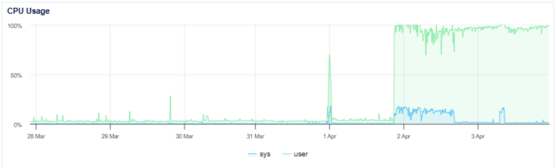
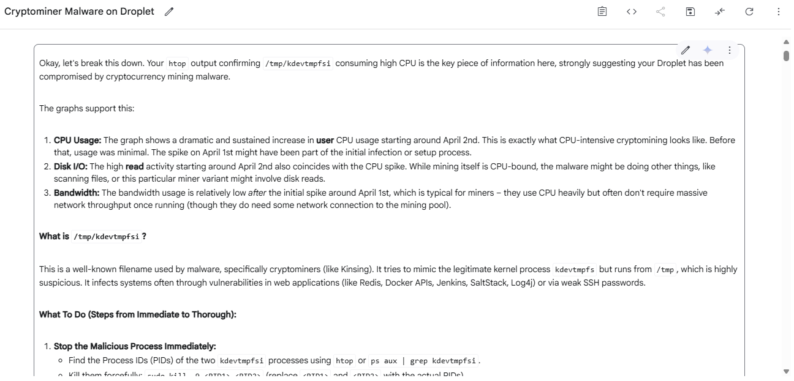

I was surprised the other day to learn that my web server was under attack.

I was remoted in to the DigitalOcean Droplet instance where my web server is hosted (I moved off of AWS a few months ago), when I noticed that system load was unusually high. Investigating further, I checked out CPU usage in the DigitalOcean Droplet dashboard and noticed it was at nearly 100% and had been for well over a day:

At this point, as I so often do these days, I turned to AI for assistance, and specifically Google’s latest model Gemini 2.5 Pro in AI Studio, which at the time was state-of-the-art (arguably OpenAI’s o3 is now – things change quickly!). Gemini told me to run `htop`, so I did, and `htop` revealed that the two processes consuming the most resources were both `/tmp/kdevtmpfsi`. I faithfully reported this information back to Gemini, and was slightly stunned when it responded with this:

“Your Droplet has been compromised by cryptocurrency mining malware.” _What?!_

After half-an-hour or so of frantic back-and-forth with Gemini, the problem became clear: my newly-deployed Streetscape app (read all about that [here](/2025/04/19/behold-its-the-road-network-visualisation-tool-youve-been-waiting-for)) was backed by a PostgreSQL database containing OpenStreetMap (OSM) data, and that database was (A) accessible over the public internet due to the internal Docker container port being mapped to the host machine, and (B) “secured” with the default password “postgres”. This meant that an attacker scanning the internet for common database ports found my Droplet, was able to successfully log in using common default credentials, and once inside the database was able to download and execute crypto mining malware. Here’s an AI-generated cartoon to help you visualise my stupidity:

I want to dig into point (A) a bit further – “the database was accessible over the public internet due to the internal Docker container port being mapped to the host machine”. What does this actually mean?

By default, services running in Docker containers are isolated from the host machine’s network. For example, if you are running a Flask app on its default port 5000 within a Docker container with no port mapping, that app will not be available at `localhost:5000` on your host machine, and it will not be possible to make the app accessible to the public internet. Obviously the latter is a pretty existential problem if you want to use Docker in production. As a core part of its functionality therefore, Docker allows you to map ports in your containers to ports on your local machine. This means that network traffic directed to a specified port on the host machine is forwarded to the corresponding port within the container. The way that a Docker user specifies this port mapping depends on the tool they are using to run Docker containers – in the case of the Docker CLI, ports are mapped by passing the `-p` flag in a `docker run` command (i.e., `docker run -p {host_port}:{container_port} {image_name}`); in the case of Docker Compose, ports are mapped by including the `ports` directive for a service in your configuration file (typically docker-compose.yml).

Although databases like PostgreSQL are typically built on a client-server architecture and served over a particular port (5432 in the case of PostgreSQL), as backend services they don’t _need_ to have their port mapped to the host machine to serve their primary function, because services can communicate over the internal Docker network by default. In my Streetscape docker-compose.yml file however, the PostgreSQL database was configured with the port mapping `5432:5432`, _for no good reason_.

Both the unnecessary port exposure and the use of a hard-coded, default password in a production setting were schoolboy errors, to put it mildly. So how did they happen? Am I an imbecile? Well… maybe. My coding workflow these days is fast and loose, powered by AI; the problematic Docker Compose configuration was probably spat out by a large language model and copied and pasted by me without a second thought. This isn’t unusual for me – a fair portion of the code I “write” now is AI-generated, in some form or another – whether it’s code I’ve copied and pasted from a tool like ChatGPT, Claude or Gemini, or whether it’s code inserted directly into my text editor of choice, VSCode, by GitHub Copilot. And in fact, it’s not unusual in the wider developer community either – according to the [2024 Stack Overflow Developer Survey](https://survey.stackoverflow.co/2024/ai), “76% of all respondents are using or are planning to use AI tools in their development process this year”. Of course, when using AI in a professional context, I manually validate generated code before submitting it for review; but in the context of personal projects such as Streetscape where the stakes are lower, such restraint is nonessential.

AI is an intoxicating accelerant, and applying forensic validation to everything it produces is a process whose returns naturally diminish as it spits out more and more code, of greater and greater quality. So you end up being carried along in a vortex of code, occasionally anchoring yourself through knowledge or intuition, but more often than not simply ceding control to the machine. Some people call this process _vibe coding_, although vibe coding in its purest form implies a layman steward and _near-total_ cessation of control. While quality remains imperfect, there is an imperative for humans to remain bound at least in some capacity to the code that powers applications. But the relative burden of having a human in the loop at the code level increases as AI systems improve; the human becomes a deadweight, a bureaucracy in microcosm.

Will humans ever be untethered from the code completely? Well, in that code is simply a means of precisely specifying ideas, for as long as ideas _need_ to be precisely specified, humans will remain tethered. Consider the fact that Python has existed since 1991, and yet people still use C++; fundamentally, it’s because certain ideas need to be expressed with greater precision. One might argue that the prompting of large language models falls along the “human idea -> computational reality” continuum that mostly contains programming languages, a sort of super-high level programming language. In this strict sense, contexts where human tethering is necessary may continue to exist. My take? While large language models (LLMs) can be thought to exist within this continuum, the technology that increasingly wraps LLMs operates above it. Agentic systems swimming in domain-specific context can be idea progenitors, not just conduits. Agency (see [reasoning models](https://en.wikipedia.org/wiki/Reasoning_language_model), [deep research](https://leonfurze.com/2025/02/15/hands-on-with-deep-research/), [Claude Code](https://docs.anthropic.com/en/docs/agents-and-tools/claude-code/overview), [OpenAI’s Codex CLI](https://help.openai.com/en/articles/11096431-openai-codex-cli-getting-started)) and context (see [LLM context windows](https://research.ibm.com/blog/larger-context-window), [Model Context Protocol](https://github.com/modelcontextprotocol) and integrations like [Claude’s integration with GitHub](https://support.anthropic.com/en/articles/10167454-using-the-github-integration)) are at the frontier of AI system development in 2025, and we’re witnessing huge strides forward on both fronts on a monthly basis. The more a system can be trusted to meet real-world needs, the less precisely ideas need to be specified, and the more the pool of human-tethered contexts dries up. This is precisely what we’re seeing currently in the developer job market, as [demand for coders dwindles](https://www.nfer.ac.uk/press-releases/decline-in-uk-tech-job-adverts-threatens-young-talent-pipeline/). So yes, humans will eventually be untethered from the code, and probably sooner than most developers are willing to admit.

This whole affair with the crypto mining did leave me feeling slightly deadened. Having a robot tell you that your server was hacked because you pointlessly exposed your database to the public internet, secured only by a password that so happens to be the name of the database, is genuinely humbling. It’s like, oh shit, I’m not really in control anymore, am I? I’ve been an AI evangelist and an early adopter of new AI tools ever since ChatGPT burst onto the scene, and that won’t stop now. The productivity benefits of AI are irresistible; it is simply illogical not to use it. But as software development as we’ve known it continues to disappear in the rearview mirror, I am increasingly questioning my own self-worth. I’ve invested a lot in my professional development over these past few years, and I’ve tied it to my personal development, and now everything I’ve learnt is being eclipsed.

I like to remind myself that I built a bunch of cool stuff in the two-year period between August 2020, when I became a Web Developer with Twinkl, and December 2022, when I started using LLMs in earnest. Sure, I made liberal use of Google and copy and paste even back then, but it was all kosher. Since ChatGPT, it’s difficult sometimes not to look at my work as somehow tainted. That isn’t to say I don’t still feel a sense of ownership and pride over the things I’ve created with varying levels of help from AI in the past two-and-a-half years – it’s just not that same, warm sense of self-satisfaction, that feeling of “I can’t believe _I_ did this”.

My plan, moving forwards:

-   Leverage the power of AI to do cool things
-   Be completely transparent about my use of AI, both in my personal and professional life
-   Keep certain things completely AI-free, including the text content of articles in this blog
-   Build a “knowledge buffer” to protect myself from the sharp end of business decisions down the road – all jobs will be swept away by AI, but the knowledgeable will survive the longest
-   Do not fear the machine: AI wasn’t built to ruin the lives of software developers – it’s just that we live in the digital age, and software is ground zero. As AI grows more agentic, it rips upwards through the layers of abstraction pretty quickly
-   Think about real-world applications. If AI really is as powerful as I purport, then why not use it to make something that helps people 👼 or makes a bunch of money 😈?
-   Remember that AI can be a force for immense good. The world right now is a pretty crap place for a lot of its inhabitant humans and animals, and the outputs of superintelligence could improve billions of lives in ways we can’t even fathom now

This article’s taken a few twists and turns hasn’t it! We’ve gone from a crypto mining malware attack to my personal coping strategy, via philosophical pontificating on the nature of code. It’s not exactly well-structured stuff, so sorry about that – but I hope you got _something_ from my ramblings.
