Over the past month and a half I’ve spent my personal project time almost exclusively on what I’ve dubbed the “Soccer Simulation” project, which in a sentence could be summarised as “building out a Flask front end for a football league simulation I built using Python last year”. A true labour of love, this piece of work is a bit of a leviathan whose scope has only increased further and further over time as I’ve repeatedly succumbed to bouts of whimsy, becoming sidelined by numerous, unplanned intricacies – and while there’s no shame in that fact, it has significantly extended the length of my absence from the Blog-osphere, which is a tragedy indeed.

And so today I’m temporarily diverting my attention away from that project, and from Web development more generally in fact, to discuss a piece of data analysis I conducted way back in early 2020, a piece of analysis that concerned – no prizes for guessing here – football. From a didactic perspective, this project was mostly about exposing myself to the Python graph-building library [_Matplotlib_](https://matplotlib.org/), a library towards which I had oft cast covetous glances during my heyday as a purveyor of Tableau dashboards, marvelling at the notion of data visualisations generated purely from lines of code, with nary a GUI in sight. In terms of datasets, my victim of choice for this particular piece of work was provided by the good masters at Kaggle – [a comprehensive set of international football results, from 1872 to 2020](https://www.kaggle.com/martj42/international-football-results-from-1872-to-2017 "https://www.kaggle.com/martj42/international-football-results-from-1872-to-2017"). I chose this dataset because of its richness, and because of my ongoing fetish (apologies for the connotations) for football data.

So with the formalities out of the way, let’s dig into the data. And just to warn you, this does go on a bit!

One of the first trivialities I noticed was the biggest ever international win – [Australia 31-0 American Samoa](https://en.wikipedia.org/wiki/Australia_31%E2%80%930_American_Samoa) – in a match played in Australia back in 2001. Many of the biggest ever international wins (29 out of the biggest 50) involved at least one Oceanic nation, with the general absence of professionalism in that region of the world often resulting in huge chasms in skill level between opposing teams. More interestingly still, the plaudits for the biggest international win ever recorded away from home belong to North Korea, who [thrashed Guam (an overseas US territory in Oceania) 21-0](https://www.footballdatabase.eu/en/match/summary/1033240-guam-coree_du_nord) in Taipei in 2005.

Once I’d had a good browse of the data, I thought as a first point of action it might be interesting to plot the changing win ratios of national teams over time, to observe the rise and fall of nations in the context of football. And thus onto one of the first Matplotlib graphs these fevered hands ever wrought:

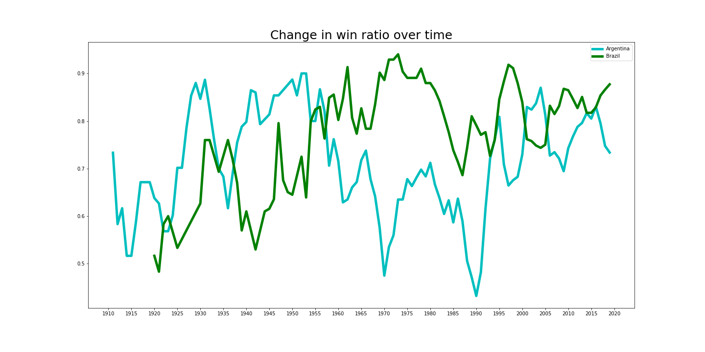
_This graph shows a five-year, rolling average of win ratio for the two big players in South America – Argentina and Brazil_

This graph suggests that although Argentina were initially the more successful of the two nations, in around 1955 Brazil wrested that mantle from their neighbours and have basically maintained superiority ever since, although things have become more evenly matched in recent years as the mythical lustre of the _Seleção_ has faded.

Next, I messed around with subplots, with the resulting figure a clear demonstration of the idea that the same data can give rise to multiple interpretations:

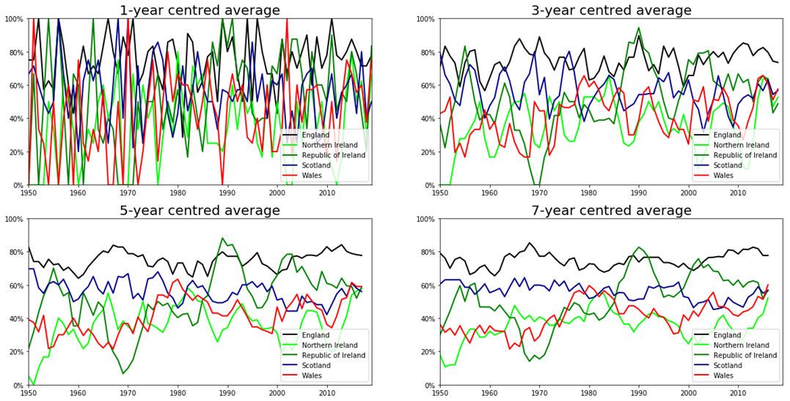

Here, focusing on the win ratios of teams from the British Isles, I plotted 1, 3, 5 and 7-year centred averages. You can see that, for the 1-year centred average (which isn’t really an average at all, as it only comprises a single year), there is a lot of noise. At various times since 1950, every single country in the British Isles has achieved the highest win ratio of the year: Wales achieved this in 1951, 1960 and 2002; and so too did minnows Northern Ireland, in 1980 and again in 1985. Each of the other three nations achieved this feat at least 10 times.

When we take a 3-year centred average we eliminate some of the random variation that comes with small group sizes, and start to observe definite trends. It is clear at this level of aggregation that England and the Republic of Ireland are the two dominant nations, although Scotland has something to say about this earlier in proceedings, topping out in 1950, 1963, 1969 and 1976.

It is when we take a 5-year centred average that we begin to see stories emerging from the data. The story, for example, of England’s overarching hegemony; the story of Scotland’s gradual decline into obscurity; the story of the Republic of Ireland’s miserable end to the 1960s; and the story of that same country’s halcyon days in the late 1980s and early 1990s.

What I find fascinating here is the fact that all of these trends are of course reflected in tales from the real world – from [Wikipedia](https://en.wikipedia.org/wiki/Republic_of_Ireland_national_football_team#1920s%E2%80%931980s), I learned that:

_“In 1969, the FAI (Football Association of Ireland) appointed Mick Meagan as the first permanent manager of the national side. His two years in charge were marked by exceptionally poor results, however with the team losing five out of six matches and gaining just one point in their 1970 World Cup qualification, and doing no better in the UEFA Euro 1972 qualifiers, leading to his dismissal.”_

And that:

_“The Republic of Ireland’s longest competitive winning streak was achieved in 1989 during the 1990 World Cup qualifying campaign. Five games against Spain, Northern Ireland, Hungary and Malta twice, were all wins. Subsequently, the side made it to the 1990 World Cup in Italy.”_

Finally, at the level of the 7-year centred average, no new information jumps out, but we do get confirmation of previous trends, and the formation of a very clear hierarchy between the teams. In order from strongest to weakest: England, Republic of Ireland, Scotland, Wales and Northern Ireland.

Of course, win ratio does not tell us everything and is arguably even a pretty poor metric. Consider for example the case of comparing Brazil’s win ratio against Australia’s. Owing to the geographic positioning of these nations, Brazil face off regularly against stout South American opposition, countries with many millions of inhabitants, for whom football is a big part of the culture; Australia’s fixture list, by contrast, is littered with Oceanic minnows. It goes without saying that it is more difficult to defeat a stronger team than a minnow; therefore a greater amount of “merit” should be apportioned for defeating stronger teams; therefore on average, a win for Australia is not nearly as meritorious as a win for Brazil. To truly make this report on the changing fortunes of nations meaningful, there must be some element of rating and weighting. And so with that reasoning in mind, the next task I assigned myself was to move beyond win ratio to create a better metric, a measure of team strength at any given point in time, based on historic results.

A key factor for me in implementing this was making sure that a weaker team beating a stronger team would receive a larger boost to their team strength metric than a stronger team beating a weaker team. My thoughts first turned to the [Elo rating system](https://en.wikipedia.org/wiki/Elo_rating_system) used to rank Chess players, because I knew that this rating system weighted team strength rating changes in a similar way.

I toyed around with the relevant equations for a fair while in Excel but unfortunately found myself unable to deduce a simple way in which their fundamental logic might be transposed onto my own problem domain. The problems I encountered included the fact that the equations I grabbed from Wikipedia give only an “expected score” for each competitor, not a coefficient change; and the fact that in a match (not a game) of chess there is always one winner and one loser – there is no possibility of a draw, unlike in football.

So frustratedly I moved on, searching for a function that could produce the coefficient change I was looking for. It then struck me that the best thing to do would be to physically draw out what I was looking for:

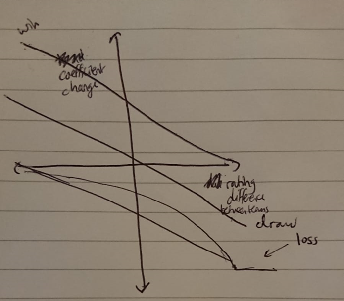
_Puts the Vitruvian Man to shame_

It was no moment of artistic genius, sure, but cracking out the ol’ pen and paper instantly helped me understand the nature of the problem a lot better. I realised that what I wanted to plot was pre-match rating (or coefficient) difference on the x-axis and post-match coefficient change on the y-axis, and that I would need three separate lines – one for each potential outcome of a football match.

Initially, the simplicity of three _straight_ lines was appealing:

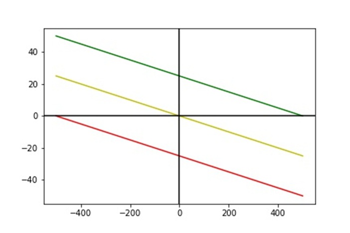

In the plot above, the lines you see are $y=-\frac{x}{20}+25$ (green, representing the win outcome), $y=-\frac{x}{20}$ (yellow, representing the draw outcome) and $y=-\frac{x}{20}-25$ (red, representing the loss outcome). The x-axis represents rating difference, and the y-axis coefficient change. As an example of how this relates to rating teams, picture the following example. Team A has a rating of 1500, and is playing a match against Team B, which has a rating of 1400. The rating difference from Team A’s perspective is 1500 – 1400 = 100. Depending on the outcome of the match, Team A’s potential coefficient change will vary, but in every case it will be the y-coordinate of a point falling on the line $x = 100$, and specifically the y-coordinate at the point where $x = 100$ intersects with one of the three “outcome” lines (green, yellow and red in the plot above):

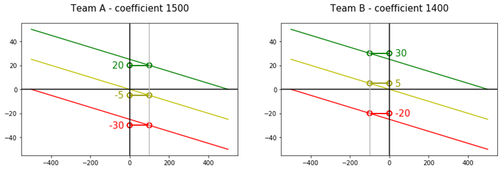

As you can see, if Team A wins, its coefficient will rise 20 points, from 1500 to 1520. If Team A draws, its coefficient will drop by 5 points, to 1495. If Team A loses, its coefficient will drop by 30 points, to 1470. The margin for gain for A is small, and this is because Team A is _expected_ to beat the nominally inferior Team B. For Team B on the other hand, the prospective bounty for victory over their superior opponents is greater, and the scope for coefficient decrease in the event of loss is small.

Fundamentally this represented a rating system that would work in the context of this dataset, because (A) coefficient change potential varies according to differences in team strength, in an analogous way to the Elo rating system, and (B) regardless of the outcome, the net coefficient gain / loss from each match will be 0, which is the simplest way to ensure we see no overall inflation or deflation in coefficients over time.

However, I was interested in designing a more nuanced system, as I believed that straight lines were unable to fully capture the underlying relationship between difference in team strength and win likelihood. I believed that the linear system would lead to a less dynamic rating system, with better teams being too generously rewarded for beating lesser teams and not punished severely enough for losing to these teams. I also liked the idea that a newcomer to the fold would be able to relatively quickly ascend to coefficient supremacy, something that did not seem likely with the linear system.

I had an idea of the curves that I wanted to see, but found myself unable to identify a function that generated the requisite y-coordinates. As such, I manually created a table of values in Excel that I knew would give me the win curve I was looking for, plotted this and added a 6-polynomial trend line based on this line, that almost perfectly fitted my data. It had the following equation:

$$
y =(6E-17) x^6-(3E-13) x^5+(2E-10) x^4-(2E-7 ) x^3+(0.0001) x^2-(0.0435)x+ 8.8779
$$

See the following graph, plotted using Microsoft Excel:

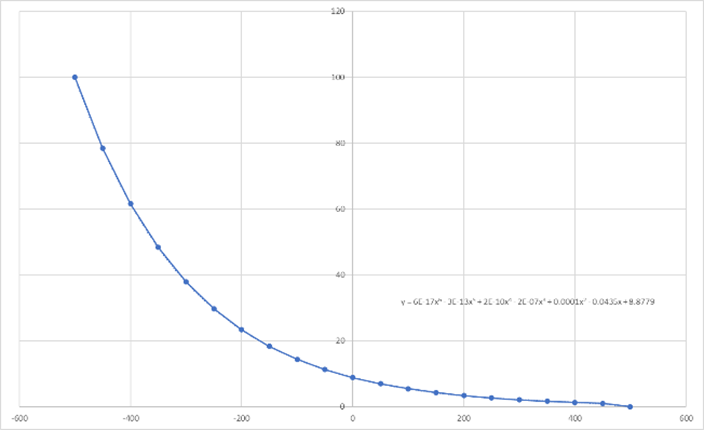

Oddly enough the same equation produced a different graph in Python, using Matplotlib:

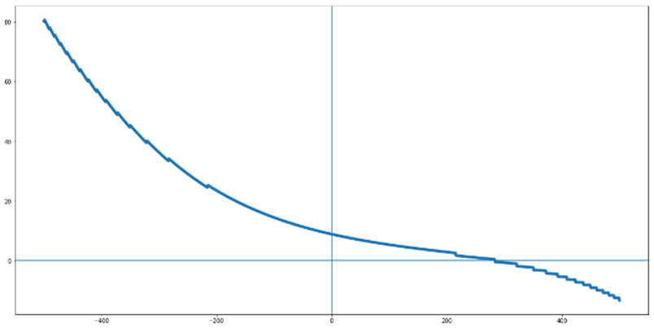

Anyway, regardless of its graphical interpretation, as you can see the curve is imperfect. I wanted the x-axis to act as an asymptote – in my mind, a team that wins a game should never be deducted coefficient points, regardless of difference in team strength. Eventually, with the help of the website [MyCurveFit](https://mycurvefit.com/ "https://mycurvefit.com/"), I was able to find an equation for a line that better suited my requirements:

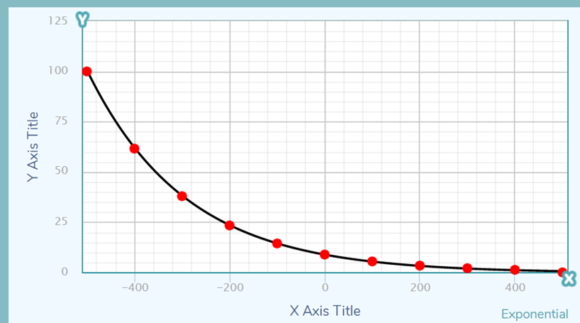

This line was generically classified by the website as “exponential with proportional rate of increase or decrease”, of the form $y=Y0-\frac{V0}{K}(1-e^{-Kx})$. The specific coefficients of this curve are $Y0=8.786934$, $V0=0.04340113$ and $K=0.004817031$, giving the equation $y=8.786934-\frac{0.04340113}{0.004817031}(1-e^{-0.004817031x})$. And of course, we must impose limits on $x$, giving us finally:

$$
y=8.786934-\frac{0.04340113}{0.004817031}(1-e^{-0.004817031x}),-500\leq x\leq 500
$$

Plotting this curve in Python, alongside its rotation by 180° about the origin, that represented the potential coefficient decrease in the event of match loss, and a straight line $y=-0.05x$, that represented the potential coefficient increase or decrease in the event of match draw:

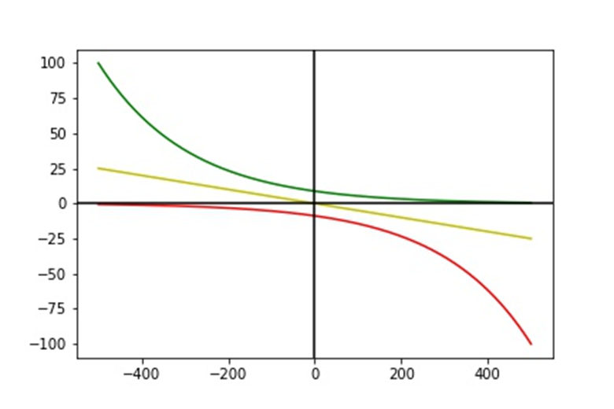

And now for an example of what this actually means in the context of a single match. Imagine this time that 1500-rated Team A are again playing 1400-rated Team B. Below, the top right plot represents the possible coefficient changes for Team A, whilst the bottom right plot represents the possible coefficient changes for Team B:

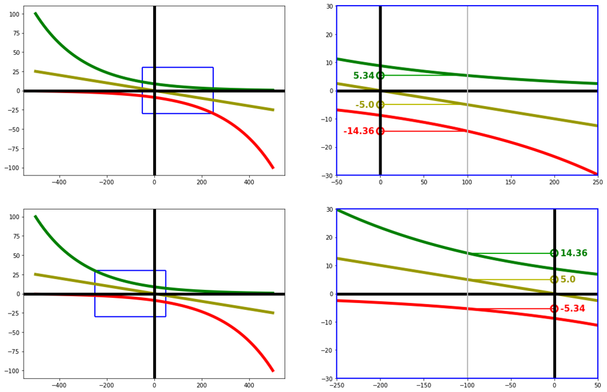

As with the linear system, the higher-rated Team A have less to gain and more to lose, with the situation reversed for the lower-rated Team B.

Anyway, it was time to actually apply this new coefficient change system to the dataset at hand, and visualise the results. I looked once more at the teams of the British Isles, and how their ratings have changed since 1950:

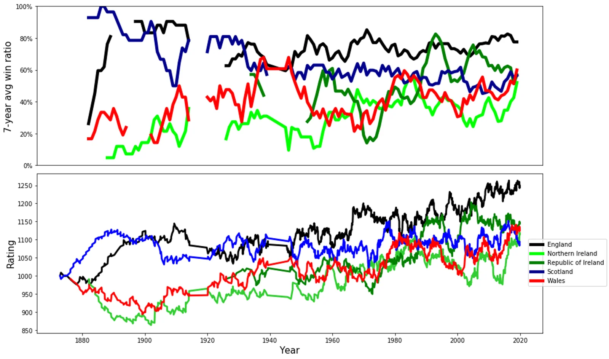

In the figure above, you can see the new coefficients plotted on the bottom, and a 7-year centred average of win ratio on the top, included here to make visual comparison more straightforward.

Firstly, we should point out that there is a very clear similarity between the win ratio plot and the new ratings plot, which is to be expected as rating points are earned by match wins. However, the added nuance provided by the rating metric helps us to reach a deeper understanding and validate our earlier discoveries. In some cases, the win ratio metric is confirmed to be an accurate measure of team strength – for example, we can see that the Irish national football team really did suffer an epic nadir in the early 1970s, a low point that has never been emulated since. We can also see that England have always been the dominant nation of the British Isles; those who saw only the win ratio metric plot may have put forth the argument that England had simply been buffering their win ratio through the defeating of minnow countries. However, contrary to what we might have suspected based purely on the win ratio metric, Ireland never really overtook England as the strongest British nation in the 1990s. And, by the looks of it, we may have underestimated the Scotland team of the late 1970s, which actually surpassed England as the number one British nation for a period of 320 days, between 28th May 1977 and 13th April 1978. Likewise, we may also have underestimated the relative strength of the England national team from the mid-1960s to the early 1970s, a period of time during which their rating far exceeded any of their neighbours.

I also plotted the coefficients that you get when you use the “linear” system for coefficient change, but didn’t include that graph here as it turned out to be surprisingly (and disappointingly) similar to the one you get from the “curved” system. Despite this apparent resultant similarity between the linear and curved systems for coefficient change, it is worth stating that on a granular, logical level, the curved rating system has the advantage of not penalising stronger teams with coefficient points deductions even when they win, something that does actually happen using the linear system. Consider the example of England’s 9-0 victory over minnows Luxembourg in 1982: with the curved rating system, this resulted in a coefficient gain for England of a modest 2 points; however, with the linear rating system, England actually suffered a loss of 7 coefficient points, which is clearly unfair, as it meant England were effectively in a lose-lose situation.

One of the issues I noticed, that will probably be clear to anybody looking at the previous figure, is that coefficients have a tendency to rise over time. To investigate this further, I graphed every single country’s coefficient progression:

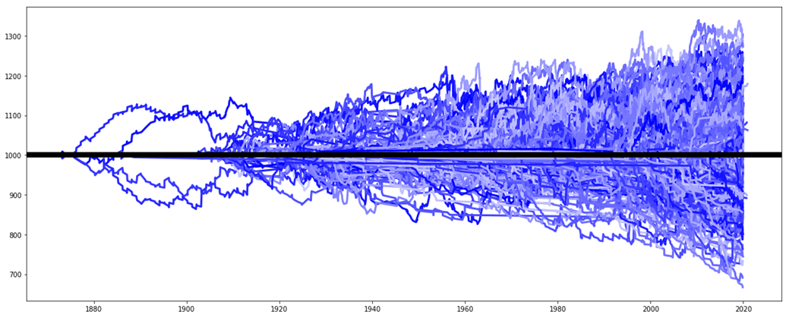

What this figure makes clear is that coefficients are not simply rising, they are _diverging_. Although this behaviour may well be an honest-to-goodness symptom of the increasing divide between the strongest nations and the weakest ones, something that may have arisen partially because of the gradual influx of weaker national teams…

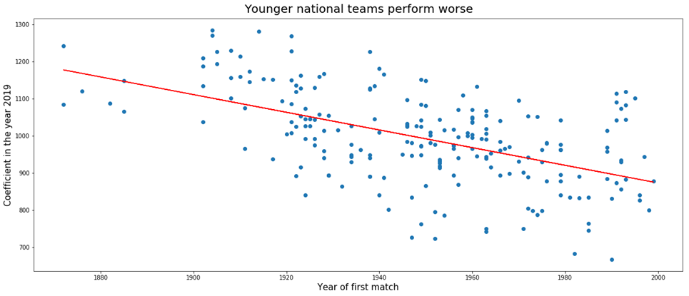
_For the above graph, national teams formed beyond the year 2000 were excluded as these national teams might not have played enough games to completely shake off their beginner coefficient of 1000._

…the divergence had the unwelcome effect of biasing coefficients towards modernity, which I felt was unfair. I therefore introduced _gravity_. Here, gravity is defined as the tendency of a coefficient to be drawn inexorably to the point 1,000, and was manifested in the code by the equation $a=\frac{(\frac{100}{b}-1)a+1000}{\frac{100}{b}}$ where $a$ is a team’s post-match, adjusted coefficient and $b$ is a parameter representing the % level of gravity one wishes to apply. The graph below shows the effect that different levels of gravity have on each international team’s coefficient over the years (left-hand side) and the overall standard deviation of all team coefficients, calculated on a yearly basis (right-hand side). Standard deviation prior to the year 1927 is faded and ignored by the trendlines, because the dearth of international games before this point makes standard deviation unreliable, as you will observe:

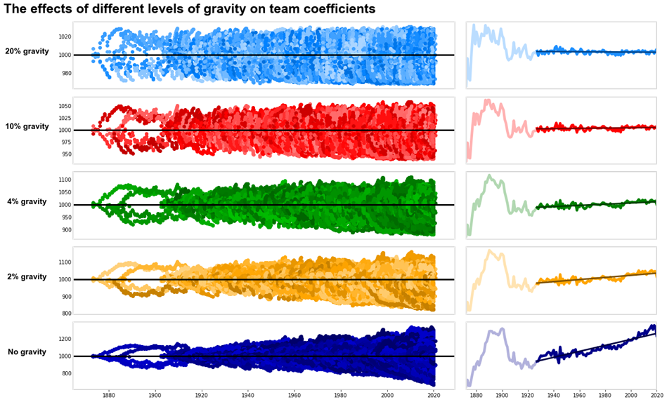

As you can see, without gravity we end up with the same divergence already observed above. You can also visualise the divergence by the sharp increase in standard deviation on the right-hand side graph. As gravity increases, the increase in standard deviation over time decreases. At a highpoint of 20% gravity, standard deviation effectively flatlines. To the casual observer, this might appear to be a great thing: there is no longer any bias towards modernity. However, when we take a closer look at how gravity affects individual teams, we see a different picture:

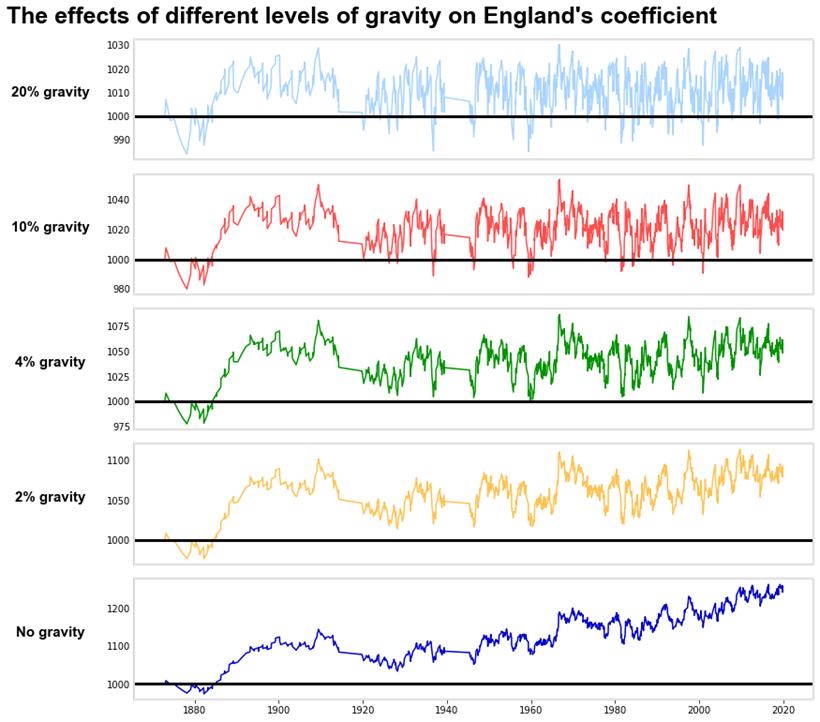

Here we can see that with 20% gravity, England’s team coefficient rises and falls in a highly stochastic manner, frequently dipping below the 1,000 marker, which by definition indicates total mediocrity. Whilst many world-weary England supporters would argue that mediocrity is a perfectly apt word for summarising their national team’s performance over the years, the reality is that the team has only ever been mediocre relative to other top footballing nations, never relative to the global pool of nations. Even at their worst, England remained a strong and competitive outfit. So, clearly 20% gravity is too high. So too is 10% gravity, and, I would argue, 4% gravity. It is only at the level of 2% gravity that we see what I would consider a more appropriate plot for a team of England’s stature. Therefore, this is the level of gravity that I originally decided on.

Of course, the only way to really decide on an appropriate level of gravity is the same way I should have ended up refining all of my parameters: seeing which combination of specific parameter values produces the optimal result prediction.

As well as gravity, there were other items of complexity I wanted to add to proceedings. Firstly, I wanted to ensure that certain matches were weighted more strongly than others. For example, a World Cup match is more important than a friendly, and I wanted this reflected. So, for simplicity, I used the following weightings:

| Tournament | Match count | Weighting |
| --- | --- | --- |
| World Cup | 900 | 3 |
| European Championship (Euros) | 286 | 2 |
| Copa América | 810 | 2 |
| Friendly | 16945 | 0.5 |
| Other | 22492 | 1 |

Applying this discriminatory weighting gives big tournament performance greater precedence, which seems fair. A famous example of a team that do particularly well in important tournaments is Germany, whilst England are often held up as an example of a team that do well in matches leading up to important tournaments, before flopping on the big stage. I wanted to put that to the test. The graph immediately below shows team coefficients without tournament weighting applied:

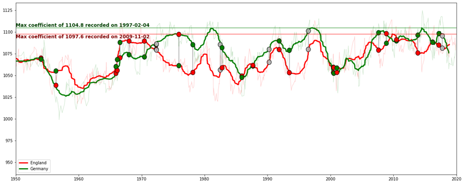
_Circles are drawn wherever a match between England and Germany took place; their colour represents the result of the match from the perspective of the team whose plot they are drawn on_

And the graph immediately below shows team coefficients with tournament weighting applied:

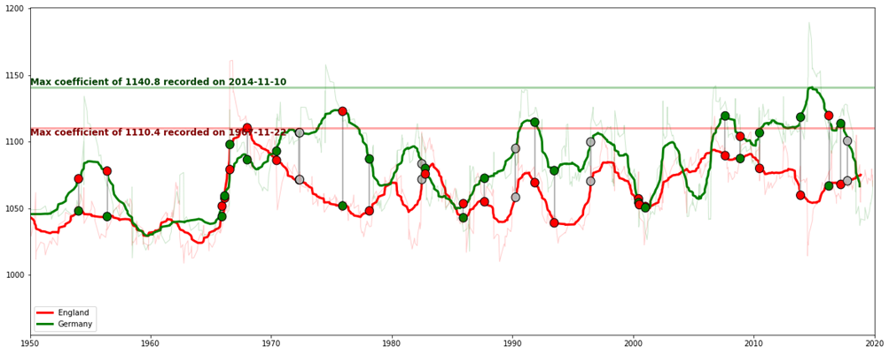

With tournament weighting applied you can see that two subjectively positive things are manifested in the visual, namely that (A) Germany’s recent superiority over England is made more evident, and (B) England’s highpoint is shifted from the 2nd November 2011 (which so happened to be the date of my fiancée’s 17th birthday) to a point far further back in time, leaving the period just after their sole World Cup victory in 1966 untouched since, something that seems reasonable.

Next, I wanted to account for win margin, such that a 5-0 victory is more greatly rewarded than a 1-0 victory, for example, and a 5-0 loss is more greatly punished than a 1-0 loss. This seemed pretty logical. For my example teams here, I chose Andorra and San Marino, as I knew San Marino had a particular proclivity for being on the end of demolition jobs, whilst Andorra represented to me a team who, whilst pretty much losing every game they play, are not quite as unprofessional as San Marino, and can maintain a degree of dignity in the face of some quite sturdy opposition, as the table below shows:

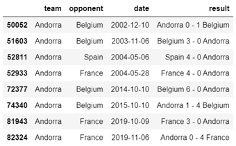

Andorra’s opponents here are drawn from a list of the five teams with the highest coefficients since the year 2000. This compares favourably to San Marino’s record against these teams:

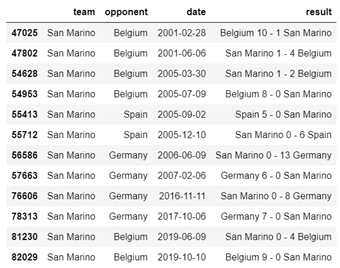

And it is now time to visualise the effect that applying win margin weighting has on these two teams’ coefficients over time. We would expect San Marino to suffer relative to Andorra here, and this is exactly what we see. Firstly, here are the coefficients with no win margin weighting:

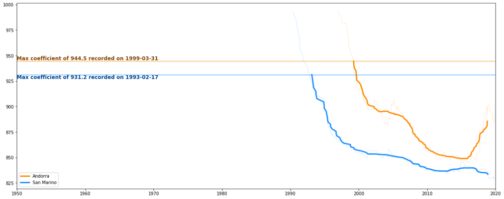

And the coefficients with win margin weighting applied:

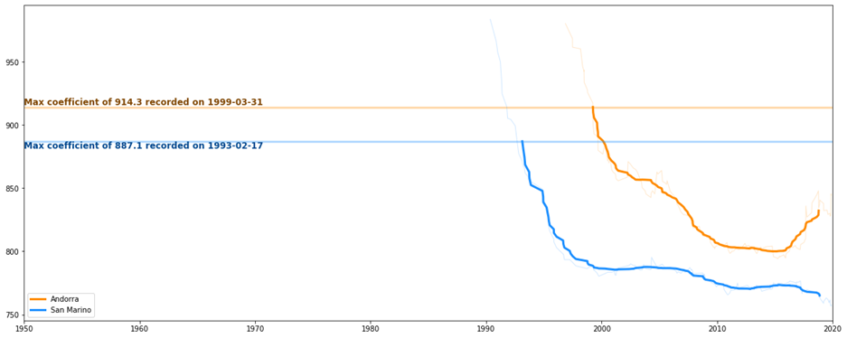

We’ve now reached the point in proceedings where, back in early 2020, I took a step back from the work, worried about the lack of a fixed end goal. The analysis could have gone on for months really, such is the richness of this dataset, and I needed to force myself to say enough is enough.

Looking back on the work now, I’m confident that I accomplished my primary goal of becoming familiar with Matplotlib. As a library, it can be a fiddly thing to work with at times – try plotting a circle on a figure with axes of different scales and you’ll see what I mean! – but it’s precisely this lack of abstraction, the fact that it forces its users to confront the practicalities of graph-building, that is its greatest strength, because it means customisability. Of course, it was also a lesson in why products such as Tableau exist – it’s certainly far simpler to make production-ready data visualisations using a piece of software like that, and the extra functionality you get out of the box saves you re-inventing the wheel or scrabbling around on Stack Overflow for a snippet of usable code. Regrets? Not really, although it would have been nice to reach a more conclusive end point, and perhaps to have seen how strong a result predictor my eventual rating system was; but I knew there was quite a bit more work that needed to be done before I was able to develop a predictive model worthy of the name, and I think that overall it was a good decision to pull the plug when I did.

If you’ve managed to get this far without glazing over and you’re not already a data analyst, you should probably become one, because I reckon only a data analyst with a thousand-yard stare could stomach this particular write-up! For the rest of you, thank you for your heroic effort in digesting all of this. If you have any comments or thoughts on the work, I would love to hear them – feel free to leave a comment on this post or pop me an email at [wjrm500@gmail.com](mailto:wjrm500@gmail.com). See you next time!
