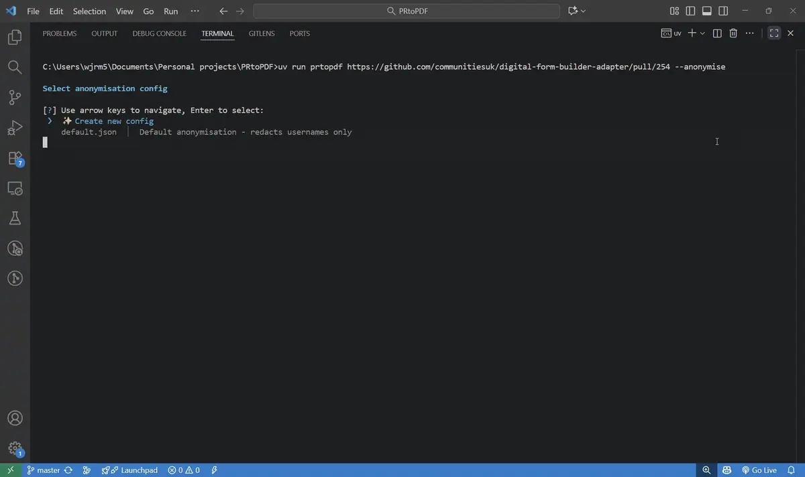
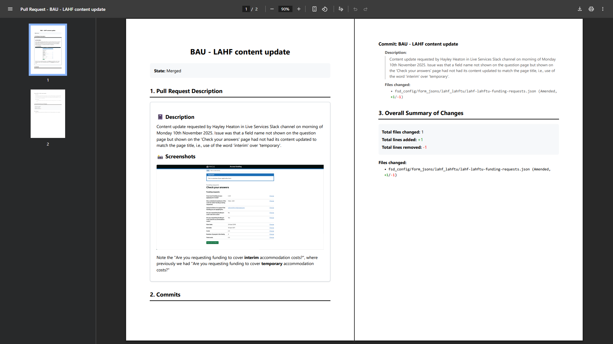
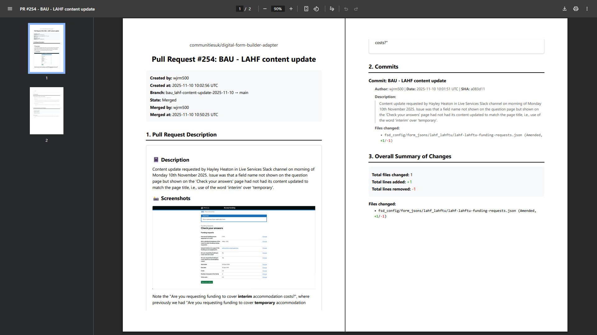
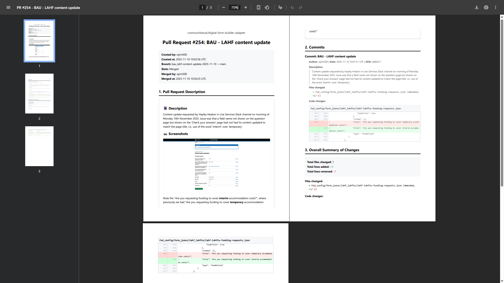

My GitHub pull request (PR) → PDF conversion tool **PRtoPDF**, first introduced in the article [Convert your GitHub pull requests to PDFs](/2025/11/07/convert-your-github-pull-requests-to-pdfs), has just received two significant upgrades.

### Anonymisation config

Firstly, PRtoPDF now supports granular configuration of anonymisation rules, to make compliance easier for users from a broader range of backgrounds and with a broader range of use cases. Where previously the program simply offered an `--anonymise` flag that redacted all GitHub usernames (PR author and merger / closer, all commit authors and committers), now the same flag triggers an interactive command-line interface that allows you to specify exactly what information you want to redact from the PDF. Existing behaviour is supported by a new `--anonymise-default` flag, which bypasses the interactive flow.

Let’s take a look at anonymisation config creation in action:

The config created above does full redaction and creates a PDF that looks like this:

For comparison, the same PR as an unredacted PDF looks like this:

The idea is that you can now redact specific pieces of information in such a way that the resultant PDF is compliant with your or your organisation’s requirements.

### Code diff visualisation

Secondly and more excitingly, you can now optionally add GitHub-style code diff visualisation to your PDFs, with options to diff code on a per-commit basis, as part of the overall summary, or both.

Here’s the above PDF with code diffs in both places (the command used was `uv run prtopdf https://github.com/communitiesuk/digital-form-builder-adapter/pull/254 --diffs-by-commit --diffs-overall`):

Code diffs can be pretty massive, so this is a strictly optional feature.

### Conclusion

Both of these features are now available in the PRtoPDF GitHub repo: [https://github.com/wjrm500/PRtoPDF](https://github.com/wjrm500/PRtoPDF)

Please follow the setup instructions in the repo README.md to get started.

As always, it’d be great to hear any feedback on these changes. See you next time!
