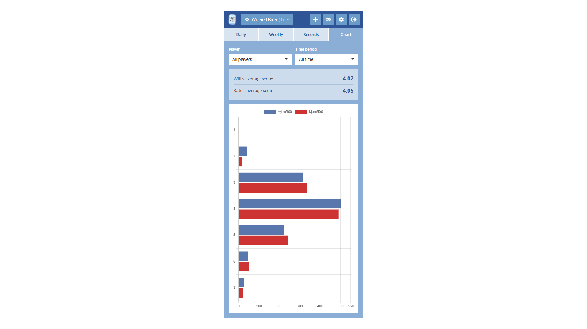

Last month was a pretty exciting one in the world of AI. Google released the long-awaited Gemini 3.0 Pro and a new agentic software development tool called Antigravity on the 18th November, and just six days later Anthropic released Claude Opus 4.5, the most capable LLM I’ve ever seen. AI fanboy that I am, I started using them in earnest almost immediately, and before long the “let’s write an article about this” neuron patterns started firing in my brain: my commercial self sensing an opportunity to tap into the _zeitgeist_. Alas, I’ve now delayed that article so long that Antigravity and Opus 4.5 are no longer the talk of the town, thanks to GPT5.2 and its [suspiciously](https://msukhareva.substack.com/p/gpt-52-and-meaningless-benchmarks) excellent benchmark scores. But as David Brent once said, _a good idea is a good idea forever_, and so here I am, baying for your attention.

I’m going to structure today’s article into an anthology of three, related sub-articles: firstly, a comparison between Google Antigravity and Claude Code on the web, two new agentic coding tools that I started using for the first time over the last month. Secondly, an homage to Anthropic’s latest, greatest model, Opus 4.5 – it really is a cut above the rest. And thirdly and finally, a bit about one of my old web apps WordleWise, that is for the first time available for public use thanks to a major restructuring powered by Opus 4.5.

### Sub-Article 1 – A Comparison Between Google Antigravity and Claude Code

**Google Antigravity**

Verdict: ★★☆☆☆ (2 out of 5)

Pros:

-   **Multi-repo workflow support**: because it works with your local filesystem, you can set up an agent in a root folder containing multiple Git repos and it can work across those, which is particularly useful for full-stack feature requests, or when looking to de-duplicate / standardise code across organisational repos
-   **Independence from GitHub**: GitHub integration is generally a very useful thing, especially when it is your main cloud Git host, but it’s also beneficial to be able to work with code that either isn’t in GitHub or is but isn’t accessible
-   **Browser automation**: Antigravity can control your browser, take screenshots and analyse these using its models’ vision capabilities. This allows it to verify stuff at a high level, and in theory supports iteration over imperfect design. In practice this felt a bit clunky, but the idea is there
-   **Artifacts**: Google really thought about how it could build developer confidence in the agent’s outputs, and one of the ways it does this is by creating two specific artifacts that bookend each and every code change: an implementation plan at the start, and a walkthrough at the end. These are highly-readable documents that tell you what the agent is going to do, and what it has done. It’s exactly the sort of thing I want to see more of in agentic coding tools
-   **Integrated planning and execution**: I like that in the same conversation you can switch from planning to execution, seamlessly. It means you can fully participate in the design process, rather than delegating to the agent after a single prompt

Cons:

-   **Software bugs**: on my Windows machine the agent was initially unable to execute any commands. After much head scratching and wasted time, I found a solution – switching the default terminal in Antigravity to PowerShell. It turned out when I imported my VSCode settings, cmd.exe was set as the default terminal, and Antigravity’s agent can’t work with cmd.exe due to a bug. See [this Reddit post](https://www.reddit.com/r/google_antigravity/comments/1p1hq5g/on_windows_cant_run_commands/) where other users report the same. There is also a [pretty major bug with the code editing tool](https://www.reddit.com/r/Bard/comments/1p3htvu/antigravity_just_deletingcorrupting_files/), whereby it randomly deletes huge chunks of code in files when trying to do a scoped edit. Obviously these sorts of issues massively impair usability
-   **Cross-contamination**: because it operates on your local filesystem, you can’t really have two agents running in parallel as they’ll potentially cross-contaminate each other, working on the same files and getting confused
-   **Over-eagerness**: I found that Antigravity has a tendency to tell you it has finished your task even when it patently hasn’t. It feels like it often prioritises speed over quality
-   **Need for manual intervention**: even with the most permissive settings, you still have to manually intervene for things like file deletion commands, which is an obvious safeguard given the access it has to your computer, but you can absolutely guarantee that the moment you leave it running at your desk to go do something else, it’ll block itself waiting for your input
-   **Lack of mobile support**: developing software on mobile is hardly a normal part of a developer’s workflow, but given that it _is_ now possible with Claude (see below), the fact you can’t do the same with Antigravity feels like a negative

**Claude Code (web version, released 20th October 2025)**

Verdict: ★★★★★ (5 out of 5)

Pros:

-   **Sandboxed environments**: it spins up an isolated environment for every conversation, giving you reproducibility and peace of mind
-   **Parallel execution**: partly enabled by the sandboxing, you can spin up multiple workers in parallel. Watching a bunch of orange splats whir round as Claude crunches its way through your work, you really feel like a king presiding over his domain
-   **Variable intelligence**: as of [4th December 2025](https://www.reddit.com/r/ClaudeAI/comments/1pdf3zx/claude_opus_45_is_now_available_in_claude_code/), you can choose between Sonnet 4.5 and Opus 4.5 depending on the complexity of the task, allowing you to save usage for simpler tasks while unleashing full-power mode for trickier stuff
-   **GitHub** **integration**: Claude Code can spin up a pull request when it’s finished, which you can review just like you would the work of another developer. It’s also fully capable with all of the usual Git commands, and can do things like rebasing to help you keep commit history tidy
-   **Mobile support**: being able to use Claude Code on mobile (not the Claude app weirdly – but [claude.ai](http://claude.ai) in the browser has a mobile-friendly interface) is a game changer for me – I can now spin up PRs lying in bed, on the bog, you name it. Not sure how healthy this practice is, mind you!
-   **Automatic repository context**: one of the sometimes painful things about developing with Claude Chat is that you have to pick and choose which files you want to add from your GitHub repo into the context window. With smaller repos you can do a Potter and take the lot (minus lockfiles and images), but with larger repos the manual selection creates constant overhead. In Claude Code, you don’t have to do this – it has access to the whole repo and can search about for whatever it needs

Cons:

-   **Strict usage limits**: usage limits are tight, especially when using Opus 4.5. And the fact that usage is shared with Claude Chat is both a blessing and a curse, the latter especially when Claude Chat is your go-to LLM. I found myself locked out of Claude Chat with days to go before usage limits reset after going a bit wild with Claude Code
-   **Limited human-AI planning**: there’s not much in the way of foreplay – it’s basically just here’s a prompt, off you go. I found myself building plans in Claude Chat and then executing them in Claude Code, which worked fine but wasn’t frictionless. It’d be cool if Claude Chat and Claude Code were integrated, so you could do all of your planning with Chat, spin up an agent when you’re ready, discuss the outputs, repeat
-   **Single repository**: you can only select one repo to work with at a time, which can be an issue if you have frontend and backend code in separate repos and a feature request that spans both

**Final verdict**

I’ve used AI software development tools pretty avidly ever since ChatGPT hit the scene in late 2022, and agents are not a new thing at this point – [GitHub Copilot agent mode](https://github.blog/news-insights/product-news/github-copilot-the-agent-awakens/) and [Claude Code](https://www.anthropic.com/news/claude-3-7-sonnet) for example were first released in February of this year. And while I’ve explored them, they’ve not become part of my day-to-day repertoire. This is mostly because GitHub Copilot always felt a bit naff, while Claude Code was hideously expensive.

Antigravity is a step in the right direction. It’s accessible, offers a variety of powerful models, and incorporates interesting features like artifacts and browser automation that help with verifiability. However, the lack of environmental isolation, the presence of some pretty serious bugs and a general inability to successfully execute complex tasks make it quite difficult to work with right now. I’m sure it’ll improve though, and I’ll definitely be keeping a close eye on it over the coming months.

On the other hand, for me and I suspect many other developers, [Claude Code on the web](https://claude.com/blog/claude-code-on-the-web) feels like a massive turning point. It’s everything [Google Jules](https://blog.google/technology/google-labs/jules-now-available/) (released August 2025), promised to be, but ultimately wasn’t. I love that I can spin up pull requests on the fly, with minimal effort. It sounds trivial, but there’s so much tech debt in the world, so many small-to-medium-sized, unrealised features, that an agentic tool like this completely unlocks. I’ve already used it to make a bunch of improvements to several of my web apps, including things like modularising route handler code in my WordleWise backend, and adding a “Next fixture” column to the “Players” table in my FantraXpert app, and I’m looking forward to doing plenty more with it, until of course I forget what code looks like completely and have an identity crisis.

### Sub-Article 2 – An Homage to Opus 4.5

I’m no stranger to shameless fawning: just take a look at [this article I wrote back in 2013](https://escapefromalcaraz.wordpress.com/2014/02/28/cold-night-at-the-britannia/) about Lionel Messi. But to do likewise over Anthropic’s new model Claude Opus 4.5 feels unsatisfactory. So instead, I’ve composed a song! I jest, I _jest_ – no, instead, I want to cut out the middleman somewhat and simply share one of the first conversations I had with Opus 4.5, that I feel really shows its power: [here’s the link](https://claude.ai/share/4677da41-95fd-40b9-be27-2ac7df3ac941). Have a read, and forgive my embarrassing prompts. You can see in the conversation how the model helped me reason through some pretty abstract software design decisions. I also loved that it generated ASCII wireframes to help me visualise its intentions for the user interface.

(Not much of a sub-article, sorry!)

### Sub-Article 3 – Bringing WordleWise to the World!

WordleWise is a Wordle score tracking application that I first developed way back in 2022 – see this article: [Using React to build a Wordle tracker](/2022/11/04/using-react-to-build-a-wordle-tracker). I developed it specifically for my wife and I to use, manually creating our accounts in the SQLite database and hard-coding references to account data in the application code. For a long time, I wanted to make it possible for other people to use the app, but the task always felt too onerous. The release of Claude Opus 4.5 changed that, and specifically the conversation with Opus 4.5 linked above was where the groundwork was laid for this change to become a reality.

WordleWise is now open to the public! Find it here: [https://wordlewise.wjrm500.com](https://wordlewise.wjrm500.com)

Here’s how it looks:

_The landing page_

_See the scores for the current week_

_See scores aggregated by week_

_See competitive and personal achievement records. An example of the former would be "Consecutive wins", and of the latter would be "Consecutive days scoring 5 or below"_

_Visualise performance with a histogram and a custom date range_

_Add your score_

_Play a past Wordle game_

I won’t try and sell WordleWise to you here – it’s not a profit-making scheme after all – but what I will say is that my wife and I have been using it to track and compare our Wordle scores every single day for over three years now, so it’s definitely sticky if nothing else!

To get started recording your scores against your family and friends…

1.  Create an account at [https://wordlewise.wjrm500.com](https://wordlewise.wjrm500.com)
2.  Create a new group by clicking the “Personal” drop-down at the top of the page, then “Create group”
3.  If on mobile, click the burger menu in the top-right and then “Group settings”; if on desktop, just click the settings button (denoted by ⚙️) directly
4.  Copy the invite code and share it with whoever

And then your invitees will need to…

1.  Create an account at [https://wordlewise.wjrm500.com](https://wordlewise.wjrm500.com)
2.  Join the group by clicking the “Personal” drop-down at the top of the page, then “Join group”, then entering the invite code

### Final thoughts

On a personal level, there’s definitely an undercurrent of sadness that comes with all of this change. The truth is that when it comes to software development, I no longer know where I start and the AI begins. Almost everything I do now is enhanced in some way by AI, to the point where I find myself reaching for it for really quite trivial stuff, creating a cycle of dependence. And I think it’s natural as a human being, and especially as a software developer, to want to avoid dependence: _dependency is bad_, that’s what’s been ingrained in our brains.

Yet I think it’s important to acknowledge the truth that right now, so much depends not on _whether_ you use AI or _how much_, but _how_. Given a solid foundation in technical principles, if you possess critical thinking skills and you earnestly engage these while working with AI, then in my opinion you do not have an unhealthy relationship with AI. The fact that AI writes all of your code is simply an opportunity for you to think about problems more abstractly, which is exactly what you end up doing as you progress in your career as a developer anyway. A Senior Developer spends less time than a Junior Developer writing code; a Lead Developer spends less than a Senior.

There is an argument that says you need to do the grind to build the mental tools you need to work in the abstract, and while there is some truth to the idea that experience builds critical thinking skills, this feels like a coping mechanism for developers who have already invested so much of their own lives in the grind. That’s because your capacity for critical thinking is pretty well-established by the time you reach a certain point in your life, and certainly by the point you’re an adult embarking on a career. That’s not to say that you can’t focus-build critical thinking skills, or that doing so within the context of a specific problem domain is not valuable; just that building these skills through years of grinding on low-level problems is indirect and very inefficient. I’m still the same person who was tackling analytics problems for £22k a year back in 2019, I’ve just acquired knowledge that allows me to apply my pre-existing critical thinking skills in specific areas of economic value. On the flipside, I’ve worked with developers with decades of experience whose brains work like automatons.

But like I said earlier, it’s _how_ you use AI. And one of the big reasons there is so much antipathy towards AI among developer circles is because so many people use it _wrong_. AI enables developers to safely switch off their critical thinking skills, while still getting work done – so they do. AI accelerates work and enables developers to spend less time working, while still getting the same _amount_ of work done – so they do. So what you can end up with in practice is developers engaging less, both mentally and physically, while nominally producing the same level of output as before. A huge amount of potential is thus being wasted, and the onus is not just on individual developers but on organisations to build cultures, structures and processes to stop this happening.

Thanks for reading this slightly rambling blog post, and have a very merry Christmas! 🎄🎄🎄
