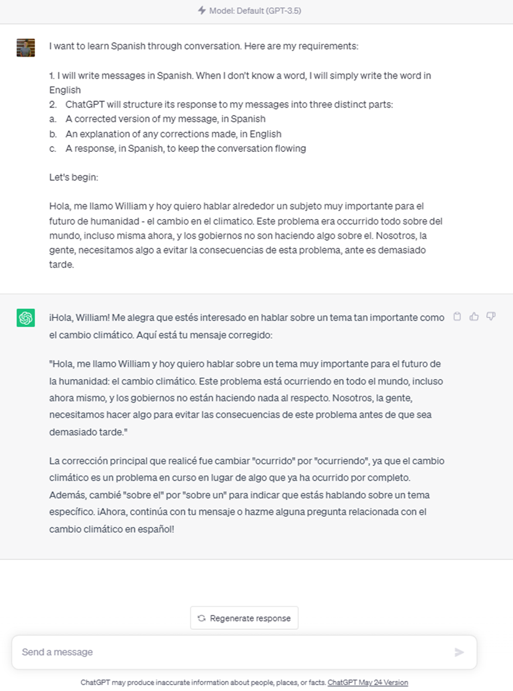
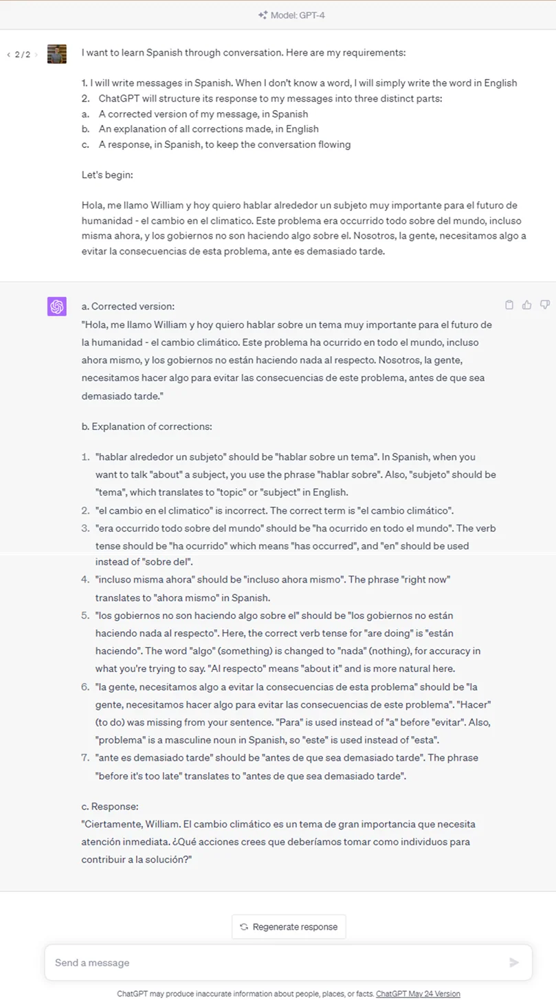
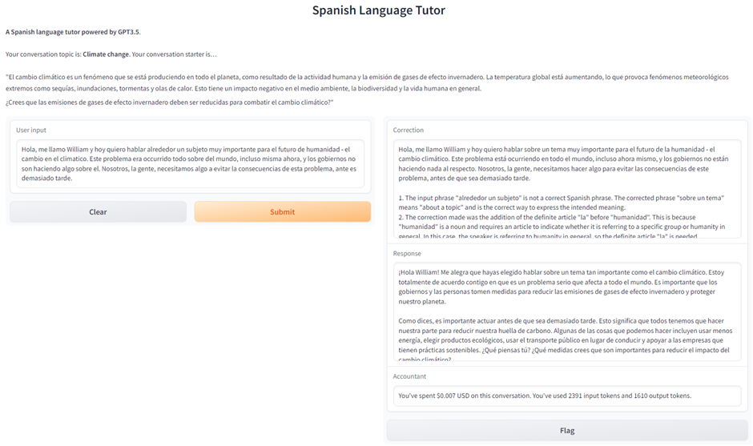

I’ve been using ChatGPT on a daily basis ever since last December, but it was only the other day that I actually got round to having a play around with the OpenAI API for the first time. It was an interesting experience that culminated in the production of a useful little language-learning app, that I intend to use in my ongoing efforts to learn Spanish. In this article, I briefly discuss the API, the problem I found with ChatGPT for language learning, and the app I created to address that problem.

_The API_

Firstly, it is important to understand what the OpenAI API is, and how it relates to ChatGPT. ChatGPT is a web interface built by OpenAI to allow users to easily interact with their GPT series of large language models (LLMs). Free users are able to interact with the GPT-3.5 model only, while paid users are able to interact with either the GPT-3.5 model or the GPT-4 model, the latter on a rate-limited basis (currently 25 messages every three hours). OpenAI also allows users to interact with their models via a paid API, which basically exists to allow software developers like myself to build applications that leverage those models. The API offers more flexibility than ChatGPT, in particular via its customisable system prompt, but it has one major downside: the GPT-4 model is only available to users who have been selected from a waitlist, and I, sadly, am not one of the lucky few. Therefore, for the app I describe in this article, I used the GPT-3.5 model.

_The problem_

Learning a language using ChatGPT is a fairly typical use case for this revolutionary technology, and [language-learning apps like Duolingo already offer integration with GPT-4](https://blog.duolingo.com/duolingo-max/). Just like with a human language tutor, you can have a free-ranging, written conversation with it in your target language about any topic under the sun, with the chatbot even able to correct your mistakes as you go. However, while GPT-3.5 is still a game-changer in this field when compared to what was publicly available before, GPT-4 is significantly more powerful in this context. I’ll provide some screenshots from ChatGPT to demonstrate some of the issues with GPT-3.5 here, but firstly, let’s set out some example requirements for what would make a useful language learning tool:

1.  I want to write messages in Spanish. When I don’t know a word, I can simply write the word in English
2.  I want ChatGPT to structure its response to my messages into three distinct parts: a corrected version of my message, in Spanish; an explanation of any corrections made, in English; and a response, in Spanish, to keep the conversation flowing

Putting those requirements into ChatGPT gives us the following example exchange:

As you can see, there are some issues, ranging in severity from minor to major:

-   There is unnecessary “fluff” – text that doesn’t really contribute to proceedings, such as the first paragraph
-   The explanation of corrections is written in Spanish, not English
-   Many of the corrections are not explained, including for example the correction of “_el cambio en climatico_” to “_el cambio climático_”
-   No substantive response was given to help continue the conversation in a natural way – instead, GPT-3.5 simply told us to “_continue with your message or ask me a question related to climate change in Spanish_”

Of course, anybody who has used ChatGPT will know that it is inherently stochastic, and it is certainly true that re-running similar prompts can sometimes lead to more coherent answers that come closer to what we might be looking for. However, the broader issue here is that GPT-3.5 is _unreliable_ – you don’t know what you’re going to get from it.

For context, here is how GPT-4 handles that same prompt:

Much better, right? But to reiterate, GPT-4 usage via ChatGPT is (A) currently available to paying subscribers only and (B) rate-limited, while GPT-4 usage via the API is locked behind a waitlist. This means that, at least for the time being, a workaround is required in order to cost-effectively use the GPT models as an effective language learning tool. And that’s where my app comes in!

_The app_

The app I’ve created is a browser-based application that you run on your local machine, which uses [Gradio](https://gradio.app/) for a sleek UI. It provides a random conversation starter at the top of the page to stimulate conversation and a box to input your response; when you have finished typing it out, click “Submit” and your input will be processed to output both a corrected version of your message, with detailed English explanations of all corrections made, and a response in Spanish. Under the hood, the app is breaking text apart, hitting the OpenAI API with a variety of prompts, parsing the output, and putting it all back together. As the OpenAI API is paid, the UI also displays a running total of the number of tokens used in the conversation, and how much this equates to in US dollars.

What value does the app add, versus just using ChatGPT or writing a bare-bones script to call the API?

-   Designed specifically for learning a language – The app is designed to abstract the details of interacting with the GPT models away from the user, meaning that you no longer need to worry about writing custom prompts yourself to get GPT to behave like a language learning tool. The app also includes a system prompt (only available via the API) that keeps the chatbot on track even during long conversations
-   Consistent output – You can be sure of exactly what output you are going to get and where it’s going to be, with no fluff
-   Support to set up OpenAI API key – When you boot up the app for the first time, it will see that you have not added your OpenAI API key and provide the relevant URL for you to do this, as well as providing a simple mechanism to automatically save your created key in the right location
-   Random conversation starters – To ensure interesting and unique conversations every time you use the app, the [Wikipedia contents](https://en.wikipedia.org/wiki/Wikipedia:Contents) were scraped and parsed to generate a list of 1,056 potential topics, one of which is automatically fed to GPT-3.5 to generate an on-topic conversation starter
-   Reliable explanations of corrections – Explanations of corrections are always given in English, and most importantly are reliably comprehensive – the app has been designed to compensate for GPT-3.5’s tendency to fail to detect or elaborate sufficiently on corrections
-   Extensibility – the code is open-source, so if you’ve got some programming ability, feel free to have a play around to tweak it to your own use case!

It is also important to note some of the issues with the app, as it is certainly not the finished article at this point. Firstly, as mentioned, OpenAI’s API is not free to use, meaning that you need to set up an OpenAI API key in order to use it, through which you will of course incur charges. It’s pretty cheap but money is money, and considering the fact that using ChatGPT with GPT-3.5 is completely free, this might be a dealbreaker for many. Secondly, even though the app is multithreaded, because multiple prompts are being run behind the scenes, some of which depend on the output of others, response times can be slow. The feeling of slowness is exacerbated by the fact that output is not streamed to the UI, as it is in ChatGPT. Thirdly, because the app has not been packaged up into a downloadable executable, you will need Git and Python installed on your local machine to run it. Fourthly, the way the app is currently built means that it can only be used to learn Spanish. It wouldn’t take long to make the necessary code adjustments here, and you can even do it yourself once you have the source code on your local machine, but of course at face value this is another pretty major issue!

To use the app, you’ll need to clone the repository with `git clone https://github.com/wjrm500/ChatGPTLanguageAssistant.git`, install the dependencies with `pip install -r requirements.txt`, start the app with `python main.py`, and then go to your browser and type [http://localhost:7860/](http://localhost:7860/) into the URL bar.

As mentioned, the app is very much in the prototype stage. The reality is that once OpenAI expands access to GPT-4, the current iteration of the app loses much of its added value. Still, it would be cool to do the following in future:

-   Support all major languages, not just Spanish!
-   Transition away from Gradio to a custom interface, which will allow for features such as…

    -   Highlighting corrections in the input text in a different colour

    -   Providing word translations on hover
-   Investigate integration with text-to-speech, so that conversation responses can be read out at the click of a button
-   Add configuration to support different modes, e.g., a mode where corrections are not evaluated; a mode where corrections are evaluated but not explained until you click on them; and the current mode, where all explanations are generated by default. This would allow users to save money on API costs at their discretion

Thanks for reading, and please feel free to leave a comment or email me at [wjrm500@gmail.com](mailto:wjrm500@gmail.com) if you have any thoughts or suggestions.
