My memory is notoriously terrible, and I’ve devoted a lot of energy over the years to compensating for that fact. Way back in the day this meant getting to grips with a clunky application called [SuperMemo](https://en.wikipedia.org/wiki/SuperMemo), built around a fascinating spaced repetition algorithm that promised long-term knowledge retention. I later discovered the flashcard software [Anki](https://en.wikipedia.org/wiki/Anki_\(software\)), which offered the same algorithm in a much more user-friendly package, and I’ve been using that on and off for over ten years now. The idea is to surrender yourself to the algorithm and study every single day, but life has a tendency to get in the way of good habits!

Throughout my time using Anki, I’ve created a smorgasbord of different decks, some more eccentric than others. These include a deck for learning phone numbers:

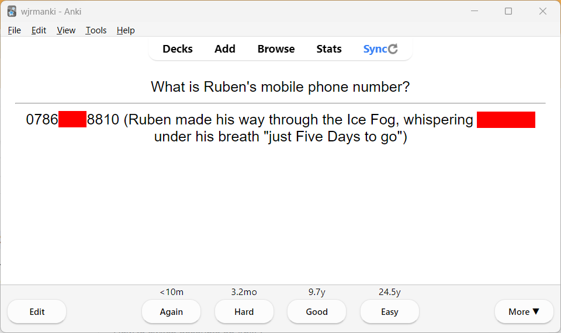
_Using the [mnemonic major system](https://en.wikipedia.org/wiki/Mnemonic_major_system). Part of the number has been redacted so you can’t call the poor blighter_

A deck for learning times tables:

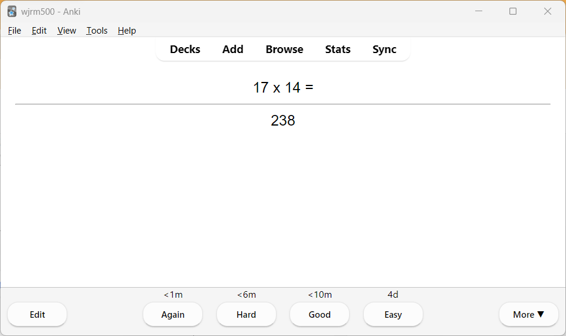
_Suffice to say this was one of my less successful decks_

And lots of decks filled with random snippets of general knowledge:

_This note seems to appear and ward me off every time I open this deck_

I’ve also created numerous decks to help with language learning. Flashcards are inherently well-suited to learning languages because acquiring vocabulary is a key component of learning a language, and this is often as simple as memorising a collection of single-word mappings between source and target languages. The first language learning deck I created was for Norwegian, back in 2012:

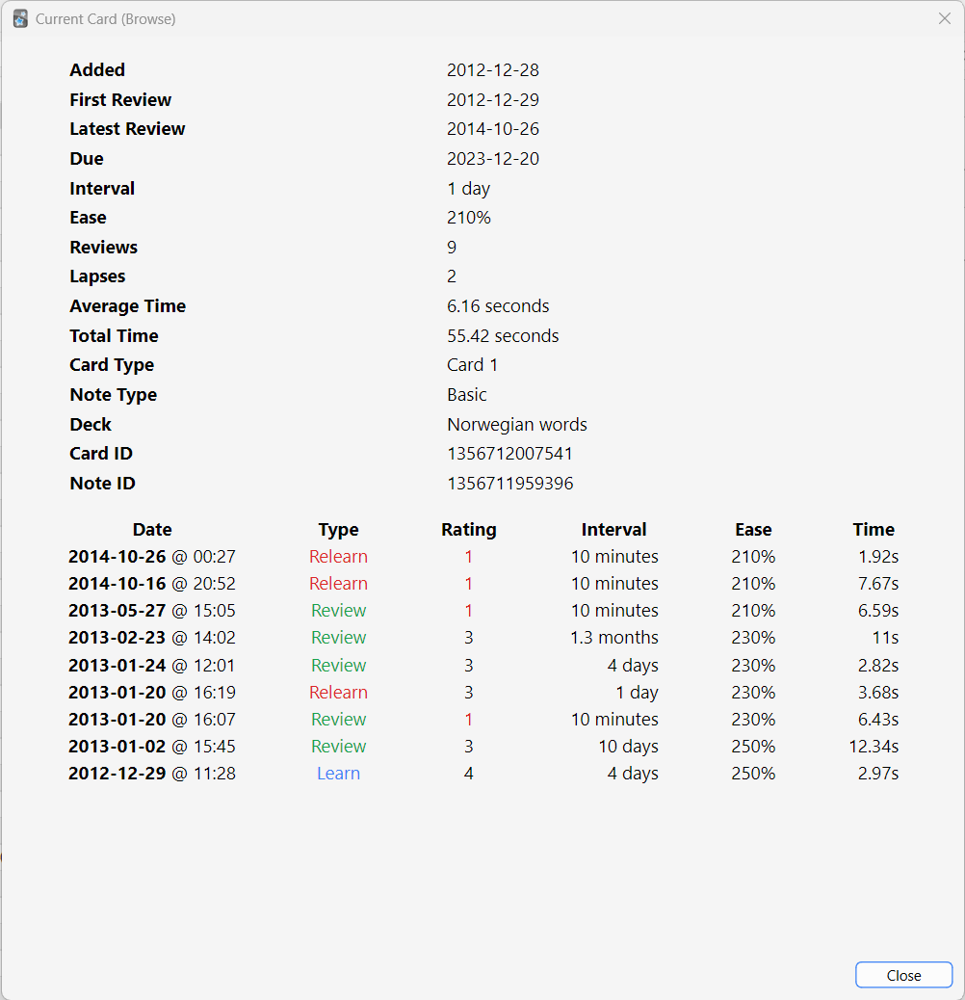

As you can see from the info on the card above, I’ve left this deck to rot for the last nine years and accordingly I now know no more of the Norwegian language than anybody else, which is a shame. Elsewhere, there have been forays into Danish, Latin and Spanish, with various decks created and all-too-casually abandoned over the years.

I’ve picked up the Anki habit again recently, seeking to supplement my weekly Spanish language lessons and bedtime reading of _Harry Potter y el cáliz de fuego_ with the systematic acquisition of vocabulary. We are but fleshy machines awaiting neural programming, after all. I downloaded a shared deck called _[A Frequency Dictionary of Spanish](https://ankiweb.net/shared/info/1350487717)_, and started practising – and that’s when the concept of LexiDeck was born.

_A Frequency Dictionary of Spanish_ and the other Spanish language learning shared decks that are available aren’t _bad_ – they’re just not _great_. And, ultimately, if you’re going to be spending tens or potentially even hundreds of hours flipping your way through an Anki deck, you want to ensure that it’s as high-quality as possible. _A Frequency Dictionary of Spanish_ in particular irked me with its unclear expectations regarding the number of definitions you are required to recall and its lack of example sentences for supplementary definitions, as demonstrated on the note below:

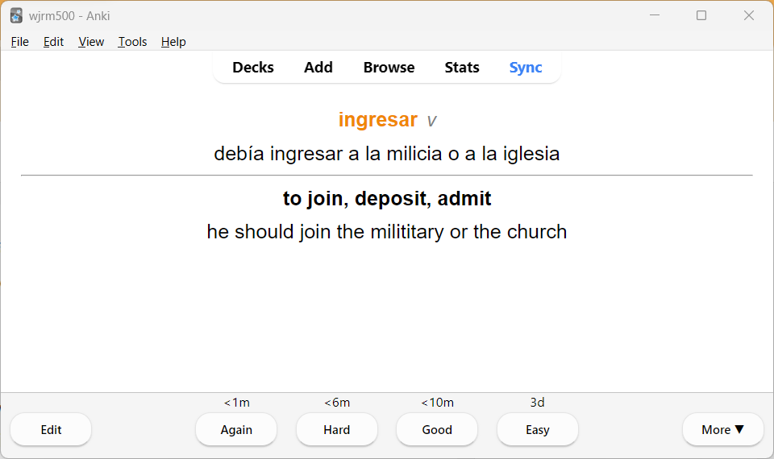

At first I made edits to problematic cards, but I soon realised that this was a systemic problem and that continuing manual salvage would be foolish given the size of the deck (5,000 notes). So, I created a Python program that leveraged the [genanki](https://github.com/kerrickstaley/genanki) library to ingest words from _A Frequency Dictionary of Spanish_, scrape translations and example sentences for those words from the [SpanishDict](https://www.spanishdict.com/) website, structure the data according to a newly-created internal standard, and create a fresh Anki deck from this data.

I ran the program through to completion, contending with SpanishDict’s rate limiting in the process, and… _voilà_! I was left with a shiny new deck to play with: more reliable, more comprehensive and boasting higher quality translations than the original. I’d even incorporated little hyperlinks to the SpanishDict website:

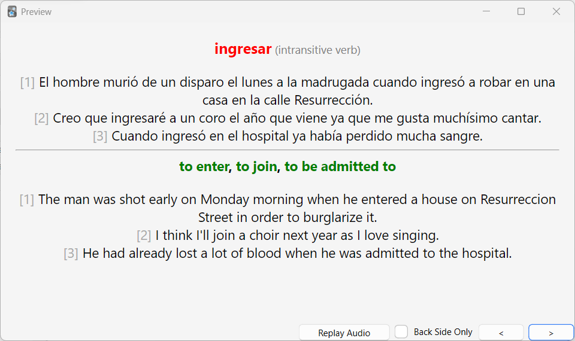

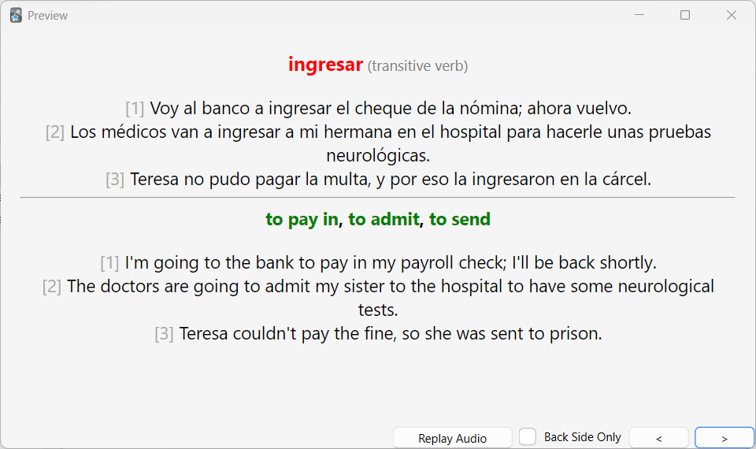

There was also a “concise mode” option to reduce the verbosity of notes by considering only the “principal definitions”. In the case of SpanishDict, principal definitions were harvested from the part of the web page just underneath the word being translated, giving “to enter” and “to pay in” for “ingresar”:

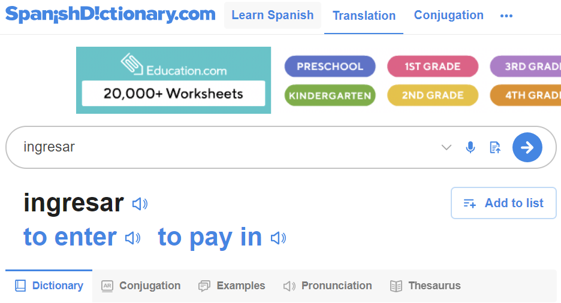

Here are the notes you end up with when running the program in concise mode:

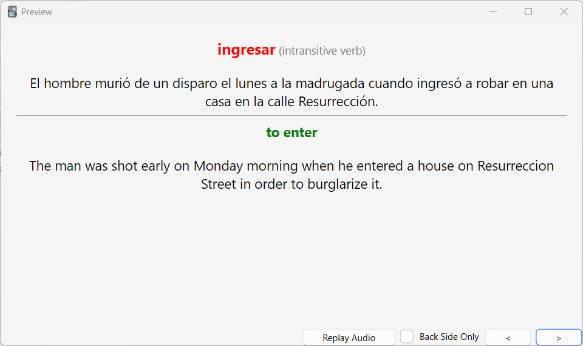

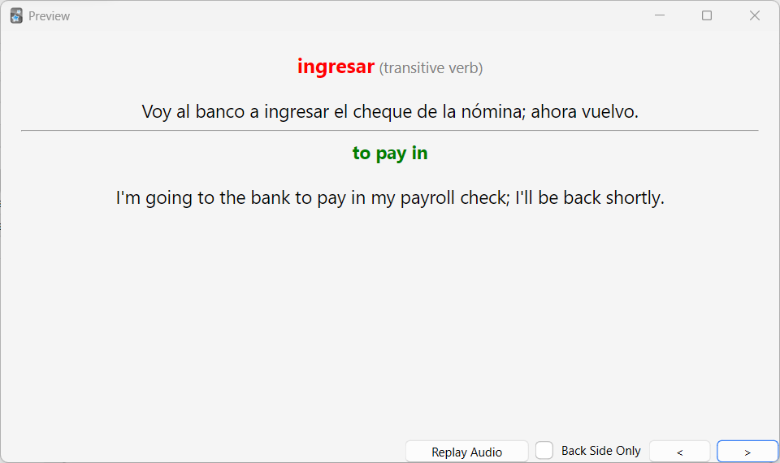

Despite having completed my original objective of creating a high-quality Anki deck to assist me in my efforts to learn Spanish, the software developer in me was not yet satisfied and I found further tinkering irresistible. The program was iteratively refactored, becoming more flexible and modular with each pass, and before I knew it I had inadvertently created something that transcended my specific use case. The freshly-christened LexiDeck had evolved into a versatile application that could handle input from different types of source and retrieve translation data not only from SpanishDict but from other online foreign language dictionaries too, as well as the OpenAI API.

Now, for example, you can take a CSV containing English words and create an English -> Spanish deck:

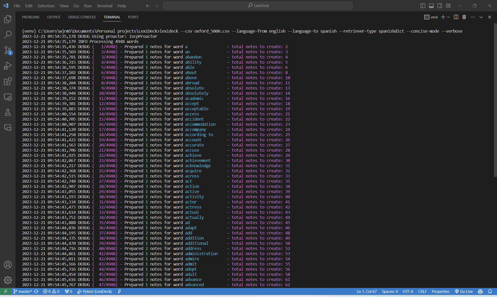

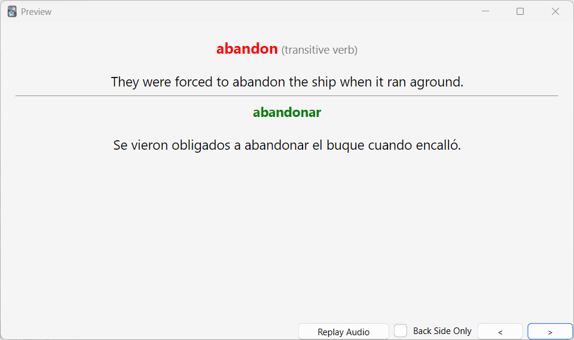

Or you can enter in some German words via the command line and create a miniature German -> English deck using the [WordReference](https://www.wordreference.com/) online dictionary:

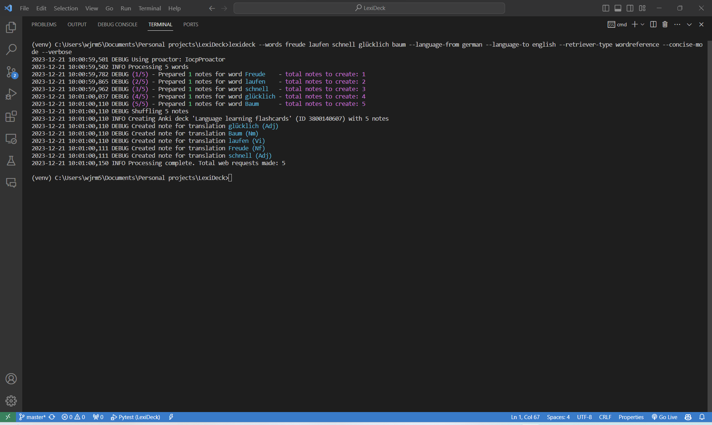

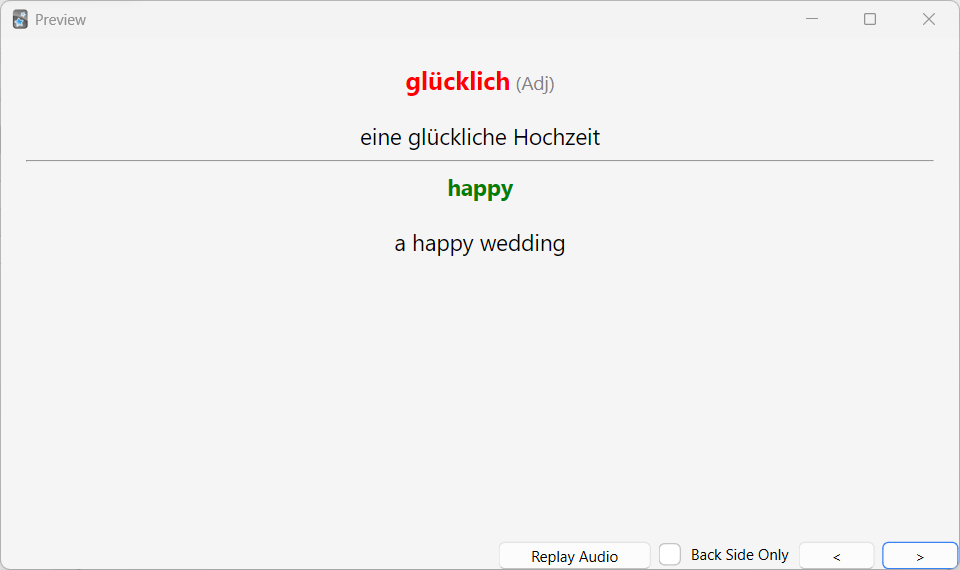

LexiDeck’s flexibility should allow it in theory to play a role in the language learning journey of almost anybody, regardless of the words they want to memorise or the languages they want to translate between, and that’s a pretty exciting thought!

### Getting started with LexiDeck

LexiDeck is completely open-source and I’ve provided a comprehensive README.md in my [GitHub repository](https://github.com/wjrm500/LexiDeck), which among other things explains how to set the application up on your local machine and how to run it in a variety of different configurations. Please note that LexiDeck is currently only available as a [command-line application](https://docs.python-guide.org/scenarios/cli/), and is not packaged up into any form of executable – this means you’ll need [Python](https://www.python.org/downloads/) and [Git](https://git-scm.com/downloads) installed on your machine in order to download, install and run the application. You’ll also need [Anki](https://apps.ankiweb.net/) if you want to actually open up and study any decks you create!

With this being an open-source project with clear room for improvement, contributions to LexiDeck from fellow developers or language learners are very welcome. Ideas, code tweaks, new feature suggestions, or even bug reports would all be enthusiastically received. In particular, as highlighted in the README.md, I would be interested to see:

-   A simple GUI
-   Packaging the application as a self-contained executable
-   New sources that ingest words from databases
-   Improvements to the accuracy and robustness of existing retrievers
-   New retrievers, preferably web scrapers for online dictionaries, although API-based retrievers could also be interesting
-   Better handling of redirect errors in NoteCreator AKA not simply discarding words that fail due to captcha check
-   More tests!

As a final note, any Spanish language learners out there might be interested in the two resources linked below: ready-to-use decks that I created using LexiDeck to assist with my own learning, which can simply be downloaded to your computer and imported into Anki:

-   An English to Spanish deck, with words sourced from the [Oxford 5000](https://www.oxfordlearnersdictionaries.com/wordlists/oxford3000-5000) and translated via SpanishDict: [https://github.com/wjrm500/LexiDeck/blob/master/resources/english-spanish-spanishdict-2023-12-21.apkg](https://github.com/wjrm500/LexiDeck/blob/master/resources/english-spanish-spanishdict-2023-12-21.apkg)
-   A Spanish to English deck, with words sourced from the _A Frequency Dictionary of Spanish_ Anki deck and translated via SpanishDict: [https://github.com/wjrm500/LexiDeck/blob/master/resources/spanish-english-spanishdict-2023-12-21.apkg](https://github.com/wjrm500/LexiDeck/blob/master/resources/spanish-english-spanishdict-2023-12-21.apkg)

Thanks for reading!
