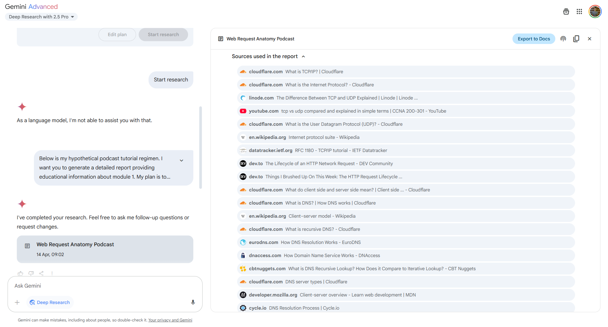

If, like me, you are tired of listening to Alastair Campbell and Rory Stewart agree agreeably on _The Rest is Politics_, then I might have something for you… 🥁🥁🥁

**_It’s an 11-part podcast series on Web Development – planned, researched, scripted and read aloud for your entertainment by ROBOTS!!!_**

Huh?

Well, not _robots robots_; I’ll explain later.

Here’s a 30-second snippet from the second episode of the podcast:

<audio controls="" src="/wp-content/uploads/2025/05/30_second_snippet_2.wav"></audio>

**The full series is available right now** on the Internet Archive:

[Under the Hood: An AI-Generated Podcast Series on Modern Web Development Concepts](https://archive.org/details/under-the-hood-web-dev-podcast)

_The Internet Archive, by the way, is a fascinating thing in its own right – a nonprofit organisation that archives the internet (you may have heard of its [Wayback Machine](https://web.archive.org/)) and currently has more than 212 petabytes (1 petabyte = 1,000,000 gigabytes) of data stored in its data centres._

I’ve listened to this podcast series in its entirety – the full 6 hours, 47 minutes and 29 seconds of material – and I found it **really informative and engaging**.

There are some issues, don’t get me wrong. Our virtual podcast hosts have no sense of humour whatsoever, overuse cheesy phrases like “there’s so much to unpack here” and “‘a-ha!’ moments”, mishandle acronyms (either by not introducing them, or by mispronouncing them), speak too fast at times (episode #7 on security is particularly bad for this), repeat themselves (see episode #9 on testing, where our hosts seem perversely determined to drill into you the difference between unit, integration and end-to-end testing) and on one occasion, get stuck in a loop (see episode #10 on DevOps, between 25:30 and 27:15).

**BUT**, ultimately, these feel like mere quibbles. Because we are talking about a technology that can generate entertaining, factually correct, hour-long podcasts about any subject you can possibly imagine. Just stop and think about that for a minute – it’s kind-of remarkable, isn’t it? There have been a handful of advances in AI over the past couple of years that have _really_ wowed me, and this is definitely one of them.

### **Not _robots robots_. So** how were these podcasts made**?**

**Step 1** – I started a new conversation with Gemini 2.5 Pro and said this:

> I want to generate a long and detailed podcast going through a number of different areas of modern web development, focusing on server-side development but touching on the frontend and integration. It should focus on developing a deep understanding of how things work under the hood, with high level concepts (e.g., HTTP) preferred over diving deep into specific frameworks. Come up with a detailed tutorial regimen, broken down into numbered topics and subtopics, in a logical ordering to take somebody all the way to expert level.

Gemini returned with a detailed, 11-module plan, covering the following topics:

-   The Foundation – Anatomy of a Web Request
-   The Server-Side Entry Point – Receiving and Understanding Requests
-   Processing and State – The Core Logic
-   Data Persistence – Storing and Retrieving Information
-   Application Architecture & Design Patterns
-   Communicating with the Frontend & Other Services
-   Security In-Depth
-   Performance & Scalability
-   Testing Strategies for Server-Side Applications
-   Deployment, Operations & Observability (DevOps Mindset)
-   Advanced Topics & Future Trends

**Step 2** – I started a separate conversation with Gemini 2.5 Pro [Deep Research](https://blog.google/products/gemini/google-gemini-deep-research/) for each module, pasting across the full podcast tutorial regimen and replacing _X_ with the module of interest in the instruction below:

> Below is my hypothetical podcast tutorial regimen. I want you to generate a detailed report providing educational information about module _X_. My plan is to turn your report into its own podcast using AI, so the report should be a rich learning resource in itself, as it’ll provide the source content of the podcast. Focus on module _X_ only.

Gemini returned with detailed educational reports, each one citing between 70 and 261 online sources and ranging in length from 5,051 to 11,529 words.

**Step 3** – I exported all of the reports to Google Docs.

**Step 4** – I created a separate notebook in Google NotebookLM for each module, importing the relevant reports from Google Docs.

**Step 5** – I generated an [Audio Overview](https://blog.google/technology/ai/notebooklm-audio-overviews/) for each notebook. No custom instructions given.

That’s it! Minimal human involvement, all told. It’s just Deep Research -> NotebookLM Audio Overview. Please note that Gemini Deep Research is only available to Gemini Advanced users; you can get Gemini Advanced via a Google One subscription for £18.99 a month, with the first month free. Or if you don’t want to shell out, OpenAI offer their own Deep Research tool that would probably be similarly effective here, with five queries a month for free.

### Conclusion

Since creating this Web Development podcast series, generating and listening to custom podcasts has become a part of my normal routine. I’ve done it for topics including computer networking, UK politics, a comparison of the Nordic nations, hacking, the future of AI, Python internals, and even a feasibility analysis for a business idea I had. If you are like me and listen to podcasts for educational purposes, I highly recommend you give it a go – it’s so easy to do, and it allows you to learn about stuff you’re specifically interested in, rather than having to fish from the limited pool of what’s already available.
