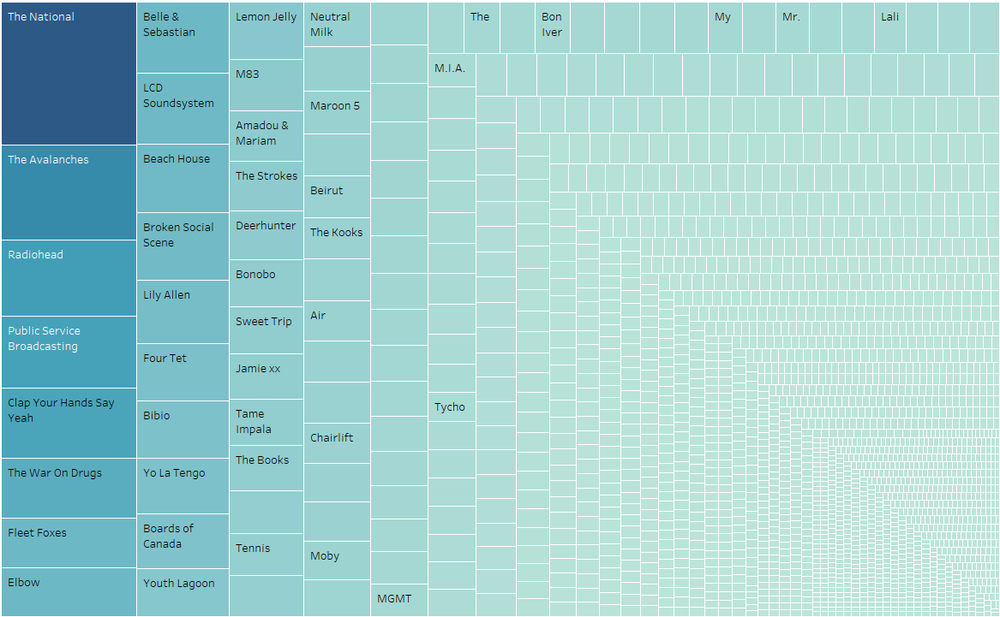
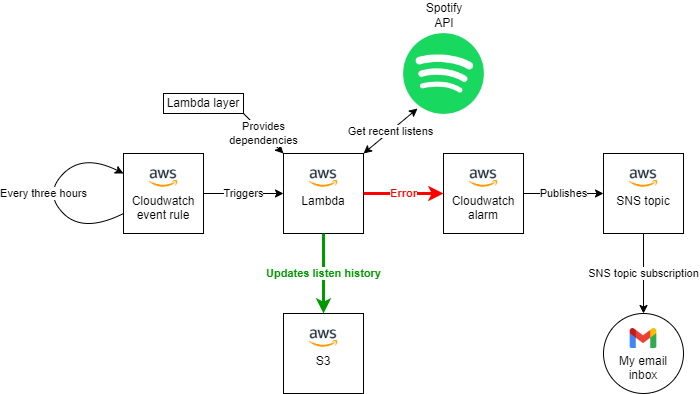

Welcome back, dear reader. It’s been a bloody long time since I “done you a post”, which is a shame not so much in a literary sense as a financial one: Bluehost absolutely rinsed me a few months back with the cost of renewing my web hosting contract, and my subsequent inactivity is making that expense seem rather gratuitous. In the interests of justifying that outlay, I have returned.

So, you know Spotify right? Well, I do too, and like many people I am absolutely dependent upon their platform for the satisfaction of my musical hankerings. And it must be said that, regardless of the damage they may or may not have inflicted upon the world of music, they do offer a [pretty comprehensive API](https://developer.spotify.com/documentation/web-api/). Via this API you can get all sorts of lovely data, including data specific to your user profile, such as your recently played songs, saved songs and playlists, as well as public data on songs, albums, artists and lots more.

Spotify have also done developers the great favour of limiting the number of recently played songs you can get from the API to 50, thereby effectively making your historical listening activity invisible to you. The reason this is a favour and not, say, a massive pain in the arse, is that it forces you, the developer, to come up with an ingenious solution in order to log your listening activity on a long-term basis, and in the process learn some valuable skills. Thanks, Spotify!

Taking up the gauntlet, a couple of years back I developed a Python script that queried the API for my recently played songs and dumped them in a local MySQL database. I then used Windows’ Task Scheduler feature to run this script whenever my computer started up. And voila, I was suddenly my own Data Controller, theoretically able to capture all of my Spotify listening data automatically and on an indefinite basis.

_The most listened to artists on mine and my wife’s shared Spotify account since 2020. Several months of data are missing in that timeframe – see below!_

Despite there being a certain synergy to this solution (most of my Spotify usage took place on my laptop, so the capture rate was pretty high), it was all pretty horrible, and here are a few reasons why:

1.  Every time I logged in to my laptop, a black terminal window would very briefly pop onto the screen, indicating that the script was being run. I think there’s a way to prevent this happening, but it was beyond me
2.  My local MySQL server had to be running for the program to work, which meant the script had to start and stop the server: a bit clunky
3.  When I bought a new laptop, I forgot to port the script and the scheduled task over from the old one for a few months, and in that time all of my listens went unrecorded, creating a void in the data. This problem is liable to recur in future, and while purchasing a new laptop is not exactly something I do every other day, it’s still bad design to be reliant on my remembering and feeling motivated enough to run a set of manual setup steps in this scenario
4.  With the data only stored locally, there would be no way (that I’m aware of) to present this data via the Web to third parties

Owing to all of these disadvantages, I decided recently to deploy the program in an AWS context, using AWS resources, inspired by a task I’d been doing at work. The idea was that there would be a Lambda function containing my existing Python script, which would call the Spotify API and then store the data in a database, as before. This time around, the database would be hosted in the cloud instead of on my local machine, and the scheduling element would be handled by a Cloudwatch event rule. Fundamentally, this design would eliminate each of the disadvantages listed above, going further than ever to ensure full data capture.

I managed to get all of this implemented with a bit of elbow grease, even using Terraform for the deployment of resources until I ran into VPC (Virtual Private Cloud)-related access issues and turned to online guides whose step-by-step solutions were only enactable via the AWS web console, at which point my Terraform code fell behind. There were conceptual hurdles: my solution meant that my Lambda function needed to simultaneously belong to a VPC (to access the AWS RDS database instance) and connect to the internet (to access the Spotify API), which meant I needed to brush up on my networking knowledge – think subnets, route tables and NAT gateways. I can’t say I’ve got much understanding of this stuff even now, but hopefully the exposure will be beneficial.

Sadly, shortly after basically completing the SQL-based implementation, I received an email stating that my year-long access to the AWS Free Tier was shortly to be coming to an end. Without access to the Free Tier, suddenly using AWS RDS became financially unviable – even for the cheapest database instance reserved in advance for a year, I would be looking at [a fee of \$172 USD](https://www.concurrencylabs.com/blog/guide-to-rds-reserved/). My thoughts quickly turned to another, much cheaper AWS storage solution – S3. Switching from SQL-based storage to dumping and retrieving a JSON file into and from a bucket meant of course that I needed to completely rewrite the data access portion of my program, but given the simple nature of what was being done, this wasn’t taxing.

And so now I have a working Lambda function up and running, grabbing data from Spotify and updating a JSON file in an S3 bucket, triggered every three hours by a Cloudwatch event rule. I even set up a Cloudwatch alarm to email me if the Lambda function fails, which is pretty neat. Here’s a diagram of the architecture I made using [draw.io](https://draw.io/):

The next step is to see if I can replicate the entire AWS configuration in Terraform. For those unfamiliar with Terraform, in this context it’s basically a way to automate the process of deploying resources to AWS. Resource deployment can also be done manually – for example, I could navigate to the AWS S3 console in my browser and manually create a new bucket by clicking “Create bucket” and filling out and submitting the web form to specify the configuration parameters. Terraform allows processes such as this to be encoded, to facilitate automation. See [this article](https://spacelift.io/blog/business-benefits-of-iac) to learn more about the benefits of infrastructure as code.

Further down the line, when the script has harvested enough data, the end goal will be to build a data dashboard. I also quite like the idea of automatically emailing myself weekly digests. It’ll be fascinating (and slightly concerning) to see how many times I listen to _Gloria_ by The Midnight each week.
