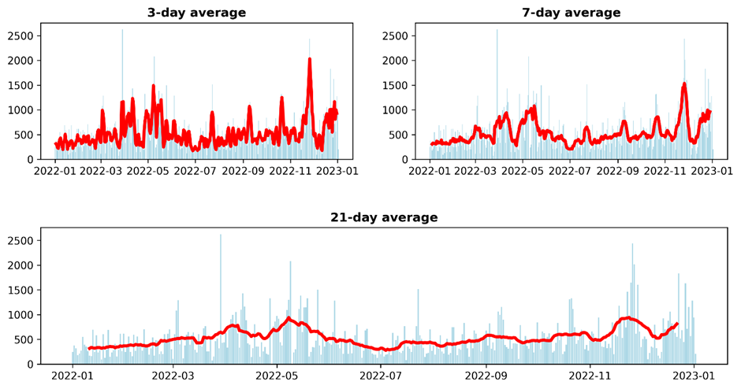
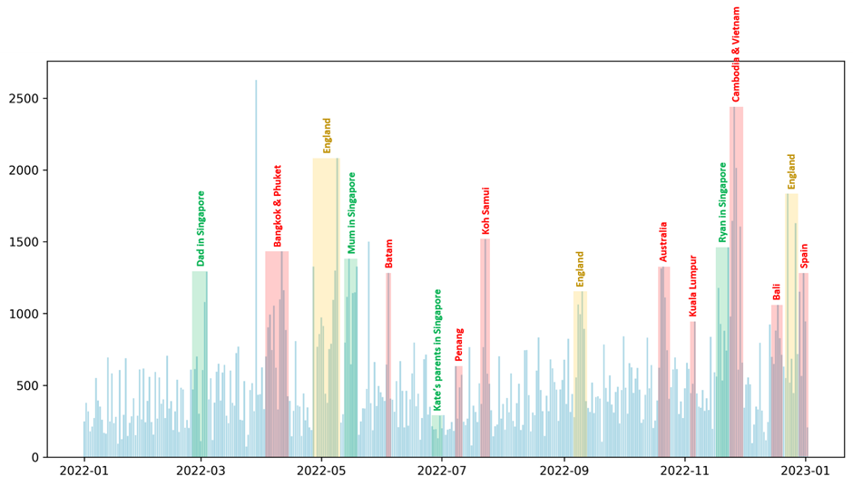
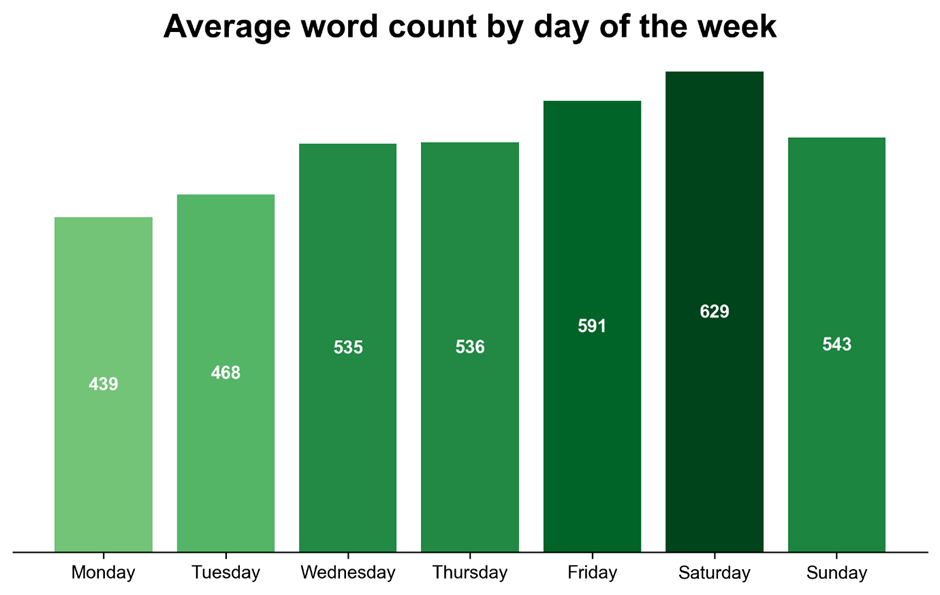
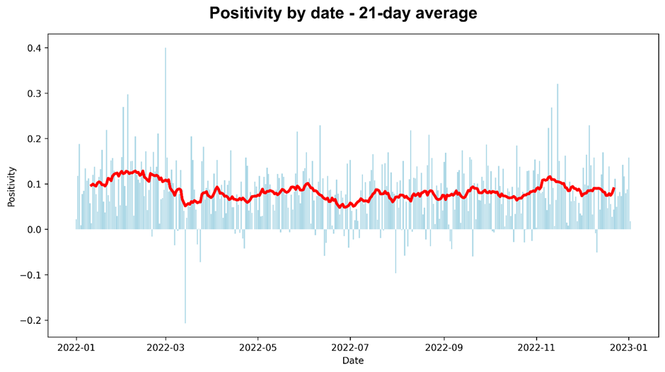
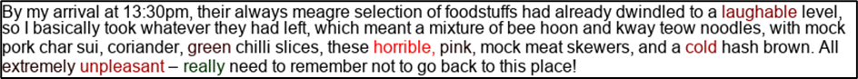
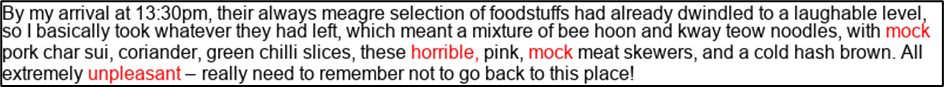
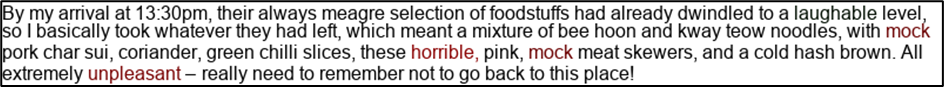
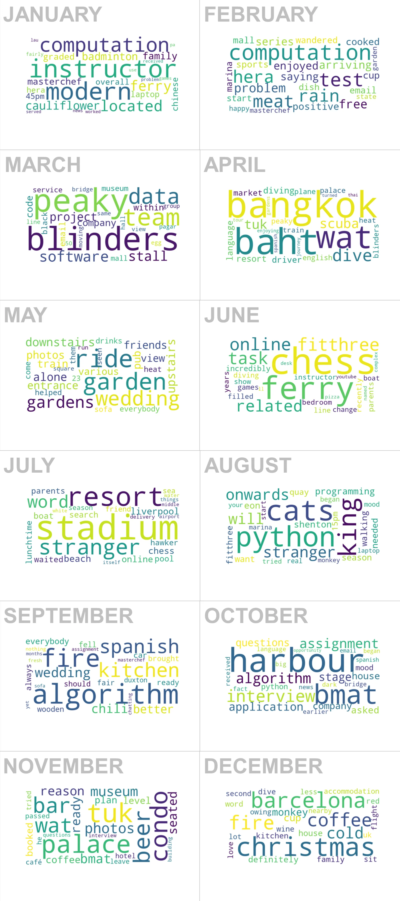

This article is a bit different to most of the other ones on this blog, as it focuses on data analysis rather than software development – making it my first analysis article since **[International Football Results Analysis](/2021/06/02/international-football-results-analysis "International Football Results Analysis")**, way back in June 2021. Today I’m not analysing football data, however; instead, I’m analysing my own diary.

This diary of mine was recorded throughout the year of 2022, with one entry for every day I wasn’t travelling between time zones. What with me suffering from chronic loquaciousness, the end result is a truly hefty tome, with the final word count standing at 195,543. For context, that’s 26,620 words longer than _Harry Potter and the Half-Blood Prince_!

_An afternoon’s light reading_

How does one go about analysing such a text? As there was no end goal here besides feeding my own curiosity, the direction of my analysis was pretty much arbitrary. I decided to tackle three major topics:

-   **Word count** – Did the amount I wrote per day remain consistent throughout the year? Was word count affected by whether or not I was on holiday, or working, on a given day? Were there certain days of the week on which I tended to write more, or less?

-   **Sentiment** – Did the sentiment (positivity) of my diary entries remain consistent throughout the year? What factors correlate with changes in positivity (e.g., is post-holiday blues a thing)? What were the most algorithmically positive and negative days, and what was it about the diary entries on those days that explains their sentiment ranking? And how far can simple sentiment analysis be trusted anyway?

-   **Topic** – Can topics, themes or trains of thought unique to certain times of the year be deduced by running a temporal analysis on word frequency?

Let’s kick off by looking at **word count**.

The figure above shows how the diary’s daily word count changes throughout the year. The light blue bars represent individual word counts and the thick red lines represent rolling, centred averages.

If we focus on the 21-day average plot, we can see that daily word count gradually rose from January to a peak in May, declined until July, and rose back up, even more gradually, to peak again in December. The significance of this trend is pretty clear to me, as the diary writer: 23rd May was the date on which I began my new job at S&P Global, which meant transitioning from working two days per week (a work pattern my previous employer Twinkl had generously allowed me to adopt upon moving to Singapore) to working four days per week. This meant that, from May onwards, my weekday activity likely varied much less; it seems logical that one would have little to recount after a mundane day of remote work.

Perhaps unsurprisingly, I wrote a lot more in my diary when I was either on holiday, in England or welcoming guests to Singapore. In the bar chart below, which shows daily word count over the course of the year, I’ve highlighted and annotated these periods:

38 of the top 40 highest daily word counts came on days when I was either on holiday, in England or welcoming guests to Singapore, with the only two exceptions being the 29th March (my final day working for Twinkl, which prompted a monologue about my time at the company), and the 25th May (my first day working out of the S&P Global Singapore office). Further, 45.3% of the total words in the diary were written for days on which I was on holiday, in England or welcoming guests to Singapore, despite these days representing only 28.8% of the total number of days in the year.

Word count changes according to day of the week, too, as you can see from the figure below:

On average, I wrote 43.3% more on Saturdays than Mondays. The pattern here is no surprise given the changes to my work timetable throughout the year, although the difference between Saturday and Sunday is interesting, and seems on the face of it to suggest my Saturdays were generally more action-packed than my Sundays.

Let’s now look at **sentiment**.

The figure above shows how the positivity of my diary entries, as calculated using the [TextBlob](https://textblob.readthedocs.io/en/dev/ "TextBlob") class’s sentiment.polarity property, changes over the course of the year. Before we continue, it is important to remember that this is an _extremely_ imperfect way of capturing positivity.

Although the positivity of my diary entries remained fairly stable throughout the year, it seemed to be highest near the beginning of the year, take a couple of dips (in March, and then again in the first half of July), gradually increase throughout late October and November, and then revert to the mean in December.

What might have caused this pattern? Well, I believe the dip in positivity observable in March can be explained by a few factors: (A) my father’s visit to Singapore concluding (at the time, I thought I might not see him again until Christmas); (B) my time at Twinkl fizzling out, with lowered productivity and a sense of things coming to an end; and (C) uncertainty around my future, with my new job not set to begin until late May.

However, in saying all this, it is worth noting that the average around this time is massively skewed downwards by the sentiment polarity of -0.21 calculated for my diary entry on the 14th March. What on Earth happened to me on that day?! Well, taking a closer look at the diary entry in question reveals that, although the day wasn’t exactly halcyon (I wrote that it was an “unproductive” day), most of my negativity seemed to be directed towards food! Here’s how I described my lunchtime visit to a vegetarian hawker stall at Chinatown Complex:

_“By my arrival at 13:30pm, their always meagre selection of foodstuffs had already dwindled to a laughable level, so I basically took whatever they had left, which meant a mixture of bee hoon and kway teow noodles, with mock pork char sui, coriander, green chilli slices, these horrible, pink, mock meat skewers, and a cold hash brown. All extremely unpleasant – really need to remember not to go back to this place!”_

Dinner wasn’t much better, with me noting that _“service was atrocious and my oily egg-fried rice was delivered after Kate had already finished her meal”_. You can easily see from these comments why the sentiment polarity calculated for this day was low, but at the same time, this serves as a clear warning against setting great store by algorithmic sentiment analysis – especially considering how much I tend to bang on about food!

What about the dip in July? I believe this to mostly relate to my struggles in my new job, which I feel safer in confessing to now, as that period of my life disappears in the rear-view mirror. Throughout the month, I wrote things like “_my motivation had seemingly reached a new nadir_”, described the relief of “_escaping back into the non-corporate world_”, wrote of a “_directionless, depressing morning_”, and elsewhere used phrases like “_mind-numbing pointlessness_”. Not a time I look back on with much fondness.

What was the most positive day, according to the TextBlob algorithm? The 1st March, apparently. Upon discovering this, I looked at the diary entry for this day and while it didn’t seem like a particularly amazing day, I noticed that I did at least use the word “productive”. However, when I actually broke the diary entry down and calculated the sentiment polarity for each word in the text, I discovered that the inclusion of the word “productive” had no bearing whatsoever on the overall sentiment polarity of the text. In fact, only two words had a positive sentiment polarity – “worth” and “most” – while the rest were considered by the algorithm to be completely neutral. This finding, in a stroke, caused me to lose faith almost entirely in word-by-word sentiment analysis.

I figured that maybe Python offered some alternative sentiment analysers with better real-world performance than TextBlob. In order to check this, I ran the same paragraph of text through four sentiment analysers commonly used in Python to solve simple NLP problems: TextBlob, [Pattern](https://digiasset.org/html/pattern-en.html "Pattern"), [Afinn](https://github.com/fnielsen/afinn "Afinn") and [Vader](https://github.com/cjhutto/vaderSentiment "Vader"). I then developed a program to colour-code the results, with more strongly coloured text representing words with more extreme sentiment polarity scores. Here are those results:

_TextBlob (and Pattern; TextBlob appears to be built on top of Pattern)_

_Afinn:_

_Vader:_

As you can imagine, I was left slightly disappointed by this library comparison, with the alternative sentiment analysers available in Python appearing to be even less capable than TextBlob. None of the sentiment analysers were able to denote words like “meagre” and “dwindled” with any level of negative polarity, but at least TextBlob was opinionated enough to flag “laughable” and “cold” as potentially negative, unlike either Afinn or Vader. It appears that more sophisticated sentiment analysis tools are offered by companies like OpenAI and Google, but of course this would mean signing up for a paid API. Anyway, let’s move swiftly on, and finish the article by looking at the **topics and themes** from the text.

In order to investigate this, I divided the diary text into months and used TF-IDF to compare word frequency across months, hunting for instances of words being used unusually frequently in a given month. By way of pre-processing, I eliminated the names of people from my analysis using the pre-trained NLP model “en\_core\_web\_sm” (“English Core Web Small”), loaded using Spacy. This model tokenises text and labels the individual tokens; one of the available labels is “person”. The “person” label allowed me to discover a list of person names in the diary text and filter these from the features of the TF-IDF matrix created by Scikit-Learn’s TfidfVectorizer class. This was an amusingly imperfect process, with the entities being flagged as person names including “_my burrito_” and “_meaty jelly_”.

I then developed a program that allowed me to generate a word cloud for a given month, containing a given number of words, where words are sized according to their “uniqueness” to that month:

I won’t inflict upon you my own interpretation of each and every one of these word clouds, but I did want to note my amusement at the rather rude swear word inadvertently concealed in April’s image.

Thanks for reading!
