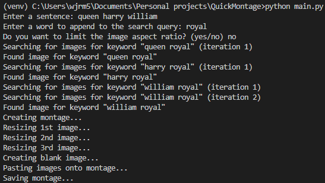

[ChatGPT](https://chat.openai.com/chat) is an absolutely incredible tool and if you’re not already using it, you should be. You _really_ should. It doesn’t matter who you are, or what you do for a living – it’s so versatile that it can turn its hand to pretty much anything you want it to do. Among many other things, it can write emails, essays, stories, songs and poems; it can summarise information; it can be used as a search engine; it can teach you new concepts; and it can generate and debug source code. While all of ChatGPT’s use cases fascinate me, as a software developer it is of course its proficiency with source code that has particularly caught my attention. And it’s not an overstatement to say that it’s already radically altered the way I approach software development.

I didn’t start writing this article to simply wax lyrical about ChatGPT, anyway. I started writing it because I wanted to hark back to the first app I ever built with the help of the technology, all the way back at the beginning of December last year. Like many of the things I build in my spare time, the app is a rather pointless specimen – but it does provide a great example of AI-assisted software development.

I call the app _QuickMontage_. It’s a tool that generates a horizontally-arranged montage of images from an input sentence, by splitting the sentence on whitespace and using the Google Image Search API to search for each of the individual tokens. For example, if you type in “broccoli cauliflower carrot”, you’d get the following montage:

_How incredibly useful!_

There’s also an additional “append word” input, to help steer the search in the right direction. This is useful in cases where there may be some ambiguity about exactly what each word is referring to. Consider the search “queen harry william”, for example. Without any extra information, you might end up with a montage containing Freddie Mercury, Harry Styles and William Wallace – _imagine_ the larks! So, if your noble intention was in fact to swiftly generate a royal montage to print out and hang on your wall, then you could add the append word “royal”, and you’d end up with this instead:

_Just think, you could get a nice frame for it and hang it over the dining table. You’d be the talk of the town!_

Finally, there’s the “limit aspect ratio” input, to help generate more “balanced” montages. Consider the following montage, showing Liverpool’s midfield next season:

_The Xavi, Iniesta and Busquets of the modern era_

Beautiful, isn’t it? But you’ll notice that the images are all of vastly different widths. By telling the app you want to limit the aspect ratio, you end up with this instead:

_Jude looks happy with his resizing, although Jordan appears to have been transported into an infinite void of blackness_

All of this glory is locked away behind a command-line interface – GUIs are so old-fashioned, right?

So that’s _QuickMontage_, in a nutshell. And it was created, with the help of ChatGPT, in less than three hours. While the app is not a particularly complicated feat of engineering, I remember being absolutely mesmerised throughout the development process at just how much ChatGPT was able to do, and more importantly, how it was able to iterate on its design in response to my feedback. It was even able to have a fair stab at refactoring the code, moving from a simple script to a class-based system. Perhaps reassuringly, it needed _a lot_ of guidance, and there were points where I had to assume control completely in order to make progress, but there’s no doubt that using ChatGPT hugely expedited the process. The way I started to view it at the time, and the way I still view it today, is almost as the junior partner in a junior-senior developer relationship (an extremely precocious junior developer, mind you!), going away and doing all of the nitty gritty stuff in response to a given set of requirements and constraints, and then returning code to be reviewed. It allows you, as a developer, to think more abstractly about software and delegate rote implementation, and that’s pretty neat.

Am I worried that it’ll put me out of a job? Yes, of course I am – I’d be foolish not to be. Having used ChatGPT extensively ever since it was released to the public, I understand its limitations better than most, and the concern is not necessarily with the technology in its current guise (I’ve been using version 4.0 since it was released to ChatGPT Plus users earlier this month). Rather, it is where the technology is likely to get to in six months, a year, two years. ChatGPT v4.0 already represents a substantial improvement on v3.5, and the two were released only three-and-a-bit months apart. And now that other players are entering the industry, such as Google with its Bard service, I think we’re about to witness a real explosion in the capabilities of these technologies, alongside increasingly fluent interfaces for domain-specific use cases, such as software development, meaning things like deeper integration with IDEs and codebases. Think GitHub Copilot, on steroids. Presumably, there will come a point at which the nature of that junior-senior developer relationship you currently have with the AI becomes completely unbalanced, and you are simply no longer able to meaningfully contribute at a technical level. And the problem for software developers is that, when all you’re doing is providing high-level, English language instructions about what you want a product to look like, and what you want it to do, you effectively become a product manager – and we already have those!

However, it’s not just software developers that should be concerned. Why? Firstly, the more AI encroaches on the professional territory of software developers, the more developers will be forced to branch out into other pathways, increasing competition in other software-related jobs. And secondly, if AI is able to do the work currently being done by software developers, who are inherently a creative, intellectual bunch of people doing creative, intellectual things (if I do say so myself), then rest assured it’ll also have little difficulty doing the work required in other jobs as well. As I said earlier, tools like ChatGPT are versatile beasts. So then we get to a point where _everybody’s_ job appears to be under threat, and that gets you thinking, maybe that means _nobody’s_ job is under threat? After all, presumably society isn’t going to simply collapse, leaving everybody unemployed. Or maybe it will, but because of advances in AI technology, we’ll all be generously catered for in our unemployment, and we’ll simply live long, inane lives of endless leisure. Who knows? All I know is that I’m open to the possibility of my current set of skills becoming completely redundant in the not-so-distant future, and actually quite excited about the opportunities that might emerge off the back of that eventuality!
