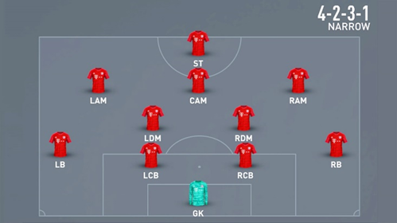
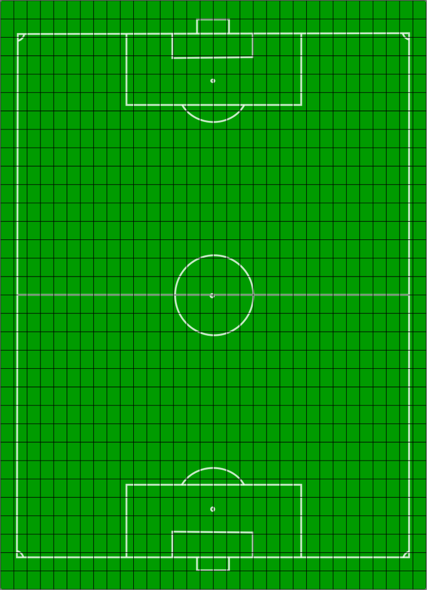
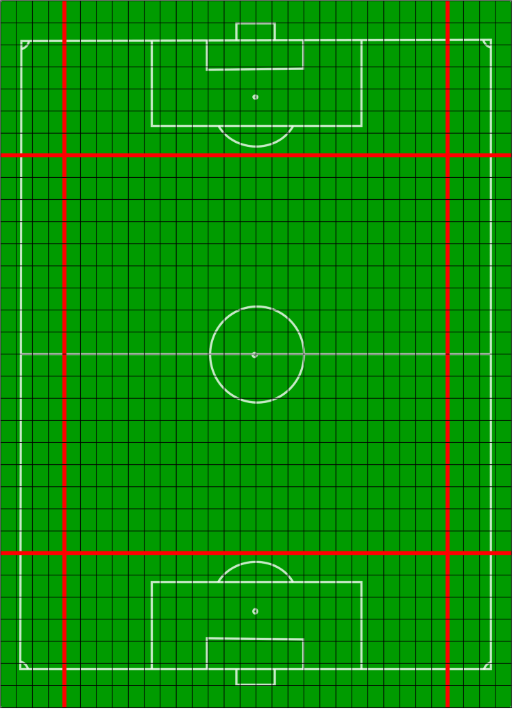
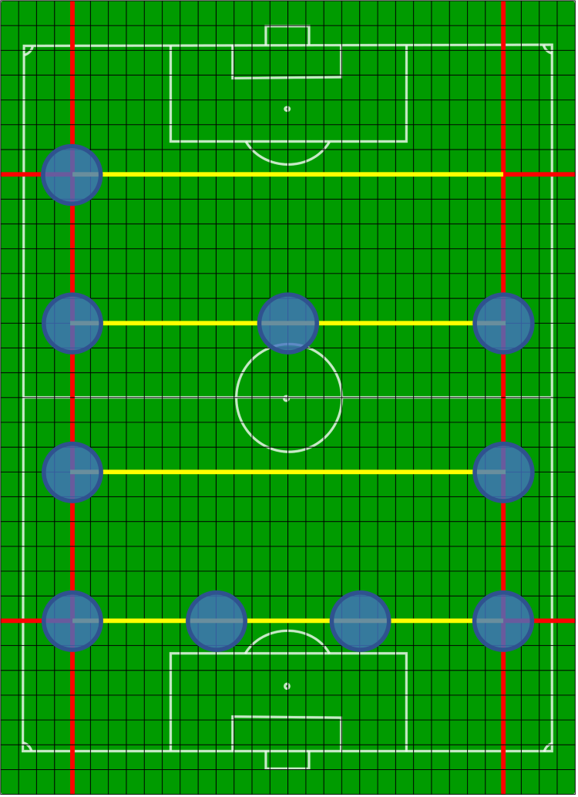
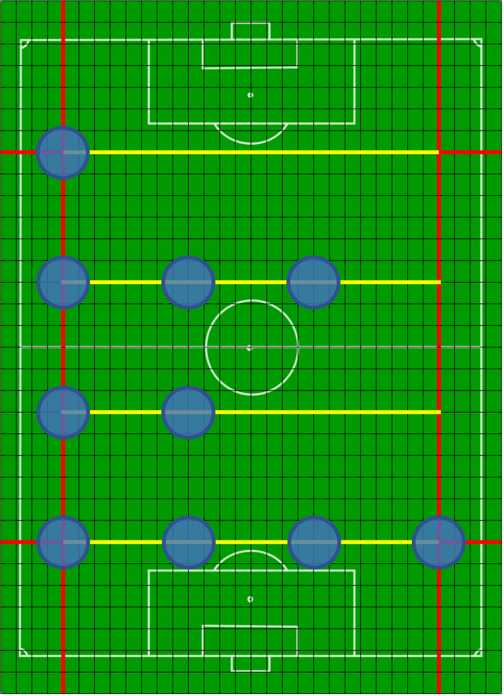
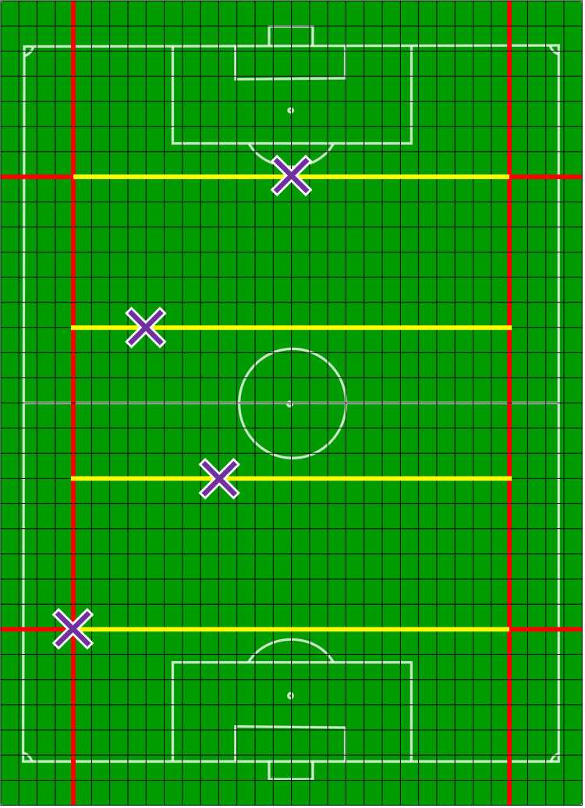
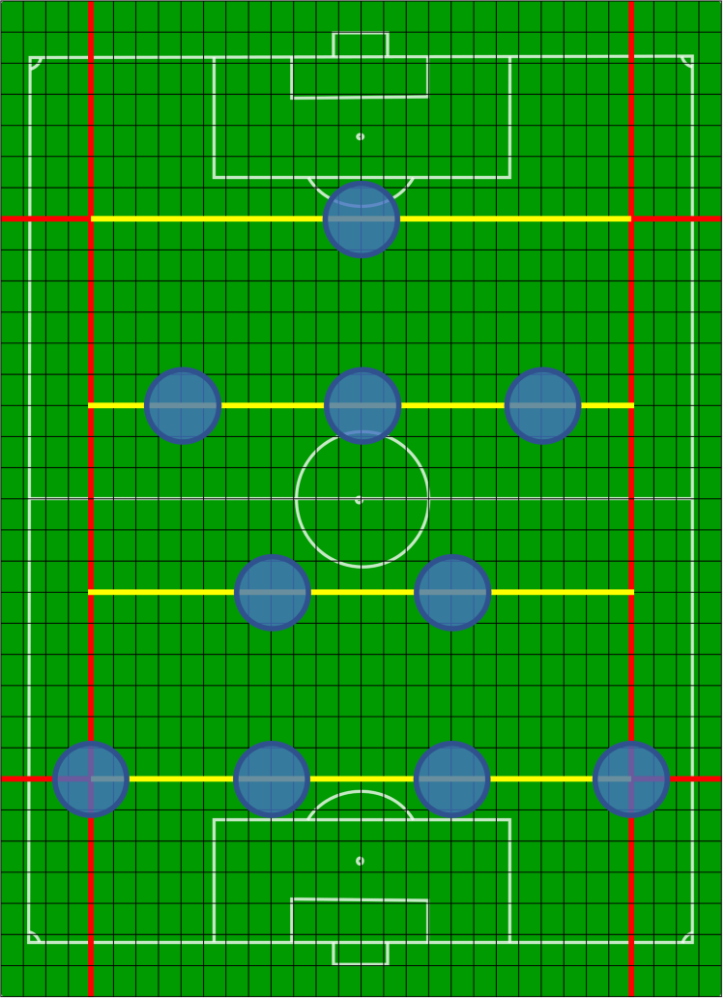
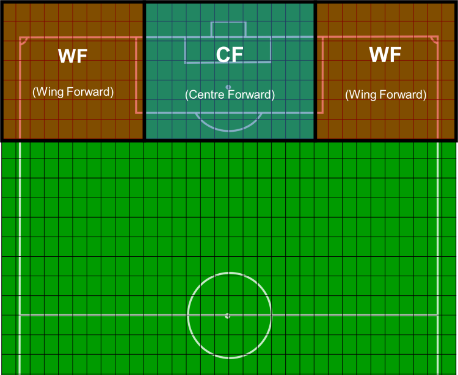
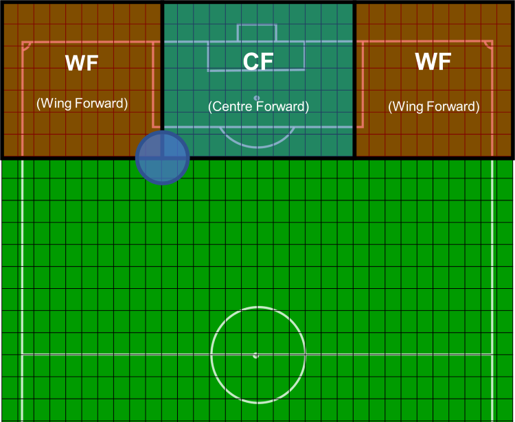
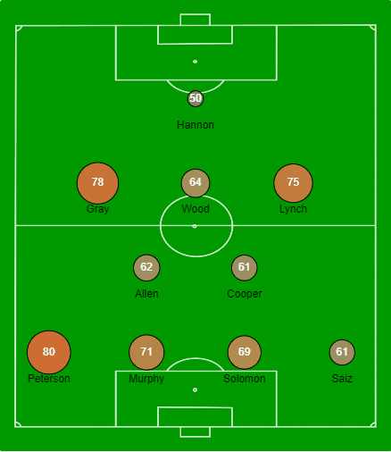

Three months ago I released a web app called _Soccer Simulation_, which you can find [here](https://soccer-sim.herokuapp.com/). The app, which in and of itself took around four months in the building, was really the culmination of a lifetime interest in football simulation, which you can read about [here](/2021/08/05/a-history-of-one-mans-inexplicable-obsession-with-football-simulation).

During the development of the app, I had to overcome a variety of challenges. Sometimes this meant getting to grips with a new tool or technology, and sometimes it just meant harnessing the limited horsepower my brain has to offer and channelling it into finding a logical solution to a logical problem. At the time the app was released, it was my intention to write a series of supplementary articles discussing some of the challenges I faced, and how I overcame them – but I never got round to it, mostly because I got swept away by new and more enticing projects!

However, there is one aspect of _Soccer Simulation_ that I’ve always wanted to revisit in greater depth, and that aspect is **the graphical interpretation of a club’s first-choice team**, that can be observed on any club page in the app (accessed by clicking on the name of a club in the league table).

And so, to brighten your winter, I have only gone and down a bleedin’ article on it. Enjoy…

## General description of problem to be solved

Displaying a graphical interpretation of a club’s first team, with players occupying positions in the club’s preferred formation.

## Solution

_Pre-requisites: it is considered for the purposes of this solution that we already have a club, which has a preferred formation and a defined selection of first team players, with names, ratings, and positions within the club’s preferred formation._

The solution to this problem involves the following four steps:

1.  Calculating the relative coordinates on a hypothetical canvas for each playing position in a formation
2.  Calculating a position name from a set of relative coordinates in order to map players to these coordinates
3.  Actually drawing the players on a non-hypothetical canvas, using the HTML canvas element
4.  Making said canvas interactive

##### Step 1 – Calculating the relative coordinates on a hypothetical canvas for each playing position in a formation

Throughout this section, we will be using the 4-2-3-1 formation as our example.

We want to end up with a set of coordinates that match the relative position and spacing of something like this (screenshot taken from the videogame _FIFA 22_):



Steps…

1\. Starting with a formation string, split it into an array e.g., “4-2-3-1” becomes \[“4”, “2”, “3”, “1”\]

2\. Split a hypothetical canvas into 32 units along both the X and Y axes:



3\. Set minima and maxima for playing positions along both axes, to provide “padding” around the edge of the canvas. Specifically, I set the minima and maxima to ensure there were 4 units of padding along the X axis and 7 units of padding along the Y axis (_minX_ = 4; _maxX_ = 28; _minY_ = 7; _maxY_ = 25)



4\. Iterate through the array created in step 1. We know that the playing positions generated for each element in that array will share the same Y coordinate because e.g., the “4” in the \[“4”, “2”, “3”, “1”\] represents a horizontal line of four defenders; the “2” represents a horizontal line of two defensive midfielders etc.

To generate this Y coordinate, we begin by asking if the array element is either the first or last in the array. If it’s the first (i.e., the “4”), then the Y coordinate will be the Y maximum _maxY_ we set in step 3. If it’s the last (i.e., the “1”), then the Y coordinate will be the Y minimum _minY_. If it’s neither the first nor the last element in the array (i.e., the “2” or the “3”), then we know the Y coordinate will be somewhere in-between _minY_ and _maxY_. We can ensure an evenly distributed spread of playing positions along the Y axis by specifying the Y coordinate in these intermediate cases using the following formula:

```js
let y = maxY - ((maxY - minY) / (numGroups - 1) * i);
```

… where _numGroups_ is equal to the number of elements in the array (i.e., 4 in our example case \[“4”, “2”, “3”, “1”\]) and _i_ is the index of the current array element.

5\. For calculating the X coordinates for a set of playing positions represented by a given array element (e.g., the four defensive positions represented by the array element “4”), we cannot utilise the same algorithm we used to calculate Y coordinates, because this would generate the following pitch:



Instead, we need a new algorithm. Specifically, we need an algorithm that compresses playing positions together when there are three or fewer for a given row.

The solution I came up with here involves the specification of an “ideal gap” between playing positions in the same row, along the X axis. This ideal gap is calculated thus:

```js
let idealGap = Math.min(8, (maxX - minX) / (numInGroup - 1));
```

… where _numInGroup_ represents the number of playing positions to generate for a given row.

This basically prevents the gap between any two playing positions in the same row from exceeding 8 units, whilst ensuring that we are able to squeeze a higher number of playing positions (e.g., 5) into the same row if needed.

Now we can use this ideal gap value to increment the X coordinate as we iterate through the playing positions in a single row. This does serve to compress playing positions as intended, but if this is the only additional step we add to the Y coordinate algorithm, we still end up with a dodgy-looking pitch:



As you can see, the playing positions are left-aligned, when really we want them to be centre-aligned.

To centre-align playing positions along the X-axis, we need to add in some extra logic. Specifically, we need to calculate the _real_ minimum X position for a given row, so that we begin placing playing positions at an appropriate leftmost point. For each row, the leftmost point or _real_ minimum X is calculated using the following code:

```js
let midX = (minX +  maxX) / 2;
let distFromCenter = (idealGap * (numInGroup - 1)) / 2
let realMinX = midX - distFromCenter;
```

In the diagram below, I’ve plotted the real minimum X values that the above code generates for a 4-2-3-1 formation:



This real minimum X logic, together with the ideal gap logic, generates a correct set of X coordinates. Specifically, initialising X as _realMinX_, you generate _numInGroup_ playing positions, incrementing the value of X by _idealGap_ between iterations:

```js
let x = realMinX;
let xCoords = [];
for (let j = 0; j < numInGroup; j++) {
   xCoords.push(x);
   x += idealGap;
}
```

And this is how the outputted coordinates look when plotted on a pitch:



##### Step 2 – Calculating a position name from a set of relative coordinates in order to map players to these coordinates

From our prerequisites, we have a bunch of first team players with defined position names. And thanks to our work in step 1, we can grab a bunch of playing position coordinates from the club’s formation. The next step is mapping the players to the coordinates, which isn’t as easy as you might think.

The problem is that, because our coordinates are generated dynamically in order to theoretically support an infinite assortment of possible formations, coordinates are not inherently tied to a particular position name. It’s not like we literally went along and said “right, for a 4-2-3-1 formation I want the left-back to have these coordinates, and the left-sided centre-back to have these coordinates…”. We could have done that, but in _Soccer Simulation_ there are 19 different formations available, and so it would have been a truly painstaking process. Plus, it would have meant having to add more code if a new formation ever got added. There’s also the fact that I’d never be able to look another programmer in the eye if I ended up going down the hard-coding route.

What we need to do, therefore, is to map the relative coordinates generated in step 1 to actual position names, to allow players to be assigned coordinates according to a match on position name.

How do we get a position name from a set of coordinates? Well…

1\. We assign “position ranges” to each prospective playing position, with these ranges defined by (A) a centre point (set of coordinates); (B) a range extending along the X axis; and (C) a range extending along the Y axis. For example, in _Soccer Simulation_ a centre-back’s position range is defined by a centre point of (16, 27); an X range of 20; and a Y range of 10. From this information we can therefore determine that a centre-back could theoretically appear anywhere between X bounds of 6 and 26, and anywhere between Y bounds of 22 and 32.

The image below shows the “position rectangles” defined according to the above description, for the positions WF and CF:



2\. For a set of coordinates, we check each prospective position to see whether the coordinates lie inside (edges included) the position rectangle. If a set of coordinates lies inside one position rectangle only, we say that they belong to that position.

Sometimes a set of coordinates might lie inside multiple position rectangles, as demonstrated on the diagram below:



In these cases, conflict is resolved by simply giving precedence to certain playing positions. For example, if a set of coordinates lies inside both the wing-back and full-back position rectangles, we say it is a wing-back position, as wing-back has precedence over full-back

3\. Now that we can map our relative coordinates generated in step 1 to specific position names, we can simply iterate through the list of first-team players and for each, assign them the coordinates of an available point for which the position name matches their own

##### Step 3 – Actually drawing the players on a real canvas, using the HTML canvas element

All of the stuff we’ve done so far is all well and good, but we’ve still got nothing to show for our efforts on the web page. But all is not lost! The work we did in steps 1 and 2, which served to tag each first-team player with a set of relative coordinates, can be leveraged within the following process…

1\. Download an image showing a top-down diagram of a football pitch

2\. Reference this image in the _src_ attribute of an _img_ element added to the HTML for the Club page. Give the element a value for _id_ so that it can be easily accessed by the JavaScript

3\. Insert a _canvas_ element just beneath it in the HTML, passing in the club’s formation as a string (e.g., “4-2-3-1”) to a _data_ attribute, again so that this can be accessed by the JavaScript

4\. In the JavaScript, get the drawing context of the canvas element using _canvas.getContext(‘2d’)_. Get the image element’s _src_ value (the path to the image) and pass this as the first argument to the drawing context’s _drawImage_ method, making sure that the image fills the canvas completely

5\. Map the canvas coordinates of the players, which are currently measured out in terms of relative units, to absolute units, according to the size of the canvas:

```js
const x = canvas.width / 32 * x;
const y = canvas.height / 32 * y;
```

6\. For each player draw a circle centred around their absolute canvas coordinates using the drawing context methods _beginPath_, _arc, fill_ and _stroke_. The size and hue of the circle is determined by the rating of the player relative to his team-mates, such that better players are more visible at a glance. Insert the player’s numeric rating at the absolute canvas coordinates using the drawing context method _fillText_, such that it sits inside the circle, and insert the player’s name at a point offset southward, such that it sits below the circle

##### Step 4 – Making the canvas interactive

The final step is to make the canvas interactive, such that hovering over a player causes that player to appear focused in some way. Here are the steps I took…

1\. Bind an event listener to the canvas element, listening for the “mousemove” event

2\. Within the event listener…

-   Get the coordinates of the cursor on the canvas. I used the following code:

```js
function getCursorPos(evt, canvas) {
    var rect = canvas.getBoundingClientRect();
    return {
        x: (evt.clientX - rect.left) / (rect.right - rect.left) * canvas.width,
        y: (evt.clientY - rect.top) / (rect.bottom - rect.top) * canvas.height
    };
}
```

-   Check to see whether the cursor coordinates lie within a player circle by measuring the distance of the cursor coordinates to each set of player coordinates (the distance between two points $x$ and $y$ can be calculated with the formula $\sqrt{(x_2 - x_1)^2 + (y_2 - y_1)^2}$), and seeing whether that distance is less than the radius of the circle surrounding the player coordinates – if it is, then the cursor must be inside the circle

-   If the cursor is inside a player circle and the player circle is not already highlighted, then highlight it by redrawing the pitch, but this time altering the way items are rendered for the player whose circle has been violated, darkening the background of the circle and emboldening the player’s name



In the actual app you’ll notice that the interactivity also extends to the table of players sitting just underneath the canvas, but I won’t get into the detail of how this works here, as it’s not 100% relevant.

Thanks very much for reading!
