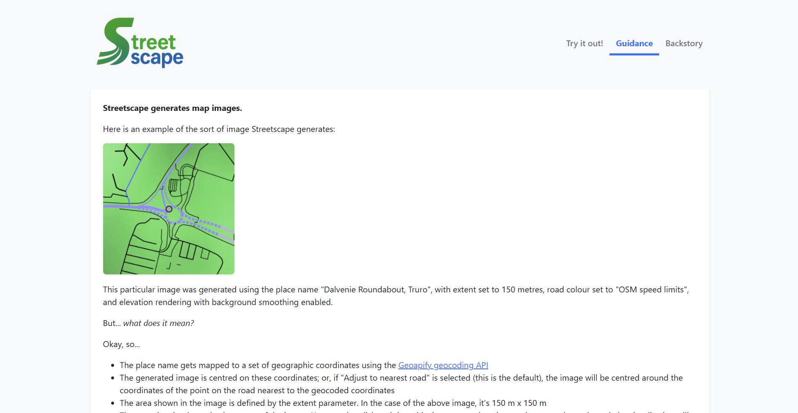
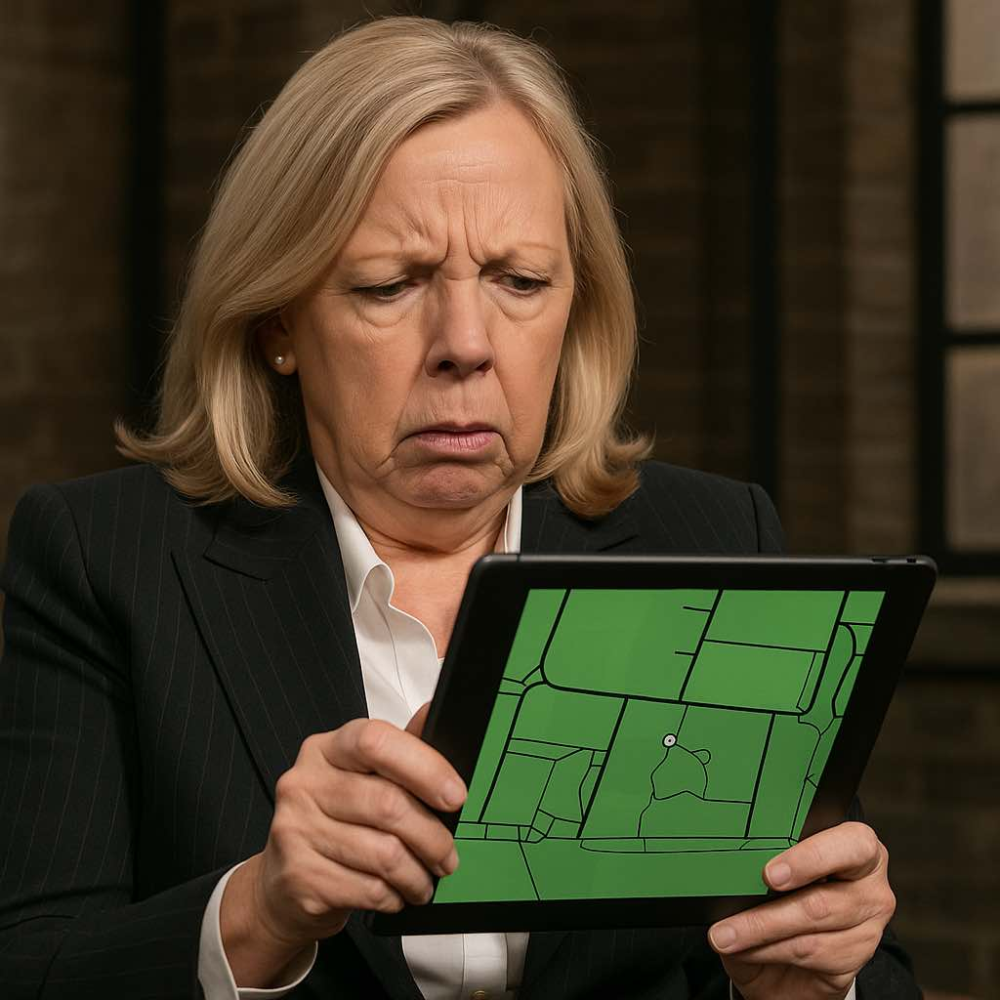
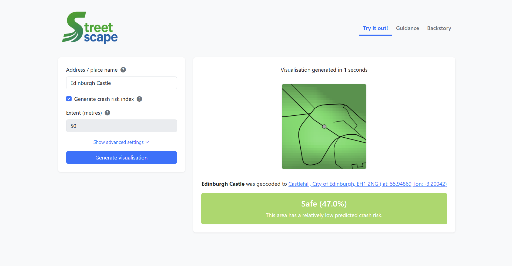
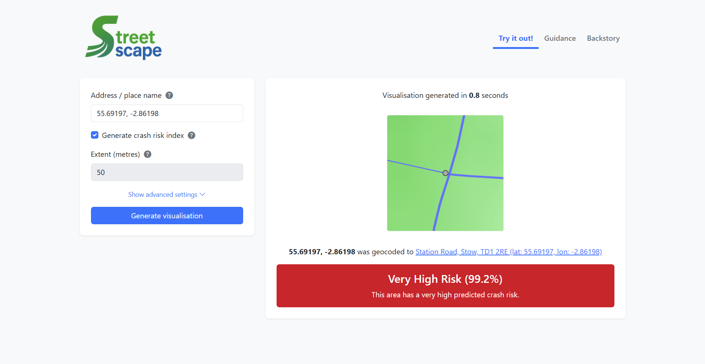
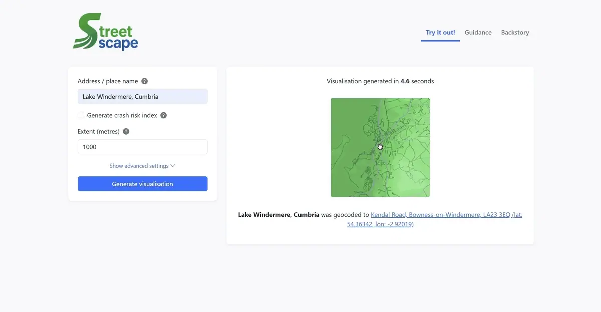
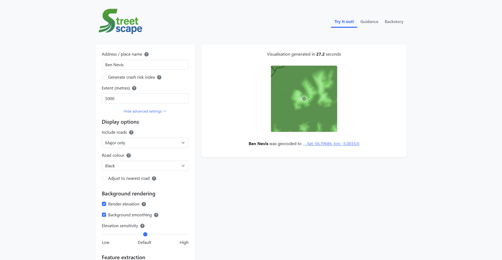
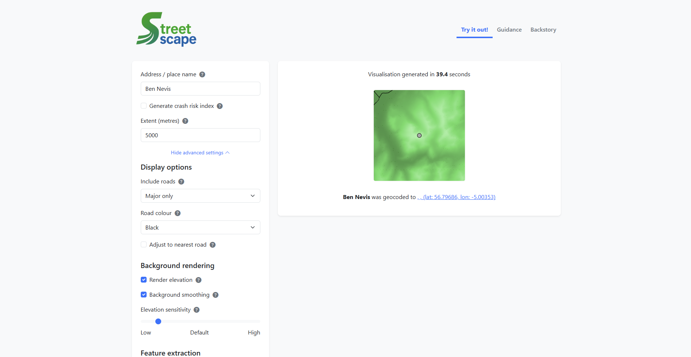
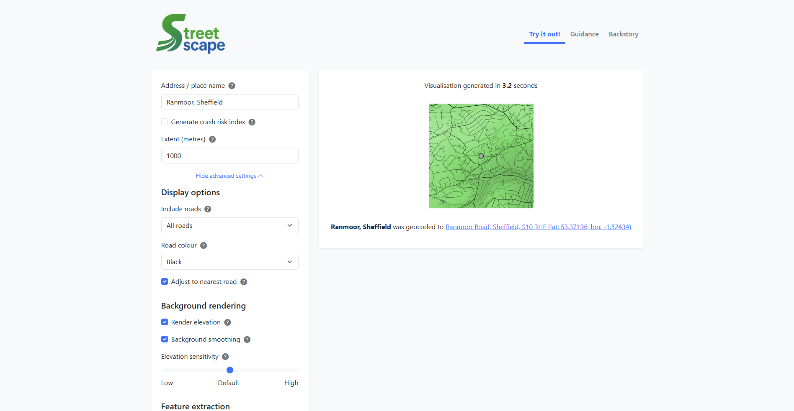
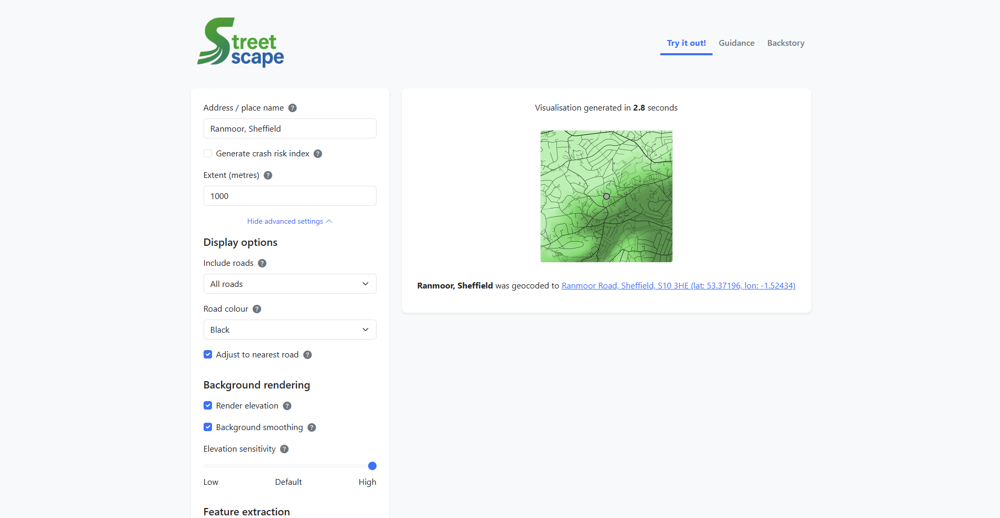

I published [an article](/2025/04/19/behold-its-the-road-network-visualisation-tool-youve-been-waiting-for) announcing the release of my new road network visualisation app [Streetscape](https://streetscape.wjrm500.com/) 10 days ago, and since then I’ve made a number of significant improvements to it, which I’d like to bombard you with today.

Firstly and perhaps least spectacularly, there’s a **new [Guidance](https://streetscape.wjrm500.com/guidance) page** to teach users how to interpret images generated by the app:

This change was inspired by feedback from old school friends, who expressed general confusion at what the app was for and what all the lines and colours meant. “I don’t understand – does Will think he invented maps?” was one cruel but amusing take. Another sent this picture:

Hopefully the guidance helps poor old Deborah.

I’ve also massively **simplified the interface on the main page**, hiding most of the parameters behind a “Show advanced settings” option:

_Before_

_After_

The more eagle-eyed among you might have spotted a new checkbox in the interface – **Generate crash risk index**. I’ve loaded the machine learning model trained on images generated by the image generation tool that powers Streetscape (read more [here](https://streetscape.wjrm500.com/backstory)), into Streetscape, and now with almost no additional latency you can have it produce a crash risk index that indicates how dangerous it thinks the geography represented in your generated image is. It does sadly lock you to a specific set of parameter values: the parameter values used to generate the images that trained the model.

Here’s an example of it in action:

Here’s another example, this time showing an intersection the model reckons is particularly dangerous:

The truth is, I was slightly hesitant about releasing this feature to the world. Because the reality is that, despite my best efforts, the model isn’t that great; it didn’t learn the things I was hoping it was going to learn. There are a bunch of reasons for this, which I delve into in quite some detail in my dissertation (you can find _that_ [here](/wp-content/uploads/2025/04/Using-a-Convolutional-Neural-Network-to-Predict-Road-Traffic-Accident-Risk-from-Geographic-Data.pdf)), but fundamentally it boiled down to data availability. So if the model gives you some wacky results, please don’t judge. I’ve been fully transparent with my methodology and results, and I’d be really interested to hear any suggestions for methodological improvements – email me at wjrm500@gmail.com or message [me on LinkedIn](https://www.linkedin.com/in/william-may-6893371a3/).

One thing I _do_ like about the model is the fact it responds in an intuitive way as you move further away from an intersection. And this moves us nicely onto my favourite new feature – the **draggable dot**. This was the realisation of a fantasy I had while working on the MSc – seeing how the model responds to highly-localised geographic repositioning in near-real time. See the screen recording below for a flavour of what I mean:

It gives Streetscape a much more interactive feel, and it works well at any scale:

The next feature I want to introduce is pretty cool as well – it’s a new parameter called **elevation sensitivity**, available as a Low-to-High slider under advanced settings. You can adjust it according to the elevation range in the image to effectively highlight topographical differences. In mountainous areas where extent is large, decreasing the elevation sensitivity creates subtler transitions in shading that bring out contour lines nicely. And in residential areas with smaller extents, increasing the elevation sensitivity accentuates relatively small, localised differences in elevation, allowing you to see differences that were previously invisible.

For example, see the difference low sensitivity makes to the background around Ben Nevis:

_Before_

_After_

And see the difference high sensitivity makes to the background around Ranmoor in Sheffield (my stomping ground, on-and-off, between 2018 and 2024):

_Before_

_After_

The final thing I want to mention is the **performance boost** the app has received. Through a mixture of data caching and bulk way plotting, images are now generated significantly faster. See the table below for a performance comparison:

| Extent | Time taken before | Time taken now | Change |
| --- | --- | --- | --- |
| 100 m | 1.1 | 1.1 | 0.0% |
| 250 m | 1.7 | 1.5 | -11.8% |
| 500 m | 3.4 | 2.1 | -38.2% |
| 1,000 m | 9.6 | 5.0 | -47.9% |
| 2,500 m | 35.2 | 15.7 | -55.4% |
| 5,000 m | 85.8 | 35.0 | -59.2% |
| 10,000 m | 146.0 | 64.0 | -56.2% |

_All times in seconds. All tests performed with Edinburgh Castle, all roads included, black way colour, node adjusted to nearest road, elevation off, feature extraction off._

Overall, Streetscape is now more user-friendly, more feature-rich and more performant.

This is probably as far as I’ll go with Streetscape now – I’m running out of ideas for improvements, and regardless of anything else, this was and is a very niche offering; a showcase for a piece of academic work, rather than anything genuinely useful in its own right.
