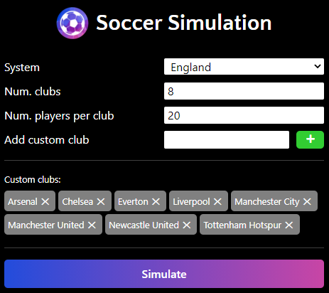
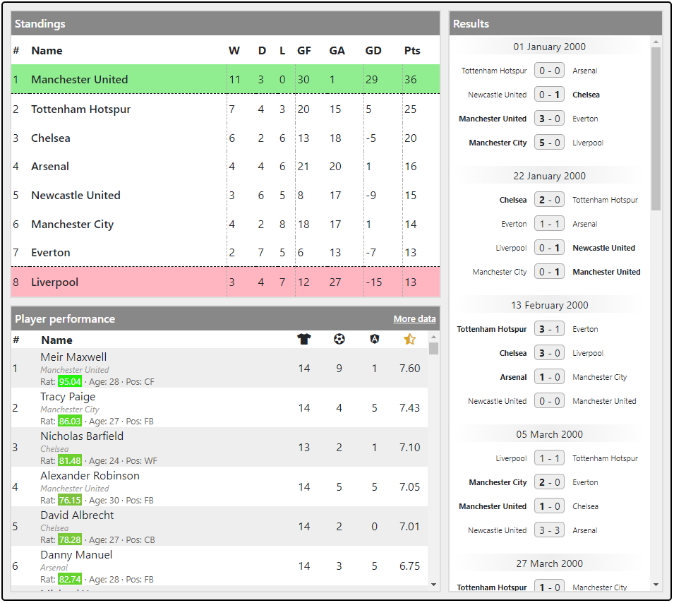
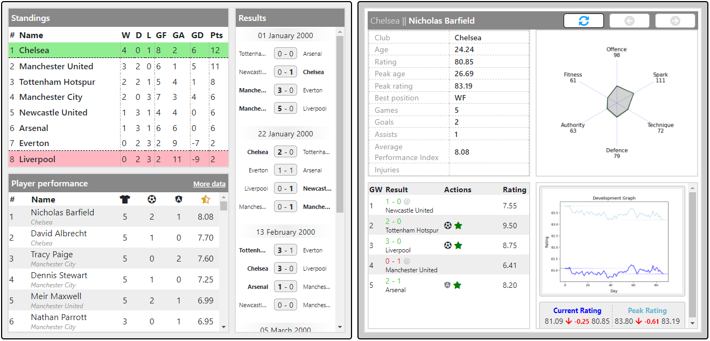

This is just a short post to point out a couple of recent updates to the [Soccer Simulation](https://soccer-sim.wjrm500.com/) app, inspired by recent suggestions by users.

### **Add custom club names**

It is now possible to replace club names used in the simulation with your own, custom club names. This feature was requested by a couple of people, and hopefully adds a bit of fun to the simulation process! See screenshots below:

A couple of notes on this: (1) team strength is random, and not dependent on the order in which custom clubs are added; (2) you do not need to replace every single club name in a given simulation – randomly-generated club names will automatically fill in any blanks.

### **Filter dashboard by gameweek**

It is now possible to filter all of the data in the dashboard by a given gameweek, which is to say that only data valid up to the specified gameweek will be visible. For example, if you filter to gameweek 10 (in a hypothetical 38-gameweek season), among other things, the league table and player performance table will appear exactly as they were at the conclusion of gameweek 10. This allows users to “step through” the season one gameweek at a time.

To access this functionality, set the URL parameter “gameweek” and reload the web page. See example URL below:

And to demonstrate the effect that this has on the dashboard:

Liverpool had a bit of a mare this season didn’t they!

Hopefully these changes make the Soccer Simulation experience that tiny bit more enjoyable.
