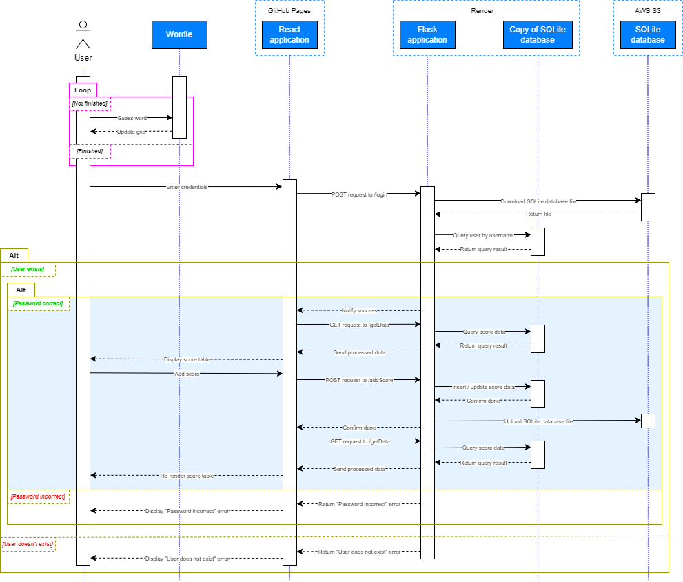
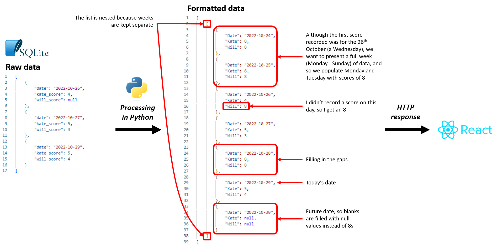
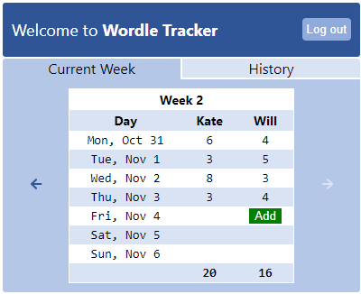

Even if nobody else in the world played Wordle but me, I’m sure I’d still enjoy it well enough. However, there’s little doubting that one of the major appeals of the game is how easy it is to compare your own performance against others. It’s why the most common WhatsApp message sent between myself and my wife Kate is “Have you done Wordle yet?” (romance, folks). Human beings are competitive by nature (yes, even the ones that say they aren’t competitive – they’re just not as good at things!), and it’s certainly not beneath my own dignity to respond to news of a Wordle victory over Kate by unleashing upon her a tirade of jeering GIFs.

That being said, you don’t get much of a sense of how good you are or how much you’re improving through this daily cycle of gaming and shaming. And, although a horizontal histogram visualising your entire score history pops up on screen after you’ve correctly guessed the word of the day, this format doesn’t necessarily invite comparison. That’s because the unconstrained time frame effectively freezes the distribution for long-term devotees of the game, rendering even medium-term peaks or troughs in performance invisible. It also means players are forever burdened by their past profligacy. Judging ability from such a dataset is like judging Cristiano Ronaldo at the end of the 2008-09 season on the basis of his only having scored 97 goals in 272 career games: while the data is valid, the ramifications of his haul of 42 goals in 49 games that year are rather ignored. Not that I’m comparing myself to Ronaldo – I bet he’s _crap_ at Wordle.

_For anybody worried that robots are about to take over the world, this is the result of passing “Cristiano Ronaldo playing Wordle” into a [“state-of-the-art” text-to-image machine learning model](https://huggingface.co/spaces/stabilityai/stable-diffusion "\"state-of-the-art\" text-to-image machine learning model")_

And so, at my insistence, a few months ago Kate and I started recording our scores on a whiteboard: that most persistent of data stores. Like mayflies granted a reprieve from the tragic fate of their species, we were suddenly able to transcend the context of a single day, with the basis of our performance comparison expanded sevenfold. But alas, that first week ended with the sickening realisation that as the whiteboard was now full up with ink, continuing to use it to record data would necessitate the haemorrhaging of old data. And, as a recent imaginary trip to the cinema to see Marvel’s _Analysts Assemble_ had left imprinted in my consciousness the image of Robert Downey Junior’s less glamorous twin brother roaring “NO DATUM LEFT BEHIND!” while frantically typing SQL into an exploding computer, I knew this situation could not go unresolved.

Long story short, I created an application to enable me and Kate to record and view our Wordle scores online, side by side. As I write this now I’ve just realised that the existence of browser-based spreadsheet software like Google Sheets makes such an application obsolete, which is a shame I suppose. Anyway, I learnt a lot during the development process, with the tools involved in the creation of the application including ReactJS, making this the first time I’d ever used a front-end framework. I also made use of a variety of online, third-party services, including [GitHub Pages](https://pages.github.com/ "GitHub Pages") (for hosting React code), [Render](https://render.com/ "Render") (for hosting Python code) and [AWS S3](https://aws.amazon.com/s3/ "AWS S3") (for hosting data in the form of an SQLite database). Here’s a sequence diagram demonstrating how the components of the “Wordle Tracker” software architecture interact:

It works like this: the user goes to the React application, hosted by GitHub Pages, and submits their login credentials on the login page. An HTTP POST request is sent to the URL of the Flask application, hosted by Render. The web service boots up (like Heroku, Render reduces hosting overhead by shutting down web services after a period of inactivity). The SQLite database file is downloaded from AWS S3 into the application’s ephemeral filesystem, using credentials stored in environment variables. The user’s login credentials are checked using the local copy of the SQLite database. If the credentials are valid, the React application will then send a secondary HTTP GET request in the callback of the original fetch request, instructing the backend to query its local copy of the SQLite database for Wordle score data. This data is then processed into a format that is easily consumable by the frontend, which basically means filling in gaps and organising the data into full weeks. The diagram below demonstrates this process:

The formatted data is sent to the React application, which renders the data inside an HTML table. If the user has not already added their score for the day, a button “Add” will appear in the column corresponding to the user:

When the user selects their score from a dropdown that appears in a [modal](https://en.wikipedia.org/wiki/Modal_window), another HTTP POST request is made, this time to the /addScore endpoint. The data is simply inserted into the local copy of the SQLite database, and this modified copy is then re-uploaded to AWS S3 to replace the original version, keeping things in sync. In the React application fetch request callback, the same HTTP GET request as before is made to update the Wordle score data in the frontend, ensuring the data in the browser is synchronised with the data on the web server.

Slightly quirky design, right? It would never be recommended in an enterprise setting to handle data persistence in this way, with data stored in an SQLite database file that has to be downloaded onto the web server, and then re-uploaded every time it gets modified. Even with additional mitigating steps, the state maintenance concerns are glaringly obvious and would pretty much cripple the application given a higher level of concurrency.

So, why did I design an application in a way I know not to be entirely robust? Put simply, it was a pragmatic decision: I tailored the design according to financial constraints and expected real-world usage.

Data storage is typically the most expensive component of a cloud-hosted web application, especially when you want to indulge in all the benefits of a fully-managed relational database service. Like Heroku, Render operates managed PostgreSQL and charges for the privilege of using it. Not wanting to shell out for a pretty basic hobby project, my thoughts immediately turned to SQLite. I then realised that it wouldn’t be sufficient to simply store my SQLite database file on Render, as Render’s filesystem is ephemeral, just like Heroku’s. And so, I needed a place to put the SQLite database file where it wouldn’t be summarily disposed of. This naturally led me to AWS S3, which has the benefit of being dirt cheap.

The end result of these design decisions is a data-persistent cloud-hosted web app with negligible costs – pretty sweet! As for the downsides: well, the application is only ever going to be used by myself and Kate, likely asynchronously, and the consequences of any issues will always be minor. It’s just not worth sweating over.

Oh, and the reason I’m using Render instead of Heroku is because from the 28th of this month, Heroku will no longer offer free dynos! A modern-day tragedy. I do now notice that Heroku have more recently announced a new offering called “eco dynos”, which despite not being free, do appear at first glance to be very cost effective.

And thus concludes my article today. I hope you’ve enjoyed the read!
