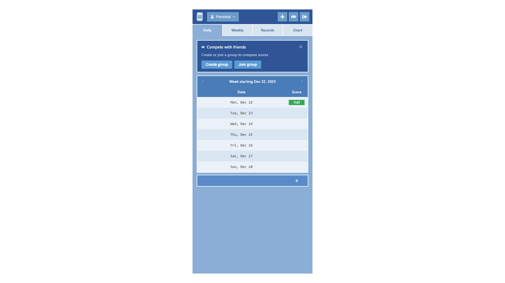
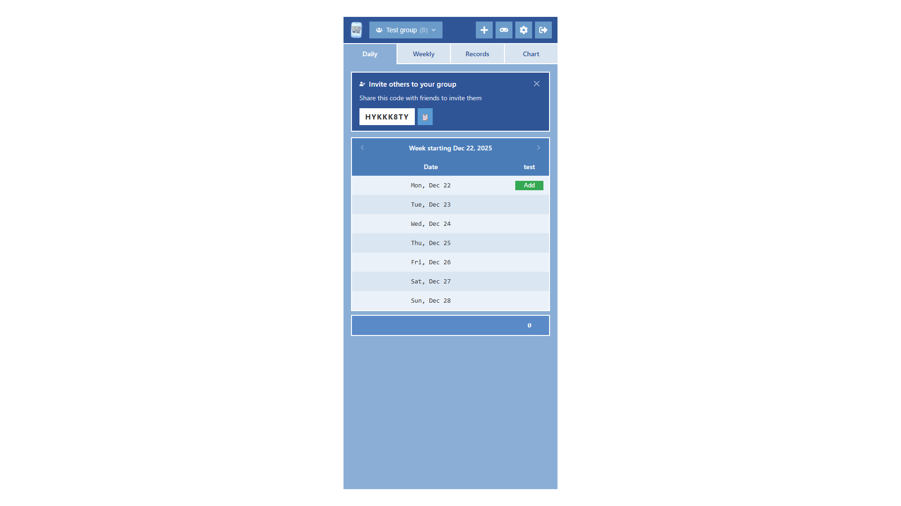
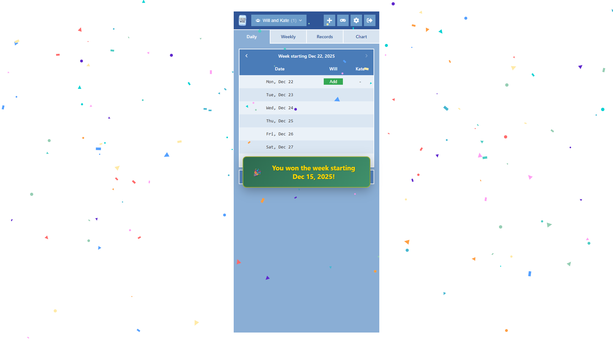
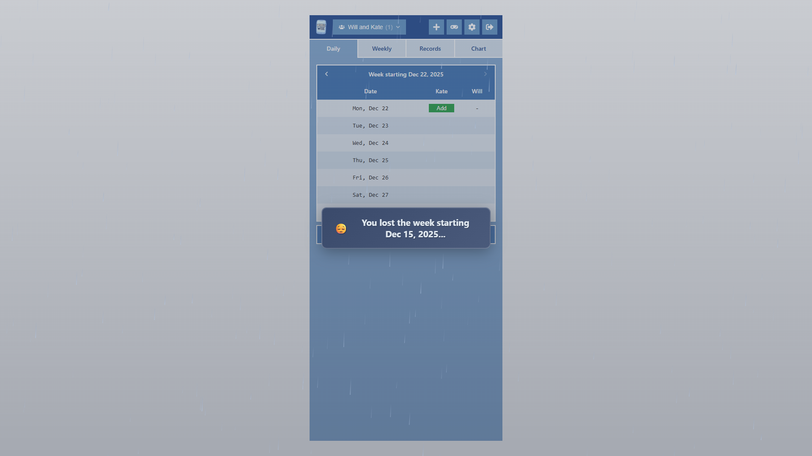

This is just a quick post to announce a couple of cool UI/UX improvements to [WordleWise](https://wordlewise.wjrm500.com/)…

Firstly, if you’re a user who doesn’t belong to a group, you’ll now see a dismissible “Compete with friends” promo banner just above the main page content, with links to the “Create group” and “Join group” actions:

Secondly, if you’re a user in a group by yourself, e.g., if you’ve just created a new group, you’ll see an “Invite others to your group” banner, with a button to copy the group’s invite code:

The idea in both cases is to surface these important actions to new users without creating permanent UI burden. If the user closes a banner, that banner won’t show again on that device (unless the user clears their local storage).

Thirdly, two new full-screen animations have been introduced to help you celebrate your success and mourn your failure: now, if you record the lowest total score of any user in your group for a given week, you’ll be rewarded with a confetti animation:

And if you don’t, you’ll be consoled by a rainfall animation:

Hopefully the new changes make the app experience slightly more enjoyable.

If you spot any bugs or have any feature requests, please leave a comment or pop me an email at [wjrm500@gmail.com](mailto:wjrm500@gmail.com)!
